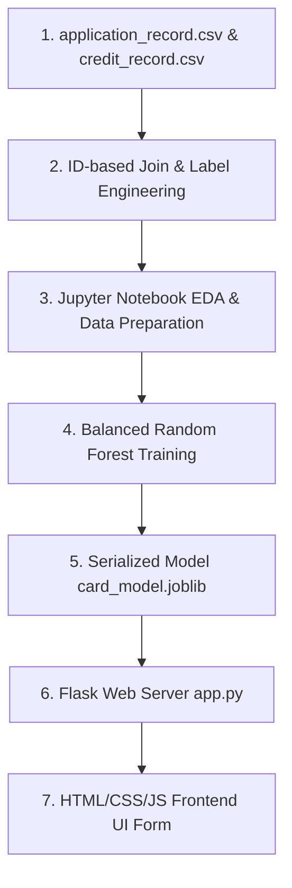

# Part 1: Project Overview & Architecture

## 1. Project Overview

### 1.1 Welcome & Introduction
When you apply for a credit card, banks don't manually read your paper application anymore. Instead, they use smart algorithms called Machine Learning models to make the decision instantly. 

In this handbook, we will build a complete **Credit Card Approval System** from scratch. 

The goal of this project is to build a machine learning model that takes applicant demographics (like income, age, employment duration, and education) and predicts whether they should be approved or rejected.

---

### 1.2 System Architecture Flow Diagram
Here is how data flows through the application:



---

# Part 2: Prerequisites & Local Setup

Before writing any machine learning code, we need to prepare our computer with the correct programming tools. Setting this up correctly is the most important step to prevent compatibility and configuration errors later.

## 2. Core Software Setup

### 2.1 Installing Python (Version 3.10+)
Python is the industry standard language for machine learning.
* Download the installer from the official [Python Downloads Page](https://www.python.org/downloads/).
* **CRITICAL STEP**: Run the installer and **check the box that says "Add Python to PATH"** before clicking Install. If you skip this, python commands will not work in your terminal.
* Verify the installation by opening your terminal or Command Prompt and running:
  ```bash
  python --version
  ```

---

### 2.2 Installing Git
Git is a version control system used to track code history and back up your project.
* Download the installer from the [Git Website](https://git-scm.com/).
* Run the installer and keep the default options selected.
* Verify by opening your terminal and typing:
  ```bash
  git --version
  ```

---

### 2.3 Installing Visual Studio Code (VS Code)
VS Code is our primary editor to write scripts and notebooks.
* Download and run the installer from the [VS Code Website](https://code.visualstudio.com/).
* Open VS Code, click the **Extensions** icon on the left sidebar, search for **Python** and **Jupyter** (both by Microsoft), and click **Install**.

*Note: We will initialize our Git tracking and connect our local codebase to GitHub later in this guide, once our application is fully built and tested locally.*

---

# Part 3: Creating the Project Workspace & Libraries

## 3. Creating the Workspace
Create a folder named `credit_card_project` on your computer. Inside, organize your folders and empty files exactly like this:
```text
credit_card_project/
├── data/
│   ├── application_record.csv
│   └── credit_record.csv
├── models/
│   └── card_model.joblib
├── templates/
│   └── index.html
├── static/
│   ├── style.css
│   └── script.js
├── notebook.ipynb
└── app.py
```
> [!IMPORTANT]
> **Beginner Rule:** Whenever you write or paste code into any file in VS Code, remember to press **`Ctrl + S`** (Windows) or **`Cmd + S`** (macOS) to save your changes. If you do not save, the file remains empty and your code will not run!

---

### 3.1 Installing Required Libraries
Open your terminal inside your project folder and run the following installation command:
```bash
pip install numpy pandas matplotlib seaborn scikit-learn xgboost joblib flask
```
We install these key libraries:

* **pandas**: Loads, merges, and cleans our tabular CSV data.
* **numpy**: Handles mathematical logic on numerical matrix arrays.
* **matplotlib & seaborn**: Generates statistical charts and plots.
* **scikit-learn**: Houses our classifiers, data splitters, and validation metrics.
* **xgboost**: Builds our gradient boosted decision tree classifier.
* **joblib**: Saves our trained model weights into a portable file.
* **flask**: Runs our lightweight local backend application server.

---

# Part 4: Downloading the Dataset

## 4. The Kaggle Dataset
For this project, we utilize the official **Credit Card Approval Prediction Dataset** on Kaggle.

<div class="my-6">
  <a href="https://www.kaggle.com/datasets/rikdifos/credit-card-approval-prediction" target="_blank" rel="noopener noreferrer" class="blog-action-btn">
    DOWNLOAD_DATASET_FROM_KAGGLE →
  </a>
</div>

This dataset is split into two CSV files:
* **`application_record.csv`**: Contains applicant details (income, education, property ownership, age, family size).
* **`credit_record.csv`**: Contains the payment history of those applicants over past months.

---

### 4.1 Dataset Columns Explained
The raw fields inside `application_record.csv` are grouped into these logical sections:

* **Identification Variable**:
  * **`ID`**: Unique identification number for each applicant.
* **Applicant Demographics**:
  * **`CODE_GENDER`**: Gender (M = Male, F = Female).
  * **`CNT_CHILDREN`**: Number of children.
  * **`CNT_FAM_MEMBERS`**: Family size.
  * **`NAME_FAMILY_STATUS`**: Family status (Married, Single, Civil marriage, Separated, Widow).
* **Financial Details**:
  * **`AMT_INCOME_TOTAL`**: Total annual income.
  * **`FLAG_OWN_CAR`**: Car ownership status (Y = Yes, N = No).
  * **`FLAG_OWN_REALTY`**: Property/Real Estate ownership (Y = Yes, N = No).
  * **`NAME_INCOME_TYPE`**: Type of income (Working, Commercial associate, Pensioner, State servant, Student).
* **Living & Education**:
  * **`NAME_EDUCATION_TYPE`**: Highest level of education achieved.
  * **`NAME_HOUSING_TYPE`**: Way of living (House/apartment, With parents, Rented apartment, etc.).
* **Employment & Time Offsets**:
  * **`DAYS_BIRTH`**: Applicant age in days (represented as a negative offset from today).
  * **`DAYS_EMPLOYED`**: Employment duration in days (negative offset; positive values indicate unemployment).
  * **`OCCUPATION_TYPE`**: Type of job/occupation.

---

### 4.2 Label Construction Strategy
The raw dataset **does not** contain an "Approved" or "Rejected" label column. We must engineer it. We define an applicant's target state based on their payment delays in `credit_record.csv`:

* **`STATUS` (Monthly Payment Code)**:
  * `0`: 1-29 days past due.
  * `1`: 30-59 days past due.
  * `2`: 60-89 days past due.
  * `3`: 90-119 days past due.
  * `4`: 120-149 days past due.
  * `5`: Overdue or bad debts, write-offs for more than 150 days.
  * `C`: Paid off that month.
  * `X`: No loan for the month.
* **Target Calculation Logic**:
  * If an applicant has had payments overdue by **60 or more days** (represented by status codes `2`, `3`, `4`, or `5` in the monthly log) at any point in their record, we label them as **Risky/Rejected (Target = 1)**.
  * Otherwise, they are labeled **Safe/Approved (Target = 0)**.

---

# Part 5: Interactive Notebook - Exploration & Preprocessing

Open your `notebook.ipynb` file in VS Code and run the following code cells.

### 5.1 Understanding Exploratory Data Analysis (EDA) & Preprocessing
Before building a machine learning model, we must load and understand our dataset. This is called Exploratory Data Analysis (EDA). EDA helps us discover missing values, identify column structures, and locate anomalies (like outliers or incorrect values). Preprocessing is the step where we clean up these anomalies and prepare the data so it fits perfectly into our machine learning models.

---

### [JUPYTER CELL 1] Ingesting Datasets
Let's import our libraries, load the raw CSV files, and inspect their dimensions:
```python
import pandas as pd
import numpy as np
import matplotlib.pyplot as plt
import seaborn as sns

# Load records
app_df = pd.read_csv('data/application_record.csv')
credit_df = pd.read_csv('data/credit_record.csv')

print(f"Application Records: {app_df.shape}")
print(f"Credit History Records: {credit_df.shape}")
```
* **Why we do this**: This verifies that the files are placed correctly in the `data/` directory and outputs the row and column dimensions.
* **What to look for**: Check if both files loaded successfully without errors. You should see thousands of application records.

---

### [JUPYTER CELL 2] Label Engineering & Merging
We calculate the default risk for each applicant and join the tables together:
```python
# Label overdue status '2', '3', '4', or '5' (60+ days overdue) as risky (1)
credit_df['is_risky'] = credit_df['STATUS'].isin(['2', '3', '4', '5']).astype(int)

# Group by ID to find if they defaulted at least once in their history
user_target = credit_df.groupby('ID')['is_risky'].max().reset_index()
user_target.rename(columns={'is_risky': 'target'}, inplace=True)

# Merge datasets on the unique ID column
df = pd.merge(app_df, user_target, on='ID', how='inner')
print(f"Merged Dataset Shape: {df.shape}")
print("Target Distribution:")
print(df['target'].value_counts(normalize=True) * 100)
```
* **Why we do this**:
  * We group the credit behavior records by user `ID` and find if they had a default history (`is_risky == 1`).
  * Merging this target back with `application_record` gives us our final labeled training dataset.
* **What to look for**: The target distribution prints out. You will notice that a huge majority of applicants are labeled `0` (Safe). This is called **class imbalance** and is something we must configure our machine learning model to handle.

---

### 5.2 What is Class Imbalance?
In our dataset, over 98% of applicants are labeled `0` (Safe/Approved), while less than 2% are labeled `1` (Risky/Rejected). This is a severe **Class Imbalance**. If we trained a model on this directly without adjustments, the model could simply guess `0` for every single applicant and achieve 98% accuracy, while failing to detect the actual risky applicants. We will resolve this during model training by using **stratified splits** and **class weights**.

---

### [JUPYTER CELL 3] Preprocessing and Fixing Anomalies
We clean up missing values, handle offsets, and drop unneeded identifiers:
```python
# Resolve null occupations
df['OCCUPATION_TYPE'] = df['OCCUPATION_TYPE'].fillna('Unknown')

# Convert birth offset to positive age in years
df['AGE'] = (df['DAYS_BIRTH'] / -365.25).astype(int)

# Convert employment offset to years. Positive values are marked as unemployed (0 years).
df['YEARS_EMPLOYED'] = df['DAYS_EMPLOYED'].apply(lambda x: 0 if x > 0 else x / -365.25)
df['UNEMPLOYED'] = (df['DAYS_EMPLOYED'] > 0).astype(int)

# Drop redundant raw columns
df_clean = df.drop(columns=['ID', 'DAYS_BIRTH', 'DAYS_EMPLOYED', 'FLAG_MOBIL'])
print(df_clean.head())
```
* **Why we do this**:
  * Missing occupation fields are filled with `'Unknown'` to avoid dropping rows.
  * Age and employment length are converted from negative days into readable years.
  * The positive values in `DAYS_EMPLOYED` indicate unemployment, so we create a binary `UNEMPLOYED` indicator flag.

---

# Part 6: Production Script - Model Comparison & Training (train.py)

We now transition from interactive notebook exploration to writing a production-grade Python script named `train.py`. While Jupyter is excellent for visual exploration (EDA) and prototype cleaning, standard Python scripts are preferred in production environments to run training pipelines from end to end and save the resulting model files.

### 6.1 Understanding Machine Learning Models & Algorithms
In this script, we train and compare three distinct classification models to find the one that balances accuracy with minority class detection:

* **Logistic Regression**: A linear model that estimates the probability of a binary event. It is fast, simple, and serves as our baseline.
* **Random Forest Classifier**: An ensemble model that builds multiple decision trees and averages their outputs. It is highly robust, handles non-linear relationships, and reduces variance.
* **XGBoost Classifier**: An advanced gradient boosting model that trains trees sequentially, where each new tree focuses on correcting the errors made by the previous ones. It is highly performant and often yields the highest accuracy.

To handle our class imbalance, we set `class_weight='balanced'` in our classifiers. This tells the algorithms to penalize errors on the minority class (Risky applicants) more heavily, forcing the model to learn its patterns.

---

### Model Comparison Training Script (`train.py`)
Save this complete script as `train.py` in your project root folder:

```python
import pandas as pd
import numpy as np
from sklearn.preprocessing import LabelEncoder
from sklearn.model_selection import train_test_split
from sklearn.linear_model import LogisticRegression
from sklearn.ensemble import RandomForestClassifier
from xgboost import XGBClassifier
from sklearn.metrics import accuracy_score, classification_report
import joblib
import os

def run_training_pipeline():
    print("Step 1: Loading raw datasets...")
    app_df = pd.read_csv('data/application_record.csv')
    credit_df = pd.read_csv('data/credit_record.csv')

    print("Step 2: Constructing target variable and merging records...")
    # Label status '2', '3', '4', or '5' as risky (1)
    credit_df['is_risky'] = credit_df['STATUS'].isin(['2', '3', '4', '5']).astype(int)
    
    # Identify if a client has defaulted at least once
    user_target = credit_df.groupby('ID')['is_risky'].max().reset_index()
    user_target.rename(columns={'is_risky': 'target'}, inplace=True)
    
    # Merge datasets
    df = pd.merge(app_df, user_target, on='ID', how='inner')

    print("Step 3: Preprocessing and resolving anomalies...")
    # Replace null occupation entries
    df['OCCUPATION_TYPE'] = df['OCCUPATION_TYPE'].fillna('Unknown')
    
    # Convert birth and employment day offsets to years
    df['AGE'] = (df['DAYS_BIRTH'] / -365.25).astype(int)
    df['YEARS_EMPLOYED'] = df['DAYS_EMPLOYED'].apply(lambda x: 0 if x > 0 else x / -365.25)
    df['UNEMPLOYED'] = (df['DAYS_EMPLOYED'] > 0).astype(int)
    
    # Drop raw and redundant ID/offset variables
    df_clean = df.drop(columns=['ID', 'DAYS_BIRTH', 'DAYS_EMPLOYED', 'FLAG_MOBIL'])

    print("Step 4: Categorical Label Encoding...")
    le = LabelEncoder()
    cat_cols = ['CODE_GENDER', 'FLAG_OWN_CAR', 'FLAG_OWN_REALTY', 'NAME_INCOME_TYPE', 
                'NAME_EDUCATION_TYPE', 'NAME_FAMILY_STATUS', 'NAME_HOUSING_TYPE', 'OCCUPATION_TYPE']
    for col in cat_cols:
        df_clean[col] = le.fit_transform(df_clean[col].astype(str))

    # Separate features and target
    X = df_clean.drop(columns=['target'])
    y = df_clean['target']

    # Stratified split to keep target ratio balanced
    X_train, X_test, y_train, y_test = train_test_split(X, y, test_size=0.2, random_state=42, stratify=y)

    print("\nStep 5: Training and evaluating classifiers...")
    models = {
        "Logistic Regression": LogisticRegression(max_iter=1000, class_weight='balanced'),
        "Random Forest": RandomForestClassifier(n_estimators=100, random_state=42, class_weight='balanced'),
        "XGBoost": XGBClassifier(use_label_encoder=False, eval_metric='logloss')
    }

    best_acc = 0.0
    best_model = None
    best_model_name = ""

    for name, clf in models.items():
        # Fit classifier
        clf.fit(X_train, y_train)
        y_pred = clf.predict(X_test)
        
        acc = accuracy_score(y_test, y_pred)
        print(f"-> {name} Accuracy: {acc * 100:.2f}%")
        
        # Track the highest performing model
        if acc > best_acc:
            best_acc = acc
            best_model = clf
            best_model_name = name

    print(f"\nWinner: {best_model_name} with {best_acc * 100:.2f}% accuracy.")
    
    # Print metrics report for the winner
    winner_preds = best_model.predict(X_test)
    print("\nBest Model Performance Report:")
    print(classification_report(y_test, winner_preds))

    # Save model binary file
    print("Step 6: Serializing and saving best model...")
    os.makedirs('models', exist_ok=True)
    joblib.dump(best_model, 'models/card_model.joblib')
    print("Model successfully written into models/card_model.joblib")

if __name__ == '__main__':
    run_training_pipeline()
```

---

### 6.2 Executing the Training Script
* Open your project terminal and run:
  ```bash
  python train.py
  ```
* **Expected Output**: The terminal will print out step-by-step progress, output accuracy percentages for each model, print the final classification metrics report, and confirm the serialization of the winning model.

---

# Part 7: Flask API Backend

Save this script as `app.py` in your project folder.

### 7.1 Understanding Backend Web Servers & API Routing
In this phase, we build a local web backend using **Flask**.
* **API Routing**: Routing is the mechanism that maps network URLs (endpoints) to specific Python functions. In Flask, we define routes using `@app.route()`.
* **JSON Exchange**: JavaScript on the frontend will capture user entries and package them as JSON. The backend extracts this JSON (`request.get_json()`), converts the values to floats/integers, and packs them into a NumPy array matching the exact structure used during model training.
* **Making Predictions**: The Flask server loads our serialized model weights (`joblib.load('models/card_model.joblib')`) in memory. When it receives a request, it calls `model.predict()` and returns the boolean approved/rejected decision back to the client.

```python
from flask import Flask, request, jsonify, render_template
import joblib
import numpy as np

app = Flask(__name__)

# Load the trained model
model = joblib.load('models/card_model.joblib')

@app.route('/')
def home():
    return render_template('index.html')

@app.route('/predict', methods=['POST'])
def predict():
    try:
        data = request.get_json()
        
        # Build features list in the exact order the model expects:
        # CODE_GENDER, FLAG_OWN_CAR, FLAG_OWN_REALTY, CNT_CHILDREN, AMT_INCOME_TOTAL, 
        # NAME_INCOME_TYPE, NAME_EDUCATION_TYPE, NAME_FAMILY_STATUS, NAME_HOUSING_TYPE, 
        # OCCUPATION_TYPE, CNT_FAM_MEMBERS, AGE, YEARS_EMPLOYED, UNEMPLOYED
        features = np.array([[
            int(data['gender']),
            int(data['own_car']),
            int(data['own_realty']),
            int(data['children']),
            float(data['income']),
            int(data['income_type']),
            int(data['education']),
            int(data['family_status']),
            int(data['housing_type']),
            int(data['occupation']),
            int(data['family_size']),
            int(data['age']),
            float(data['years_employed']),
            int(data['unemployed'])
        ]])
        
        # Predict target (0 = Safe/Approved, 1 = Risky/Rejected)
        prediction = model.predict(features)[0]
        
        # Invert label: Approved is true if prediction is 0
        approved = int(prediction) == 0
        
        return jsonify({'approved': approved})
    except Exception as e:
        return jsonify({'error': str(e)}), 400

if __name__ == '__main__':
    app.run(port=5000, debug=True)
```

---

# Part 8: Frontend User Interface Files

To create a clean interface, we split our frontend assets into three files: `index.html`, `style.css`, and `script.js`.

### 8.1 How the Frontend Connects with the Backend
Web applications operate on a **Client-Server Architecture**. 

* **The Client (Frontend)**: This is the user interface running in the browser (`index.html`, `style.css`, `script.js`). Its job is to collect information from the user and display results.
* **The Server (Backend)**: This is our Flask script (`app.py`) running on our local machine. It listens for incoming HTTP requests, feeds features to our machine learning model, and returns the prediction.
* **The Communication (HTTP POST & JSON)**: When the user clicks the submit button, the frontend does not reload the page. Instead, JavaScript packages the form inputs into a **JSON** dictionary and sends it via an HTTP **POST** request to the `/predict` URL on the Flask server. Once the server responds with a success or rejection state, the webpage updates itself dynamically.

---

### Frontend Template (`templates/index.html`)
Save this layout configuration inside `templates/index.html`:

```html
<!DOCTYPE html>
<html lang="en">
<head>
    <meta charset="UTF-8">
    <meta name="viewport" content="width=device-width, initial-scale=1.0">
    <title>Credit Card Approval Predictor</title>
    <link rel="stylesheet" href="/static/style.css">
</head>
<body>
    <div class="container">
        <h2>Credit Card Eligibility Predictor</h2>
        <form id="predictionForm">
            <label for="gender">Gender:</label>
            <select id="gender" required>
                <option value="0">Female</option>
                <option value="1">Male</option>
            </select>

            <label for="own_car">Owns a Car?</label>
            <select id="own_car" required>
                <option value="0">No</option>
                <option value="1">Yes</option>
            </select>

            <label for="own_realty">Owns Real Estate / Property?</label>
            <select id="own_realty" required>
                <option value="0">No</option>
                <option value="1">Yes</option>
            </select>

            <label for="children">Number of Children:</label>
            <input type="number" id="children" min="0" value="0" required>

            <label for="income">Annual Income ($):</label>
            <input type="number" id="income" min="0" required>

            <label for="income_type">Income Type:</label>
            <select id="income_type" required>
                <option value="4">Working</option>
                <option value="0">Commercial associate</option>
                <option value="1">Pensioner</option>
                <option value="2">State servant</option>
                <option value="3">Student</option>
            </select>

            <label for="education">Highest Education Level:</option>
            <select id="education" required>
                <option value="4">Secondary / secondary special</option>
                <option value="1">Higher education</option>
                <option value="2">Incomplete higher</option>
                <option value="3">Lower secondary</option>
                <option value="0">Academic degree</option>
            </select>

            <label for="family_status">Family Status:</label>
            <select id="family_status" required>
                <option value="1">Married</option>
                <option value="3">Single / not married</option>
                <option value="0">Civil marriage</option>
                <option value="2">Separated</option>
                <option value="4">Widow</option>
            </select>

            <label for="housing_type">Housing Type:</label>
            <select id="housing_type" required>
                <option value="1">House / apartment</option>
                <option value="5">With parents</option>
                <option value="2">Municipal apartment</option>
                <option value="4">Rented apartment</option>
                <option value="3">Office apartment</option>
                <option value="0">Co-op apartment</option>
            </select>

            <label for="occupation">Occupation Type:</label>
            <select id="occupation" required>
                <option value="18">Unknown</option>
                <option value="8">Laborers</option>
                <option value="3">Core staff</option>
                <option value="14">Sales staff</option>
                <option value="10">Managers</option>
                <option value="4">Drivers</option>
                <option value="6">High skill tech staff</option>
            </select>

            <label for="family_size">Family Size:</label>
            <input type="number" id="family_size" min="1" value="1" required>

            <label for="age">Age (Years):</label>
            <input type="number" id="age" min="18" max="100" required>

            <label for="years_employed">Years Employed:</label>
            <input type="number" id="years_employed" min="0" step="0.1" value="0" required>

            <label for="unemployed">Is Unemployed?</label>
            <select id="unemployed" required>
                <option value="0">No</option>
                <option value="1">Yes</option>
            </select>

            <button type="submit">Predict Eligibility</button>
        </form>
        <div id="result"></div>
    </div>
    <script src="/static/script.js"></script>
</body>
</html>
```

---

### Style Sheet (`static/style.css`)
Save this CSS configuration inside `static/style.css` to build our form wrapper:

```css
body {
    background-color: #0a0a0c;
    color: #e4e4e7;
    font-family: system-ui, -apple-system, sans-serif;
    display: flex;
    justify-content: center;
    align-items: center;
    min-height: 100vh;
    margin: 0;
    padding: 20px 0;
}

.container {
    background-color: #121214;
    border: 1px solid #27272a;
    padding: 32px;
    border-radius: 16px;
    width: 360px;
    box-shadow: 0 10px 25px rgba(0, 0, 0, 0.5);
}

h2 {
    text-align: center;
    margin-bottom: 24px;
    font-size: 1.5rem;
    color: #ffffff;
}

label {
    display: block;
    margin-bottom: 6px;
    font-size: 0.85rem;
    font-weight: 500;
    color: #a1a1aa;
}

input, select, button {
    width: 100%;
    margin-bottom: 16px;
    padding: 10px;
    border-radius: 8px;
    border: 1px solid #27272a;
    background-color: #1a1a1e;
    color: #ffffff;
    box-sizing: border-box;
    font-size: 0.9rem;
    transition: all 0.2s;
}

input:focus, select:focus {
    border-color: #3b82f6;
    outline: none;
}

button {
    background-color: #2563eb;
    color: white;
    border: none;
    font-weight: 650;
    cursor: pointer;
    margin-top: 10px;
}

button:hover {
    background-color: #1d4ed8;
}

#result {
    margin-top: 15px;
    padding: 12px;
    border-radius: 8px;
    text-align: center;
    font-weight: bold;
    font-size: 0.95rem;
    display: none;
}

.success {
    background-color: rgba(16, 185, 129, 0.15);
    border: 1px solid rgba(16, 185, 129, 0.4);
    color: #34d399;
}

.danger {
    background-color: rgba(239, 68, 68, 0.15);
    border: 1px solid rgba(239, 68, 68, 0.4);
    color: #f87171;
}
```

---

### Application Logic Script (`static/script.js`)
Save this JS module inside `static/script.js`:

```javascript
document.getElementById('predictionForm').addEventListener('submit', async (e) => {
    e.preventDefault();

    const resultDiv = document.getElementById('result');
    resultDiv.style.display = 'none';

    // Pack input form values into a JSON payload
    const payload = {
        gender: document.getElementById('gender').value,
        own_car: document.getElementById('own_car').value,
        own_realty: document.getElementById('own_realty').value,
        children: document.getElementById('children').value,
        income: document.getElementById('income').value,
        income_type: document.getElementById('income_type').value,
        education: document.getElementById('education').value,
        family_status: document.getElementById('family_status').value,
        housing_type: document.getElementById('housing_type').value,
        occupation: document.getElementById('occupation').value,
        family_size: document.getElementById('family_size').value,
        age: document.getElementById('age').value,
        years_employed: document.getElementById('years_employed').value,
        unemployed: document.getElementById('unemployed').value
    };

    try {
        // Send POST request containing payload to the prediction endpoint
        const response = await fetch('/predict', {
            method: 'POST',
            headers: { 'Content-Type': 'application/json' },
            body: JSON.stringify(payload)
        });

        const result = await response.json();
        
        resultDiv.style.display = 'block';
        if (result.approved) {
            resultDiv.className = 'success';
            resultDiv.innerText = 'Application Status: APPROVED';
        } else {
            resultDiv.className = 'danger';
            resultDiv.innerText = 'Application Status: REJECTED';
        }
    } catch (err) {
        resultDiv.className = 'danger';
        resultDiv.innerText = 'Error processing credit application.';
        console.error(err);
    }
});
```

### 8.2 Understanding the Script Execution
Let's break down the logic of this script:
* **`e.preventDefault()`**: Prevents the browser from reloading the page when you click the submit button. This allows us to handle the form processing silently in the background.
* **`payload`**: Gathers all values from form fields (e.g. `income` and `age`) and formats them into a single JavaScript object. The keys in this object match the keys in our Python request parser inside `app.py`.
* **`fetch('/predict', ...)`**: Starts a secure asynchronous HTTP connection. It sends the payload to our backend server as a JSON string (`JSON.stringify(payload)`) with headers identifying the content type.
* **`response.json()`**: Waits for the server to reply and parses the returned JSON string back into a readable JavaScript dictionary.
* **Result Banner Update**: Displays the `#result` container and applies the appropriate CSS styles. If `result.approved` is `true`, it displays a green success banner; if `false`, it shows a red rejection banner.

---

# Part 9: Connecting to GitHub & Pushing Your Code

Now that your machine learning model is trained and your web application is fully tested locally, you are ready to back up your codebase to GitHub.

### 9.1 Connecting a Local Folder to GitHub
Open your project terminal and run these commands sequentially to initialize and link your repository:

1. **Initialize Git locally**: Run `git init`. This creates a hidden `.git` folder inside your project directory to start tracking changes.
2. **Stage your files**: Run `git add .` to prepare all code, template, and document assets for tracking.
3. **Commit files**: Run `git commit -m "feat: complete credit card predictor codebase"` to save your local snapshot.
4. **Rename main branch**: Run `git branch -M main` to establish your primary branch.
5. **Link to GitHub repository**: Create a repository on GitHub, copy its URL, and run:
   ```bash
   git remote add origin https://github.com/yourusername/repository-name.git
   ```
6. **Push code to GitHub**: Run `git push -u origin main` to upload your codebase remote.

---

# Part 10: Summary & Next Steps

Congratulations! You have successfully built a complete Credit Card Approval Prediction System from end to end.

## 10. Summary of Accomplishments
Throughout this handbook, you built:
* An **Ingestion Pipeline** that merges demographic application logs with monthly credit history records.
* A **Target Labeling Strategy** based on repayment delays of 60+ days overdue.
* An **EDA and Data Preparation script** resolving missing features and day offsets.
* A **Machine Learning pipeline** comparing Logistic Regression, Random Forest, and XGBoost models while configuring class weights to handle severe class imbalance.
* A **Flask API Backend server** bridging raw JSON requests with high-performance model predictions.
* An **HTML/CSS/JS frontend interface** displaying dynamic outcome banners.

## 10.1 Future Extensions
To build upon this foundation, you can try:
* **Hyperparameter Optimization**: Use Scikit-Learn's `GridSearchCV` to optimize the max depth, estimators, and learning rate of the XGBoost classifier.
* **Feature Importance Plotting**: Print out model feature weights to see which variables (like annual income or employment length) affect approval classifications the most.
* **Cloud Deployment**: Package your application inside a Docker container and deploy it to a cloud provider (like AWS Elastic Beanstalk or Render) to make your predictor accessible online.
