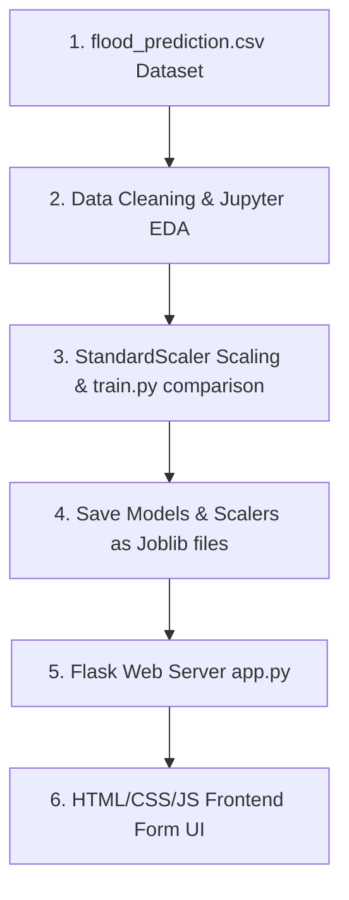

# Part 1: Project Overview & Architecture

## 1. Project Overview

### 1.1 Welcome & Introduction
Floods are among the most devastating natural disasters, claiming thousands of lives and displacing millions every year. Traditional flood warning methods often fail to analyze complex atmospheric changes in time, resulting in delayed advisories.

**Rising Waters** is a machine learning-powered **Flood Prediction System** that resolves this challenge. By analyzing regional weather variables—such as temperature, relative humidity, cloud cover, and seasonal rainfall offsets—the system calculates the exact probability of a flood event. Early predictions enable disaster relief coordinators and local authorities to issue evacuation advisories, mobilize resources, and save lives.

---

### 1.2 System Architecture Flow Diagram
Here is how data flows through the application:



---

# Part 2: Prerequisites & Local Setup

Before writing any machine learning code, we need to prepare our computer with the correct programming tools. Setting this up correctly is the most important step to prevent compatibility and configuration errors later.

## 2. Core Software Setup

### 2.1 Installing Python (Version 3.10+)
Python is the industry standard language for machine learning.
* Download the installer from the official [Python Downloads Page](https://www.python.org/downloads/).
* **CRITICAL STEP**: Run the installer and **check the box that says \"Add Python to PATH\"** before clicking Install. If you skip this, python commands will not work in your terminal.
* **Why we use Python**: Python provides a mature ecosystem of libraries (like Scikit-Learn and Pandas) written in optimized C. This allows us to perform heavy numerical matrix operations easily without writing low-level code ourselves.

---

### 2.2 Installing Git
Git is a version control system used to track code history and back up your project.
* Download the installer from the [Git Website](https://git-scm.com/).
* Run the installer and keep the default options selected.
* **Why we use Git**: Version control acts as a safety net. As you write and experiment with model code, it is extremely easy to accidentally break dependencies. Git allows you to save snapshots (commits) and roll back your code to a working state in seconds.

---

### 2.3 Installing Visual Studio Code (VS Code)
VS Code is our primary editor to write scripts and notebooks.
* Download and run the installer from the [VS Code Website](https://code.visualstudio.com/).
* Open VS Code, click the **Extensions** icon on the left sidebar, search for **Python** and **Jupyter** (both by Microsoft), and click **Install**.
* **Why we use VS Code**: VS Code bridges the gap between interactive exploration (Jupyter Notebooks) and writing production-ready scripts (`train.py`), allowing you to manage your entire software development lifecycle in a single editor.

---

# Part 3: Creating the Project Workspace & Libraries

## 3. Creating the Workspace
To keep our project organized, we separate our files logically. A structured folder layout ensures our raw data remains isolated, our serialized models are stored securely, and our web backend assets are cleanly separated.

Create a folder named `floodprediction` on your computer. Inside, organize your folders and empty files exactly like this:
```text
floodprediction/
├── data/
│   └── flood_prediction.csv     (We will download this next!)
├── models/
│   ├── flood_model.joblib       (This is generated by train.py later!)
│   └── scaler.joblib            (This is generated by train.py later!)
├── templates/
│   └── index.html
├── static/
│   ├── style.css
│   └── script.js
├── notebook.ipynb
└── app.py
```
> [!IMPORTANT]
> **Beginner Rule:** Whenever you write or paste code into any file in VS Code, remember to press **`Ctrl + S`** (Windows) or **`Cmd + S`** (macOS) to save your changes. If you do not save, the file remains empty and your code will not run!

---

### 3.1 Installing Required Libraries
Open your terminal inside your project folder and run the following installation command:
```bash
pip install numpy pandas matplotlib seaborn scikit-learn xgboost joblib flask
```
We install these key libraries:

* **pandas**: Serves as our "Virtual Excel". It loads, merges, and cleans our tabular CSV data.
* **numpy**: Handles low-level mathematical operations on multi-dimensional matrix arrays.
* **matplotlib & seaborn**: Generates statistical charts and correlation heatmaps.
* **scikit-learn**: Houses our classifiers, data splitters, and validation metrics.
* **xgboost**: Builds our gradient boosted decision tree classifier.
* **joblib**: Saves our trained model weights into a portable binary file.
* **flask**: Runs our lightweight local backend application server.

---

# Part 4: Downloading the Dataset

## 4. The Flood Dataset
For this project, we utilize a custom compiled dataset containing historical weather records and observed flood labels.

<div class="my-6">
  <a href="/download/flood_prediction.csv" download class="blog-action-btn">
    DOWNLOAD_DATASET_FROM_WEBSITE →
  </a>
</div>

Place the downloaded `flood_prediction.csv` file inside your project's `data` folder. The final path must be:
`floodprediction/data/flood_prediction.csv`

---

### 4.1 Dataset Columns Explained
The raw fields inside `flood_prediction.csv` are structured as follows:

* **Climate Indicators**:
  * **`Temp`**: Average regional temperature in Celsius (°C). Hotter temperatures can increase evaporation and atmospheric moisture capacity.
  * **`Humidity`**: Relative humidity percentage (%). Higher humidity indicates saturated air, making rainfall more imminent.
  * **`Cloud Cover`**: Cloud cover percentage (%). Represents atmospheric water vapor presence.
* **Precipitation Metrics**:
  * **`ANNUAL`**: Total annual rainfall in millimeters (mm).
  * **`Jan-Feb`**: Winter precipitation total in mm.
  * **`Mar-May`**: Summer precipitation total in mm.
  * **`Jun-Sep`**: Monsoon season precipitation total in mm. This is typically the most dangerous season for flooding.
  * **Post-Monsoon & Averages**:
    * **`Oct-Dec`**: Post-monsoon season precipitation total in mm.
    * **`avgjune`**: Average rainfall observed during the peak month of June in mm.
* **Geographical & Classification Targets**:
  * **`sub`**: Regional sub-basin precipitation index.
  * **`flood`**: Binary target column (**1 = Flood**, **0 = No Flood**). This is the value our model must learn to predict.

---

# Part 5: Interactive Notebook - Exploration & Preprocessing

Open your `notebook.ipynb` file in VS Code and run the following code cells.

### 5.1 Understanding Exploratory Data Analysis (EDA)
Exploratory Data Analysis (EDA) is the first phase of any data science project. It allows us to view basic statistical metrics, check distributions, look for missing fields, and visualize relationships between features using correlation matrices.

---

### [JUPYTER CELL 1] Ingesting & Checking Dataset Shape
Let's import our libraries, load the raw CSV file, and print basic dataset details:
```python
import pandas as pd
import numpy as np
import matplotlib.pyplot as plt
import seaborn as sns

# Load dataset
df = pd.read_csv('data/flood_prediction.csv')

print("Dataset Loaded Successfully!")
print(f"Dataset Shape: {df.shape} (Rows, Columns)")
print("\nFirst 5 Records:")
print(df.head())
```
* **Why we do this**: This verifies that the file is placed correctly in the `data/` directory and outputs the row and column dimensions.
* **What to look for**: Check if the file loaded successfully without errors. You should see 117 rows and 11 columns.

---

### [JUPYTER CELL 2] Statistical Summary & Target Class Balance
We check the summary statistics of all climate features and inspect if the target classes are balanced:
```python
print("Data Summary Statistics:")
print(df.describe())

print("\nMissing Values per Column:")
print(df.isnull().sum())

print("\nTarget Class Distribution (Flood vs. No Flood):")
print(df['flood'].value_counts(normalize=True) * 100)
```
* **Why we do this**:
  * `describe()` helps us verify the ranges of our features (e.g., temperatures around 28–31°C, humidity around 70–80%).
  * `isnull().sum()` checks if there are empty rows that could crash model training.
  * Class distribution prints the ratio of flood events, helping us see if the target classes are balanced.

---

### [JUPYTER CELL 3] Correlation Heatmap Visualization
We visualize how different rainfall seasons and weather variables correlate with flood occurrences:
```python
plt.figure(figsize=(10, 8))
sns.heatmap(df.corr(), annot=True, cmap='coolwarm', fmt=".2f")
plt.title('Correlation Heatmap of Weather Features and Flood Status')
plt.show()
```
* **Why we do this**: Correlation maps show the linear relationship between variables (from -1 to 1). Features with high positive numbers (close to 1.0) have a strong correlation with flooding.
* **What to look for**: Notice how the monsoon season rainfall (`Jun-Sep` and `avgjune`) has a very strong positive correlation with the `flood` target. This confirms our meteorological hypothesis that seasonal rain clusters trigger flood disasters.

---

### [JUPYTER CELL 4] Split, Standard Scale, and Train Baseline Model
We prepare our features, split our data into training and test partitions, apply a Standard Scaler, and train a baseline Random Forest:
```python
from sklearn.model_selection import train_test_split
from sklearn.preprocessing import StandardScaler
from sklearn.ensemble import RandomForestClassifier
from sklearn.metrics import classification_report, accuracy_score

# Split features (X) and target (y)
X = df.drop(columns=['flood'])
y = df['flood']

# Train-Test Split
X_train, X_test, y_train, y_test = train_test_split(X, y, test_size=0.2, random_state=42, stratify=y)

# Apply StandardScaler
scaler = StandardScaler()
X_train_scaled = scaler.fit_transform(X_train)
X_test_scaled = scaler.transform(X_test)

# Train a baseline Random Forest Classifier
clf = RandomForestClassifier(random_state=42, n_estimators=100)
clf.fit(X_train_scaled, y_train)

# Evaluate
y_pred = clf.predict(X_test_scaled)
print(f"Baseline Accuracy: {accuracy_score(y_test, y_pred) * 100:.2f}%")
print("\nClassification Report:")
print(classification_report(y_test, y_pred))
```
* **Why we do this**:
  * **StandardScaler**: Centers each column's values around 0 with a standard deviation of 1. This prevents larger variables (like `ANNUAL` rainfall of 3000mm) from dominating smaller variables (like `Temp` of 28°C) during model calculation.
  * **Stratified Split**: Ensures the train and test subsets have the same proportion of flood events.
  * **Data Leakage Prevention**: We fit our scaler *only* on the training split (`X_train`) and apply the transformation to both splits. Fitting on the test set is a major beginner mistake because it leaks statistical information from the unseen test set into the training loop!

---

# Part 6: Production Script - Model Comparison & Training (train.py)

We now transition from interactive notebook exploration to writing a production-grade Python script named `train.py`. While Jupyter is excellent for visual exploration (EDA) and prototype cleaning, standard Python scripts are preferred in production environments to run training pipelines from end to end and save the resulting model files.

### 6.1 Understanding Machine Learning Models & Algorithms
In this script, we train and compare three distinct classification models to find the one that balances accuracy with minority class detection:

* **Logistic Regression**: A linear model that estimates the probability of a binary event. It is fast, simple, and serves as our baseline.
* **Random Forest Classifier**: An ensemble model that builds multiple decision trees and averages their outputs. It is highly robust, handles non-linear relationships, and reduces variance.
* **XGBoost Classifier**: An advanced gradient boosting model that trains trees sequentially, where each new tree focuses on correcting the errors made by the previous ones. It is highly performant and often yields the highest accuracy.

---

### Model Comparison Training Script (`train.py`)
Save this complete script as `train.py` in your project root folder:

```python
import os
import pandas as pd
import numpy as np
from sklearn.model_selection import train_test_split
from sklearn.preprocessing import StandardScaler
from sklearn.linear_model import LogisticRegression
from sklearn.ensemble import RandomForestClassifier
from xgboost import XGBClassifier
from sklearn.metrics import accuracy_score, classification_report
import joblib

def run_training_pipeline():
    print("Step 1: Loading weather dataset...")
    df = pd.read_csv('data/flood_prediction.csv')

    print("Step 2: Resolving missing values...")
    # Fill any empty cells with median values
    for col in df.columns:
        if df[col].isnull().sum() > 0:
            df[col] = df[col].fillna(df[col].median())

    # Split features and target
    X = df.drop(columns=['flood'])
    y = df['flood']

    # Stratified split to keep label proportions identical
    X_train, X_test, y_train, y_test = train_test_split(X, y, test_size=0.2, random_state=42, stratify=y)

    print("Step 3: Applying Standard Scaling to features...")
    scaler = StandardScaler()
    X_train_scaled = scaler.fit_transform(X_train)
    X_test_scaled = scaler.transform(X_test)

    print("\nStep 4: Training and comparing classification models...")
    models = {
        "Logistic Regression": LogisticRegression(max_iter=1000, class_weight='balanced'),
        "Random Forest": RandomForestClassifier(n_estimators=100, random_state=42, class_weight='balanced'),
        "XGBoost": XGBClassifier(use_label_encoder=False, eval_metric='logloss')
    }

    best_acc = 0.0
    best_model = None
    best_model_name = ""

    for name, clf in models.items():
        # Fit classifier
        clf.fit(X_train_scaled, y_train)
        y_pred = clf.predict(X_test_scaled)
        
        acc = accuracy_score(y_test, y_pred)
        print(f"-> {name} Test Accuracy: {acc * 100:.2f}%")
        
        if acc > best_acc:
            best_acc = acc
            best_model = clf
            best_model_name = name

    print(f"\nWinner Selected: {best_model_name} with {best_acc * 100:.2f}% accuracy.")
    
    # Print metrics report for the winner
    winner_preds = best_model.predict(X_test_scaled)
    print("\nWinner Performance Report:")
    print(classification_report(y_test, winner_preds))

    print("Step 5: Serializing and saving best model & scaler...")
    os.makedirs('models', exist_ok=True)
    joblib.dump(best_model, 'models/flood_model.joblib')
    joblib.dump(scaler, 'models/scaler.joblib')
    print("✓ Output model: models/flood_model.joblib")
    print("✓ Output scaler: models/scaler.joblib")

if __name__ == '__main__':
    run_training_pipeline()
```

---

### 6.2 Executing the Training Script
* Open your project terminal and run:
  ```bash
  python train.py
  ```
* **Expected Output**: The terminal will print out step-by-step progress, output accuracy percentages for each model, print the final classification metrics report, and confirm the serialization of the winning model.

---

# Part 7: Flask API Backend

Save this script as `app.py` in your project folder.

### 7.1 Understanding Backend Web Servers & API Routing
In this phase, we build a local web backend using **Flask**.
* **API Routing**: Routing is the mechanism that maps network URLs (endpoints) to specific Python functions. In Flask, we define routes using `@app.route()`.
* **JSON Exchange**: JavaScript on the frontend will capture user entries and package them as JSON. The backend extracts this JSON (`request.get_json()`), converts the values to floats/integers, and packs them into a NumPy array matching the exact structure used during model training.
* **Making Predictions**: The Flask server loads our serialized model weights (`joblib.load('models/flood_model.joblib')`) in memory. When it receives a request, it calls `model.predict()` and returns the boolean approved/rejected decision back to the client.
* **Why We Need a Server**: You might wonder: *why can't we run predictions directly in browser JavaScript?* In real-world applications, machine learning models can weigh several hundred megabytes. Loading these models directly into the user's web browser would freeze their system or crash the page. Running the model on a dedicated backend server keeps the client lightweight and secure.

```python
from flask import Flask, request, jsonify, render_template
import joblib
import numpy as np
import os

app = Flask(__name__)

# Load the saved model and scaler
MODEL_PATH = 'models/flood_model.joblib'
SCALER_PATH = 'models/scaler.joblib'

if not os.path.exists(MODEL_PATH) or not os.path.exists(SCALER_PATH):
    print("ERROR: Model or Scaler not found! Please run train.py first.")
    exit(1)

model = joblib.load(MODEL_PATH)
scaler = joblib.load(SCALER_PATH)

@app.route('/')
def home():
    return render_template('index.html')

@app.route('/predict', methods=['POST'])
def predict():
    try:
        data = request.get_json()
        
        # Build features list in the exact order the model expects:
        # Temp, Humidity, Cloud Cover, ANNUAL, Jan-Feb, Mar-May, Jun-Sep, Oct-Dec, avgjune, sub
        features_raw = np.array([[
            float(data['temp']),
            float(data['humidity']),
            float(data['cloud_cover']),
            float(data['annual_rainfall']),
            float(data['jan_feb']),
            float(data['mar_may']),
            float(data['jun_sep']),
            float(data['oct_dec']),
            float(data['avg_june']),
            float(data['sub_index'])
        ]])
        
        # Apply the StandardScaler fitted during training
        features_scaled = scaler.transform(features_raw)
        
        # Predict target (0 = No Flood, 1 = Flood)
        prediction = model.predict(features_scaled)[0]
        prediction_proba = model.predict_proba(features_scaled)[0]
        
        result = {
            'flood': int(prediction) == 1,
            'flood_probability': float(prediction_proba[1]) * 100,
            'no_flood_probability': float(prediction_proba[0]) * 100
        }
        
        return jsonify(result)
    except Exception as e:
        return jsonify({'error': str(e)}), 400

if __name__ == '__main__':
    app.run(port=5000, debug=True)
```

---

# Part 8: Frontend User Interface Files

To create a clean interface, we split our frontend assets into three files: `index.html`, `style.css`, and `script.js`.

### 8.1 How the Frontend Connects with the Backend
Web applications operate on a **Client-Server Architecture**. 

* **The Client (Frontend)**: This is the user interface running in the browser (`index.html`, `style.css`, `script.js`). Its job is to collect information from the user and display results.
* **The Server (Backend)**: This is our Flask script (`app.py`) running on our local machine. It listens for incoming HTTP requests, feeds features to our machine learning model, and returns the prediction.
* **The Communication (HTTP POST & JSON)**: When the user clicks the submit button, the frontend does not reload the page. Instead, JavaScript packages the form inputs into a **JSON** dictionary and sends it via an HTTP **POST** request to the `/predict` URL on the Flask server. Once the server responds with a success or rejection state, the webpage updates itself dynamically.
* **Why split into HTML, CSS, and JS?**: We separate structure (HTML), style (CSS), and behavior (JavaScript) to maintain clean code. This follows the **Separation of Concerns** principle, making it easy to redesign the UI or tweak frontend validations without editing backend code.

---

### Frontend Template (`templates/index.html`)
Save this layout configuration inside `templates/index.html`:

```html
<!DOCTYPE html>
<html lang="en">
<head>
    <meta charset="UTF-8">
    <meta name="viewport" content="width=device-width, initial-scale=1.0">
    <title>Flood Prediction System</title>
    <link rel="stylesheet" href="/static/style.css">
</head>
<body>
    <div class="container">
        <h2>Flood Risk Prediction System</h2>
        <form id="predictionForm">
            <label for="temp">Average Temperature (°C):</label>
            <input type="number" id="temp" step="0.1" required>

            <label for="humidity">Relative Humidity (%):</label>
            <input type="number" id="humidity" min="0" max="100" required>

            <label for="cloud_cover">Cloud Cover (%):</label>
            <input type="number" id="cloud_cover" min="0" max="100" required>

            <label for="annual_rainfall">Annual Rainfall (mm):</label>
            <input type="number" id="annual_rainfall" step="0.1" required>

            <label for="jan_feb">Winter Rainfall (Jan-Feb) (mm):</label>
            <input type="number" id="jan_feb" step="0.1" required>

            <label for="mar_may">Summer Rainfall (Mar-May) (mm):</label>
            <input type="number" id="mar_may" step="0.1" required>

            <label for="jun_sep">Monsoon Rainfall (Jun-Sep) (mm):</label>
            <input type="number" id="jun_sep" step="0.1" required>

            <label for="oct_dec">Autumn Rainfall (Oct-Dec) (mm):</label>
            <input type="number" id="oct_dec" step="0.1" required>

            <label for="avg_june">Average June Rainfall (mm):</label>
            <input type="number" id="avg_june" step="0.1" required>

            <label for="sub_index">Sub-Division Basin Index:</label>
            <input type="number" id="sub_index" step="0.1" required>

            <button type="submit">Check Flood Risk</button>
        </form>
        <div id="result">
            <div id="riskLevel"></div>
            <div id="probabilityText"></div>
        </div>
    </div>
    <script src="/static/script.js"></script>
</body>
</html>
```

---

### Style Sheet (`static/style.css`)
Save this CSS configuration inside `static/style.css` to build our form wrapper:

```css
body {
    background-color: #0a0a0c;
    color: #e4e4e7;
    font-family: system-ui, -apple-system, sans-serif;
    display: flex;
    justify-content: center;
    align-items: center;
    min-height: 100vh;
    margin: 0;
    padding: 20px 0;
}

.container {
    background-color: #121214;
    border: 1px solid #27272a;
    padding: 32px;
    border-radius: 16px;
    width: 380px;
    box-shadow: 0 10px 25px rgba(0, 0, 0, 0.5);
}

h2 {
    text-align: center;
    margin-bottom: 24px;
    font-size: 1.5rem;
    color: #ffffff;
}

label {
    display: block;
    margin-bottom: 6px;
    font-size: 0.85rem;
    font-weight: 500;
    color: #a1a1aa;
}

input, select, button {
    width: 100%;
    margin-bottom: 16px;
    padding: 10px;
    border-radius: 8px;
    border: 1px solid #27272a;
    background-color: #1a1a1e;
    color: #ffffff;
    box-sizing: border-box;
    font-size: 0.9rem;
    transition: all 0.2s;
}

input:focus, select:focus {
    border-color: #3b82f6;
    outline: none;
}

button {
    background-color: #2563eb;
    color: white;
    border: none;
    font-weight: 650;
    cursor: pointer;
    margin-top: 10px;
}

button:hover {
    background-color: #1d4ed8;
}

#result {
    margin-top: 15px;
    padding: 16px;
    border-radius: 8px;
    text-align: center;
    font-size: 0.95rem;
    display: none;
}

.success {
    background-color: rgba(16, 185, 129, 0.15);
    border: 1px solid rgba(16, 185, 129, 0.4);
    color: #34d399;
}

.danger {
    background-color: rgba(239, 68, 68, 0.15);
    border: 1px solid rgba(239, 68, 68, 0.4);
    color: #f87171;
}

#riskLevel {
    font-size: 1.1rem;
    font-weight: 850;
    margin-bottom: 8px;
}

#probabilityText {
    font-size: 0.85rem;
    opacity: 0.9;
}
```

---

### Application Logic Script (`static/script.js`)
Save this JS module inside `static/script.js`:

```javascript
document.getElementById('predictionForm').addEventListener('submit', async (e) => {
    e.preventDefault();

    const resultDiv = document.getElementById('result');
    const riskLevel = document.getElementById('riskLevel');
    const probText = document.getElementById('probabilityText');
    resultDiv.style.display = 'none';

    // Pack input form values into a JSON payload
    const payload = {
        temp: document.getElementById('temp').value,
        humidity: document.getElementById('humidity').value,
        cloud_cover: document.getElementById('cloud_cover').value,
        annual_rainfall: document.getElementById('annual_rainfall').value,
        jan_feb: document.getElementById('jan_feb').value,
        mar_may: document.getElementById('mar_may').value,
        jun_sep: document.getElementById('jun_sep').value,
        oct_dec: document.getElementById('oct_dec').value,
        avg_june: document.getElementById('avg_june').value,
        sub_index: document.getElementById('sub_index').value
    };

    try {
        // Send POST request containing payload to the prediction endpoint
        const response = await fetch('/predict', {
            method: 'POST',
            headers: { 'Content-Type': 'application/json' },
            body: JSON.stringify(payload)
        });

        const result = await response.json();
        
        resultDiv.style.display = 'block';
        if (result.flood) {
            resultDiv.className = 'danger';
            riskLevel.innerText = 'WARNING: HIGH FLOOD RISK DETECTED';
            probText.innerText = `Flood Probability: ${result.flood_probability.toFixed(2)}% | Safety Chance: ${result.no_flood_probability.toFixed(2)}%`;
        } else {
            resultDiv.className = 'success';
            riskLevel.innerText = 'STATUS: SAFE - LOW FLOOD RISK';
            probText.innerText = `Flood Probability: ${result.flood_probability.toFixed(2)}% | Safety Chance: ${result.no_flood_probability.toFixed(2)}%`;
        }
    } catch (err) {
        resultDiv.style.display = 'block';
        resultDiv.className = 'danger';
        riskLevel.innerText = 'Error processing API request.';
        probText.innerText = '';
        console.error(err);
    }
});
```

### 8.2 Understanding the Script Execution
Let's break down the logic of this script:
* **`e.preventDefault()`**: Prevents the browser from reloading the page when you click the submit button. This allows us to handle the form processing silently in the background.
* **`payload`**: Gathers all values from form fields (e.g. `temp` and `humidity`) and formats them into a single JavaScript object. The keys in this object match the keys in our Python request parser inside `app.py`.
* **`fetch('/predict', ...)`**: Starts a secure asynchronous HTTP connection. It sends the payload to our backend server as a JSON string (`JSON.stringify(payload)`) with headers identifying the content type.
* **`response.json()`**: Waits for the server to reply and parses the returned JSON string back into a readable JavaScript dictionary.
* **Result Banner Update**: Displays the `#result` container and applies the appropriate CSS styles. If `result.flood` is `true`, it displays a red warning banner; if `false`, it shows a green safety banner.

---

# Part 9: Connecting to GitHub & Pushing Your Code

Now that your machine learning model is trained and your web application is fully tested locally, you are ready to back up your codebase to GitHub.

### 9.1 Connecting a Local Folder to GitHub
Open your project terminal and run these commands sequentially to initialize and link your repository:

1. **Initialize Git locally**: Run `git init`. This creates a hidden `.git` folder inside your project directory to start tracking changes.
2. **Stage your files**: Run `git add .` to prepare all code, template, and document assets for tracking.
3. **Commit files**: Run `git commit -m "feat: complete flood prediction predictor codebase"` to save your local snapshot.
4. **Rename main branch**: Run `git branch -M main` to establish your primary branch.
5. **Link to GitHub repository**: Create a repository on GitHub, copy its URL, and run:
   ```bash
   git remote add origin https://github.com/yourusername/repository-name.git
   ```
6. **Push code to GitHub**: Run `git push -u origin main` to upload your codebase remote.

---

# Part 10: Summary & Next Steps

Congratulations! You have successfully built a complete Flood Prediction System from end to end.

## 10. Summary of Accomplishments
Throughout this handbook, you built:
* An **Ingestion Pipeline** that loads regional temperature, humidity, cloud cover, and seasonal rainfall offsets.
* A **Jupyter EDA script** exploring column statistics, inspecting distributions, and visualizing rainfall correlation heatmaps.
* A **Machine Learning pipeline** comparing Logistic Regression, Random Forest, and XGBoost models while configuring a StandardScaler to normalize feature ranges.
* A **Flask API Backend server** bridging raw JSON requests with high-performance model predictions.
* An **HTML/CSS/JS frontend interface** displaying dynamic risk level warnings and safety probabilities.

## 10.1 Future Extensions
To build upon this foundation, you can try:
* **Feature Importance Plotting**: Print out model feature weights to see which variable (such as average June rainfall vs. cloud cover) affects flood risk decisions the most.
* **Alert Notifications**: Integrate a notification service (like Twilio) to automatically send SMS or email warnings when a high-risk flood event is predicted.
* **Cloud Deployment**: Package your application inside a Docker container and deploy it to a cloud hosting provider (like Render or AWS) to make your predictor accessible online to disaster relief coordinators.
