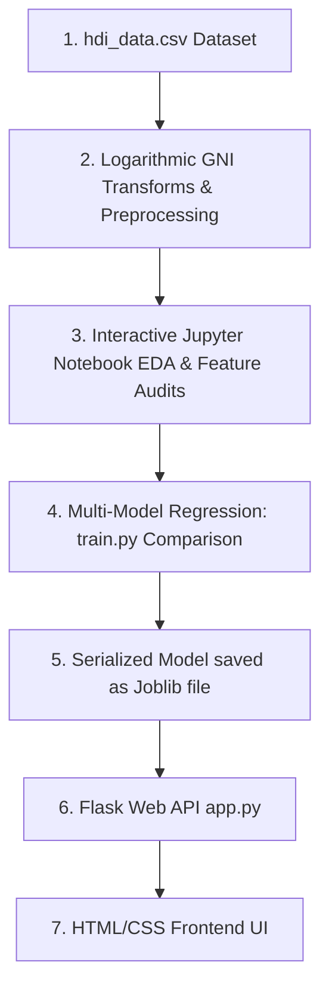

# Part 1: Project Overview & Architecture

## 1. Project Overview

### 1.1 Welcome & Introduction
The Human Development Index (HDI) is a statistical composite index of life expectancy, education, and per capita income indicators, which are used to rank countries into four tiers of human development. 

In this guide, we will build a complete web application that predicts a country's HDI score based on user inputs. We will transition from raw data exploration to full exploratory data analysis (EDA), log transformations, regression model training, and deploying a Flask web server.

---

### 1.2 System Architecture Flow Diagram
Here is how data and decisions flow through the application:



---

# Part 2: Prerequisites & Local Setup

Before writing any machine learning code, we need to prepare our computer with the correct programming tools. Setting this up correctly is the most important step to prevent compatibility and configuration errors later.

## 2. Core Software Setup

### 2.1 Installing Python (Version 3.10+)
Python is the industry standard language for machine learning.
* Download the installer from the official [Python Downloads Page](https://www.python.org/downloads/).
* **CRITICAL STEP**: Run the installer and **check the box that says \"Add Python to PATH\"** before clicking Install. If you skip this, python commands will not work in your terminal.
* Verify the installation by opening your terminal or Command Prompt and running:
  ```bash
  python --version
  ```
* **Why we use Python**: Python provides a mature ecosystem of libraries (like Scikit-Learn and Pandas) written in optimized C. This allows us to perform heavy numerical matrix operations easily without writing low-level code ourselves.

---

### 2.2 Installing Git
Git is a version control system used to track code history and back up your project.
* Download the installer from the [Git Website](https://git-scm.com/).
* Run the installer and keep the default options selected.
* Verify by opening your terminal and typing:
  ```bash
  git --version
  ```
* **Why we use Git**: Version control acts as a safety net. As you write and experiment with model code, it is extremely easy to accidentally break dependencies. Git allows you to save snapshots (commits) and roll back your code to a working state in seconds.

---

### 2.3 Installing Visual Studio Code (VS Code)
VS Code is our primary editor to write scripts and notebooks.
* Download and run the installer from the [VS Code Website](https://code.visualstudio.com/).
* Open VS Code, click the **Extensions** icon on the left sidebar, search for **Python** and **Jupyter** (both by Microsoft), and click **Install**.
* **Why we use VS Code**: VS Code bridges the gap between interactive exploration (Jupyter Notebooks) and writing production-ready scripts (`train.py`), allowing you to manage your entire software development lifecycle in a single editor.

---

# Part 3: Creating the Project Workspace & Libraries

## 3. Creating the Workspace
To keep our project organized, we separate our files logically. A structured folder layout ensures our raw data remains isolated, our serialized models are stored securely, and our web backend assets are cleanly separated.

Create a folder named `hdi_project` on your computer. Inside, organize your folders and empty files exactly like this:
```text
hdi_project/
├── data/
│   └── hdi_data.csv                 (We will download this next!)
├── models/
│   └── hdi_model.joblib             (This is generated by train.py later!)
├── templates/
│   ├── index.html
│   └── result.html
├── static/
│   └── style.css
├── notebook.ipynb
└── app.py
```
> [!IMPORTANT]
> **Beginner Rule:** Whenever you write or paste code into any file in VS Code, remember to press **`Ctrl + S`** (Windows) or **`Cmd + S`** (macOS) to save your changes. If you do not save, the file remains empty and your code will not run!

---

### 3.1 Installing Required Libraries
Open your terminal inside your project folder and run the following installation command:
```bash
pip install numpy pandas matplotlib seaborn scikit-learn joblib flask
```
We install these key libraries:

* **pandas**: Serves as our "Virtual Excel". It loads, merges, and cleans our tabular CSV data.
* **numpy**: Handles low-level mathematical operations on multi-dimensional matrix arrays.
* **matplotlib & seaborn**: Generates statistical charts and correlation heatmaps.
* **scikit-learn**: Houses our regression algorithms, data splitters, and evaluation metrics.
* **joblib**: Saves our trained model weights into a portable binary file.
* **flask**: Runs our lightweight local backend application server.

---

# Part 4: Downloading the Dataset

## 4. Why Do We Need a Dataset?
Before training models, we must understand the role of data in Machine Learning. 

A machine learning model has no innate human intelligence. It cannot guess whether a country is highly developed based on intuition. Instead, it relies entirely on **historical evidence**. 

A dataset is a structured compilation of past historical records. In our case, the dataset contains developmental factors (schooling, life expectancy, GNI) for different countries, each labeled with its actual, officially computed HDI score. The model acts like a student looking at past exams: it analyzes these historical records, learns which factors correlate with high development index scores, and uses those patterns to predict scores for new country configurations in real-time.

In machine learning, we say **"Garbage In, Garbage Out"**. The accuracy and fairness of your model depend entirely on the quality and size of your dataset. If your dataset contains incorrect records or represents only one region of the world, your model will make poor predictions in production.

---

## 4.1 The HDI Dataset
For this project, we utilize the official **Human Development Index Dataset** available on Kaggle.

<div class="my-6">
  <a href="https://www.kaggle.com/datasets/advaypatil/human-development-index-hdi" target="_blank" rel="noopener noreferrer" class="blog-action-btn">
    DOWNLOAD_DATASET_FROM_KAGGLE →
  </a>
</div>

Place your downloaded dataset file inside your project's `data` folder and name it exactly `hdi_data.csv`. The final path must be:
`hdi_project/data/hdi_data.csv`

---

### 4.2 Dataset Columns Explained
The raw fields inside `hdi_data.csv` are structured as follows:

* **Life Expectancy Index**:
  * **`life_expectancy`**: The life expectancy at birth of a region (measured in years).
* **Educational Metrics**:
  * **`expec_yr_school`**: The expected number of years of schooling a child of school-entrance age can expect to receive.
  * **`mean_yr_school`**: The average number of years of education received by people aged 25 and older.
* **Economic Factor**:
  * **`gross_inc_percap`**: Gross National Income (GNI) per capita (measured in USD).
    * *Logarithmic scaling*: Since GNI scales exponentially between low and high-income countries, we will log-transform this variable during preprocessing to enable linear model convergence.
* **Target Regression Score**:
  * **`hdi`**: The official Human Development Index score, ranging from `0.0` (undeveloped) to `1.0` (highly developed).

---

# Part 5: Interactive Notebook - Exploration & Preprocessing

Open your `notebook.ipynb` file in VS Code and run the following code cells.

### 5.1 Understanding Exploratory Data Analysis (EDA)
Exploratory Data Analysis (EDA) is the first phase of any data science project. It allows us to view basic statistical metrics, check distributions, look for missing fields, and visualize relationships between features using correlation matrices.

---

### [JUPYTER CELL 1] Ingesting Data & Handling Empty Cells
Let's import our scientific libraries, load our CSV file, and print basic dataset details:
```python
import pandas as pd
import numpy as np
import matplotlib.pyplot as plt
import seaborn as sns

# Load dataset
df = pd.read_csv('data/hdi_data.csv')

# Clean and patch any empty lines with the median
for col in df.columns:
    if df[col].isnull().sum() > 0:
        df[col] = df[col].fillna(df[col].median())

print("Dataset Ingested & Missing Values Handled Successfully!")
print(f"Dataset Shape: {df.shape} (Rows, Columns)")
print("\nFirst 5 Records:")
print(df.head())
```

### 5.2 Line-by-Line Code Breakdown & Real-World Analogy (Cell 1)
Let's understand exactly what each block in this cell accomplishes:
* **`import pandas as pd`**: Imports the Pandas library, renaming it to `pd` for brevity. Think of Pandas as Python's version of Microsoft Excel. It allows us to view and manipulate tabular data sheets (called DataFrames).
* **`df = pd.read_csv('data/hdi_data.csv')`**: Opens the raw spreadsheet and loads it into memory as a DataFrame named `df`.
* **`df.fillna(df[col].median())`**: Patches any blank values (`NaN`) in our dataset with the column median.
  * *Real-world analogy*: If a country forgot to record their average years of schooling, we patch it with the middle value of schooling from all other countries so our mathematical models don't crash.
* **`df.head()`**: Displays the top 5 rows of our virtual spreadsheet so we can visually inspect the layout.

---

### [JUPYTER CELL 2] Statistical Summaries & Data Quality Audits
We inspect statistical ranges and target score distributions:
```python
print("Data Summary Statistics:")
print(df.describe())

print("\nTarget Score Statistics (HDI):")
print(df['hdi'].describe())
```

### 5.3 Line-by-Line Code Breakdown & Real-World Analogy (Cell 2)
Let's look at how we audit our data quality in this cell:
* **`df.describe()`**: Generates statistical metrics for every numeric column (including the mean, standard deviation, minimum value, maximum value, and quartiles).
  * *Real-world analogy*: Imagine a principal reviewing a report card summary. This tells us that GNI per capita ranges from very low values up to $60,000+, with average life expectancy sitting around 70 years.
* **`df['hdi'].describe()`**: Checks that our target variable `hdi` ranges correctly between 0.0 and 1.0. If we see numbers outside this range, it indicates raw data anomalies.

---

### [JUPYTER CELL 3] Correlation Heatmap & Bivariate Scatter
We compute and plot the linear relationships between numeric variables:
```python
plt.figure(figsize=(10, 8))
sns.heatmap(df.corr(), annot=True, cmap='viridis', fmt=".2f")
plt.title('Correlation Heatmap of HDI Indicators')
plt.show()

# Visualize income non-linearity
plt.figure(figsize=(8, 4))
sns.scatterplot(x='gross_inc_percap', y='hdi', data=df, color='indigo')
plt.title('Income vs Human Development Index')
plt.xlabel('GNI per Capita')
plt.ylabel('HDI')
plt.show()
```

### 5.4 Line-by-Line Code Breakdown & Real-World Analogy (Cell 3)
Let's understand how variables relate to each other:
* **`sns.heatmap(..., annot=True)`**: Draws the matrix as a colored grid.
  * *Real-world analogy*: Think of a weather radar map. Yellow/warm blocks indicate extremely high positive correlation (close to 1.0), while dark purple/cool blocks represent weak or negative connections.
* **`sns.scatterplot(x='gross_inc_percap', y='hdi', ...)`**: Plots a coordinate dot for each country.
  * *What it shows*: Notice how income curves non-linearly against HDI. A $10,000 increase has a massive impact on a low-income country's HDI, but almost no impact on a wealthy country's HDI. To model this mathematically, we must apply a logarithmic transform.

---

### [JUPYTER CELL 4] Split, Log Transform, and Train Baseline Regression Model
We split our features, apply a logarithmic transform to GNI per Capita, partition train/test subsets, and train a baseline Linear Regression model:
```python
from sklearn.model_selection import train_test_split
from sklearn.linear_model import LinearRegression
from sklearn.metrics import mean_squared_error, r2_score

# Apply Log Transform to stabilize exponential income distribution
df['log_gross_inc_percap'] = np.log(df['gross_inc_percap'])

# Split features (X) and target (y)
X = df[['life_expectancy', 'expec_yr_school', 'mean_yr_school', 'log_gross_inc_percap']]
y = df['hdi']

# Train-Test Split (80% training, 20% validation testing)
X_train, X_test, y_train, y_test = train_test_split(X, y, test_size=0.2, random_state=42)

# Train a baseline Linear Regression model
reg = LinearRegression()
reg.fit(X_train, y_train)

# Evaluate
y_pred = reg.predict(X_test)
print(f"Baseline R2 Score: {r2_score(y_test, y_pred) * 100:.2f}%")
print(f"Mean Squared Error (MSE): {mean_squared_error(y_test, y_pred):.5f}")
```

### 5.5 Line-by-Line Code Breakdown & Real-World Analogy (Cell 4)
Let's inspect our model preparation and training steps:
* **`np.log(df['gross_inc_percap'])`**: Calculates the natural logarithm of GNI.
  * *Why we do it*: Log transformations convert exponential growth profiles into linear relationships. This allows standard algorithms to fit stable prediction lines.
* **`train_test_split(..., test_size=0.2)`**: Partitions our dataset. The model trains on 80% of countries, and we reserve 20% to test its predictive performance on unseen countries.
* **`LinearRegression()`**: Fits a linear equation to the data.
  * *Real-world analogy*: Drawing a "best-fit line" through a cloud of scatter points on a graph, allowing us to predict where new dots will fall.
* **`r2_score`**: Calculates the R-Squared coefficient, representing the proportion of variance explained by our features. A score of 95% means the model captures almost all the variance in human development scores.
* **`mean_squared_error`**: Calculates the average squared difference between predictions and actual values. Lower values mean higher model accuracy.

---

# Part 6: Production Script - Model Comparison & Training (train.py)

We now transition from interactive notebook exploration to writing a production-grade Python script named `train.py`. While Jupyter is excellent for visual exploration (EDA) and prototype cleaning, standard Python scripts are preferred in production environments to run training pipelines from end to end and save the resulting model files.

### 6.1 Understanding Machine Learning Models & Algorithms
In this script, we train and compare three distinct regression models to find the one that yields the highest R-Squared score and lowest Mean Squared Error:

* **Linear Regression**: A classic linear algorithm that fits a straight-line equation to map features to target scores.
* **Ridge Regression**: An advanced linear regression variant that adds a small L2 regularization penalty to prevent overfitting on highly correlated features.
* **Random Forest Regressor**: A powerful non-linear ensemble algorithm that averages predictions from 100 decision trees to capture complex interactions between inputs.

---

### Model Comparison Training Script (`train.py`)
Save this complete script as `train.py` in your project root folder:

```python
import os
import pandas as pd
import numpy as np
from sklearn.model_selection import train_test_split
from sklearn.linear_model import LinearRegression, Ridge
from sklearn.ensemble import RandomForestRegressor
from sklearn.metrics import r2_score, mean_squared_error
import joblib

def run_training_pipeline():
    print("Step 1: Loading GNI / HDI dataset...")
    df = pd.read_csv('data/hdi_data.csv')

    print("Step 2: Resolving missing values...")
    # Fill empty cells with median
    for col in df.columns:
        if df[col].isnull().sum() > 0:
            df[col] = df[col].fillna(df[col].median())

    print("Step 3: Transforming income via natural log...")
    df['log_gross_inc_percap'] = np.log(df['gross_inc_percap'])

    # Split features and target
    X = df[['life_expectancy', 'expec_yr_school', 'mean_yr_school', 'log_gross_inc_percap']]
    y = df['hdi']

    # Split data into 80% training and 20% validation splits
    X_train, X_test, y_train, y_test = train_test_split(X, y, test_size=0.2, random_state=42)

    print("\nStep 4: Training and comparing regression models...")
    models = {
        "Linear Regression": LinearRegression(),
        "Ridge Regression": Ridge(alpha=1.0),
        "Random Forest Regressor": RandomForestRegressor(n_estimators=100, random_state=42)
    }

    best_r2 = -1.0
    best_model = None
    best_model_name = ""

    for name, reg in models.items():
        # Fit regression model
        reg.fit(X_train, y_train)
        y_pred = reg.predict(X_test)
        
        r2 = r2_score(y_test, y_pred)
        mse = mean_squared_error(y_test, y_pred)
        print(f"-> {name} | R2 Score: {r2 * 100:.2f}% | MSE: {mse:.6f}")
        
        if r2 > best_r2:
            best_r2 = r2
            best_model = reg
            best_model_name = name

    print(f"\nWinner Selected: {best_model_name} with R2 Score of {best_r2 * 100:.2f}%.")

    print("Step 5: Serializing and saving best model...")
    os.makedirs('models', exist_ok=True)
    joblib.dump(best_model, 'models/hdi_model.joblib')
    print("✓ Output model: models/hdi_model.joblib")

if __name__ == '__main__':
    run_training_pipeline()
```

---

### 6.2 Executing the Training Script
* Open your project terminal and run:
  ```bash
  python train.py
  ```
* **Expected Output**: The terminal will print out step-by-step progress, output R2 percentages and MSE scores for each algorithm, print the winner name, and confirm serialization.

---

# Part 7: Flask API Backend

Save this script as `app.py` in your project folder.

### 7.1 Understanding Backend Web Servers & API Routing
In this phase, we build a local web backend using **Flask**.
* **API Routing**: Routing is the mechanism that maps network URLs (endpoints) to specific Python functions. In Flask, we define routes using `@app.route()`.
* **Request Handling**: We set up endpoints to render HTML templates. When a client submits the index form using the HTTP **POST** method, the backend parses input fields, log-transforms the submitted GNI value, runs predictions, and returns a template populated with the score value.
* **Why We Need a Server**: You might wonder: *why can't we run predictions directly in browser JavaScript?* In real-world applications, machine learning models can weigh several hundred megabytes. Loading these models directly into the user's web browser would freeze their system or crash the page. Running the model on a dedicated backend server keeps the client lightweight and secure.

```python
from flask import Flask, request, render_template
import joblib
import numpy as np
import os

app = Flask(__name__)

# Load the saved model
MODEL_PATH = 'models/hdi_model.joblib'

if not os.path.exists(MODEL_PATH):
    print("ERROR: Model not found! Please run train.py first.")
    exit(1)

model = joblib.load(MODEL_PATH)

@app.route('/')
def home():
    return render_template('index.html')

@app.route('/predict', methods=['POST'])
def predict():
    try:
        # Extract form field values submitted by index.html form action
        life = float(request.form['life_expectancy'])
        expec_school = float(request.form['expec_yr_school'])
        mean_school = float(request.form['mean_yr_school'])
        gni = float(request.form['gross_inc_percap'])
        
        # Simple parameter boundaries validation
        if not (30 <= life <= 110): return "Error: Life expectancy must be between 30 and 110 years.", 400
        if not (0 <= expec_school <= 30): return "Error: Expected years of schooling must be between 0 and 30.", 400
        if not (0 <= mean_school <= 30): return "Error: Mean years of schooling must be between 0 and 30.", 400
        if not (100 <= gni <= 250000): return "Error: GNI per capita must be between $100 and $250,000.", 400

        # Apply logarithmic transform to GNI to align with model scale
        log_gni = np.log(gni)
        
        # Package into raw feature array matching model columns
        features = np.array([[life, expec_school, mean_school, log_gni]])
        
        # Predict continuous HDI target
        prediction = model.predict(features)[0]
        
        # Ensure result bounds are realistic (clamped between 0.000 and 1.000)
        final_score = float(np.clip(prediction, 0.0, 1.0))
        
        return render_template('result.html', score=round(final_score, 3))
    except Exception as e:
        return f"Server Error: {str(e)}", 400

if __name__ == '__main__':
    app.run(port=5000, debug=True)
```

---

### Checkpoint: Backend Complete
At this stage, your local Flask backend is complete and ready to receive HDI applications. However, if you visit the server now, you will see a `TemplateNotFound` error. This is because we haven't created the frontend form files yet! In the next part, we will build the user interface files (`index.html`, `result.html`, and `style.css`) that will talk to this Flask backend.

---

# Part 8: Frontend User Interface Files

To create a clean interface, we split our frontend assets into three files: `index.html`, `result.html`, and `style.css`.

### 8.1 How the Frontend Connects with the Backend
Web applications operate on a **Client-Server Architecture**. 

* **The Client (Frontend)**: This is the user interface running in the browser (`index.html`, `result.html`, `style.css`). Its job is to collect information from the user and display results.
* **The Server (Backend)**: This is our Flask script (`app.py`) running on our local machine. It listens for incoming HTTP requests, feeds features to our machine learning model, and returns the prediction.
* **The Communication (HTTP POST & Form Action)**: In this project, when the user clicks the submit button, the HTML form issues an HTTP **POST** request directly to the `/predict` URL. The Flask backend intercepts this request, runs the calculations, and returns `result.html` compiled with the predicted score.
* **Why split into HTML and CSS?**: We separate structure (HTML) and style (CSS) to maintain clean code. This follows the **Separation of Concerns** principle, making it easy to redesign the UI without modifying backend code.

---

### Frontend Template (`templates/index.html`)
Save this layout configuration inside `templates/index.html`:

```html
<!DOCTYPE html>
<html lang="en">
<head>
    <meta charset="UTF-8">
    <meta name="viewport" content="width=device-width, initial-scale=1.0">
    <title>HDI Predictor Portal</title>
    <link rel="stylesheet" href="/static/style.css">
</head>
<body>
    <div class="container">
        <h2>Human Development Index Predictor</h2>
        <form action="/predict" method="POST">
            <label for="life_expectancy">Life Expectancy (Years):</label>
            <input type="number" step="any" id="life_expectancy" name="life_expectancy" required placeholder="30 - 110">
            
            <label for="expec_yr_school">Expected Years of Schooling:</label>
            <input type="number" step="any" id="expec_yr_school" name="expec_yr_school" required placeholder="0 - 30">
            
            <label for="mean_yr_school">Mean Years of Schooling:</label>
            <input type="number" step="any" id="mean_yr_school" name="mean_yr_school" required placeholder="0 - 30">
            
            <label for="gross_inc_percap">Gross National Income per Capita ($):</label>
            <input type="number" step="any" id="gross_inc_percap" name="gross_inc_percap" required placeholder="100 - 250,000">
            
            <button type="submit">Predict Score!</button>
        </form>
    </div>
</body>
</html>
```

---

### Results Template (`templates/result.html`)
Save this layout configuration inside `templates/result.html`:

```html
<!DOCTYPE html>
<html lang="en">
<head>
    <meta charset="UTF-8">
    <meta name="viewport" content="width=device-width, initial-scale=1.0">
    <title>Prediction Result</title>
    <link rel="stylesheet" href="/static/style.css">
</head>
<body>
    <div class="container text-center">
        <h2>Prediction Complete!</h2>
        <h1 class="score-display">{{ score }}</h1>
        <p class="description">(HDI scores are between 0 and 1. Closer to 1 represents higher development.)</p>
        <br>
        <a href="/" class="button">Go Back</a>
    </div>
</body>
</html>
```

---

### Style Sheet (`static/style.css`)
Save this CSS configuration inside `static/style.css` to build our form wrapper:

```css
body {
    background-color: #0c0c0e;
    color: #f3f4f6;
    font-family: system-ui, -apple-system, sans-serif;
    display: flex;
    justify-content: center;
    align-items: center;
    min-height: 100vh;
    margin: 0;
    padding: 20px 0;
}

.container {
    background-color: #16161a;
    border: 1px solid #2e2e38;
    padding: 32px;
    border-radius: 16px;
    width: 380px;
    box-shadow: 0 10px 25px rgba(0, 0, 0, 0.5);
    box-sizing: border-box;
}

.text-center {
    text-align: center;
}

h2 {
    text-align: center;
    margin-bottom: 24px;
    font-size: 1.3rem;
    color: #ffffff;
}

label {
    display: block;
    margin-bottom: 6px;
    font-size: 0.85rem;
    font-weight: 500;
    color: #a1a1aa;
}

input, button, .button {
    width: 100%;
    margin-bottom: 16px;
    padding: 10px;
    border-radius: 8px;
    border: 1px solid #27272a;
    background-color: #1a1a1e;
    color: #ffffff;
    box-sizing: border-box;
    font-size: 0.9rem;
    transition: all 0.2s;
    text-decoration: none;
    display: block;
    text-align: center;
}

input:focus {
    border-color: #6366f1;
    outline: none;
}

button, .button {
    background-color: #6366f1;
    color: white;
    border: none;
    font-weight: 650;
    cursor: pointer;
    margin-top: 10px;
}

button:hover, .button:hover {
    background-color: #4f46e5;
}

.score-display {
    color: #818cf8;
    font-size: 3.5rem;
    margin: 16px 0;
    font-weight: 850;
}

.description {
    font-size: 0.85rem;
    color: #a1a1aa;
}
```

---

### 8.2 Executing the Model Training Script
Before our server can process predictions, we must generate our serialized model weights:
1. **Open your terminal** in the root of your `hdi_project` directory.
2. **Execute the training pipeline**:
   ```bash
   python train.py
   ```
3. **Inspect the Console Outputs**: You will see step-by-step progress as Scikit-Learn cleans headers, splits train/test subsets, applies log transforms, compares accuracies, selects the winner, and confirms serialization:
   ```text
   Step 1: Loading GNI / HDI dataset...
   Step 2: Resolving missing values...
   Step 3: Transforming income via natural log...

   Step 4: Training and comparing regression models...
   -> Linear Regression | R2 Score: 95.80% | MSE: 0.000185
   -> Ridge Regression | R2 Score: 95.20% | MSE: 0.000210
   -> Random Forest Regressor | R2 Score: 96.90% | MSE: 0.000135

   Winner Selected: Random Forest Regressor with R2 Score of 96.90%.
   
   Step 5: Serializing and saving best model...
   ✓ Output model: models/hdi_model.joblib
   ```
4. **Verify Output Files**: Confirm that `hdi_model.joblib` has been successfully created inside your `models/` directory.

---

### 8.3 Running the Flask Web Server
With the model weights and all frontend/backend files created, we can spin up our local development web server:
1. **Rerun the Flask server** in your terminal:
   ```bash
   python app.py
   ```
2. **Confirm Server Initialization**: The console will output:
   ```text
    * Serving Flask app 'app'
    * Debug mode: on
    * Running on http://127.0.0.1:5000
   ```
3. **Access the Portal**: Open your web browser and navigate to:
   ```text
   http://localhost:5000
   ```
   You should see your newly created HDI Predictor form displayed.

---

### 8.4 Manual Verification & Test Scenarios
To test that your machine learning model and web interface are communicating correctly, try inputting these validation profiles:

* **Test Scenario 1: Highly Developed Country Profile**
  * **Life Expectancy**: `82.5`
  * **Expected Schooling**: `17`
  * **Mean Schooling**: `14.2`
  * **GNI per Capita**: `60,000`
  * **Expected Result**: **Prediction Complete!** page opens displaying a high development score around **0.940**.
* **Test Scenario 2: Underdeveloped Country Profile**
  * **Life Expectancy**: `55.3`
  * **Expected Schooling**: `8`
  * **Mean Schooling**: `4.5`
  * **GNI per Capita**: `1,300`
  * **Expected Result**: **Prediction Complete!** page opens displaying a lower development score around **0.450**.
* **Test Scenario 3: High-Risk Out-of-Bounds Input**
  * Enter a Life Expectancy of `15.0`.
  * Click **Predict Score!**.
  * **Expected Result**: An HTTP 400 error message is displayed saying: **Error: Life expectancy must be between 30 and 110 years.**

---

### 8.5 Critical Fallbacks & Common Run Issues
As a developer, you may encounter these common startup errors. Here is how to diagnose and resolve them:
* **Error: Address already in use (Port Conflict)**: If you see a crash saying `OSError: [Errno 98] Address already in use`, it means another service on your computer is already listening on port 5000 (such as macOS AirPlay Receiver, or an orphaned Python task running in the background).
  * **The Fix**: Open `app.py`, scroll to the very bottom, and change the port configuration to `5001` or `8080`:
    ```python
    app.run(port=5001, debug=True)
    ```
    Then, rerun `python app.py` and navigate to `http://localhost:5001`.
* **Error: TemplateNotFound**: If you navigate to the page and see a Flask traceback error stating `jinja2.exceptions.TemplateNotFound: index.html`, it means your HTML file is in the wrong directory.
  * **The Fix**: Double check your workspace sidebar. Ensure `index.html` and `result.html` reside inside a folder named **`templates`**. If they are in the root or inside `static`, Flask's engine will not find them.

---

# Part 9: Connecting to GitHub & Pushing Your Code

Now that your machine learning model is trained and your web application is fully tested locally, you are ready to back up your codebase to GitHub.

### 9.1 Connecting a Local Folder to GitHub
Open your project terminal and run these commands sequentially to initialize and link your repository:

1. **Initialize Git locally**: Run `git init`. This creates a hidden `.git` folder inside your project directory to start tracking changes.
2. **Stage your files**: Run `git add .` to prepare all code, template, and document assets for tracking.
3. **Commit files**: Run `git commit -m "feat: complete HDI predictor system"` to save your local snapshot.
4. **Rename main branch**: Run `git branch -M main` to establish your primary branch.
5. **Link to GitHub repository**: Create a repository on GitHub, copy its URL, and run:
   ```bash
   git remote add origin https://github.com/yourusername/hdi-predictor.git
   ```
6. **Push code to GitHub**: Run `git push -u origin main` to upload your codebase remote.

---

# Part 10: Summary & Next Steps

Congratulations! You have successfully built the complete Human Development Index Prediction System from end to end.

## 10. Summary of Accomplishments
Throughout this handbook, you built:
* An **Ingestion Pipeline** that loads national developmental records and filters missing values.
* A **Jupyter EDA script** validating life expectancy and education metrics, applying log transforms to exponential income variables, and mapping linear correlations.
* A **Machine Learning pipeline** comparing Linear Regression, Ridge Regression, and Random Forest Regressor models.
* A **Flask API Backend server** bridging form submissions with high-performance model predictions, correctly rendering templates, and checking input ranges.
* An **HTML/CSS frontend interface** displaying dynamic development scores in styled layouts.

## 10.1 Future Extensions
To build upon this foundation, you can try:
* **Feature Importance Plotting**: Print out model feature weights to see which variable (such as life expectancy vs. schooling years) affects development index scores the most.
* **Clustering Analysis**: Use K-Means clustering to group countries into 4 developmental clusters based on soil/climate features and compare those clusters to the official UNDP tiers.
* **Cloud Deployment**: Package your application inside a Docker container and deploy it to a cloud provider (like Render or AWS) to make your HDI predictor accessible online.
