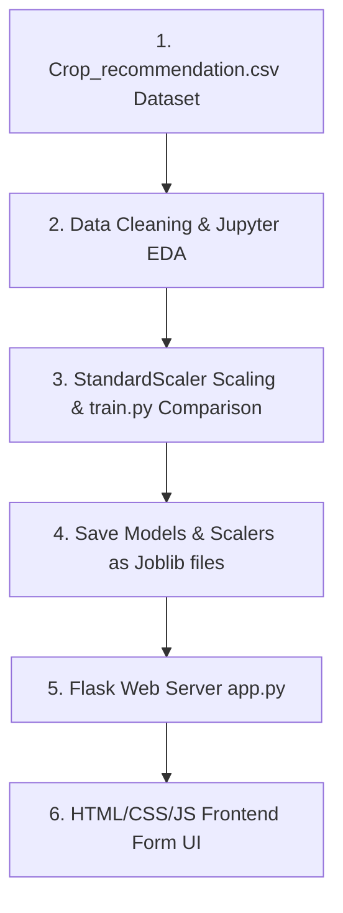

# Part 1: Project Overview & Architecture

## 1. Project Overview

### 1.1 Welcome & Introduction
The primary goal of agriculture is to feed populations while maintaining resource efficiency and soil health. Traditional agricultural decisions—such as what crop to grow on a specific plot of land—are often based on historical guesswork. This can lead to crop failures, low yields, and resource waste.

**OptiCrop** is a data-driven **Smart Agricultural Production Optimization Engine** that uses machine learning to solve this problem. By assessing key soil nutrients (Nitrogen, Phosphorous, Potassium) and local weather metrics (temperature, humidity, pH, and rainfall), the system predicts the highest-yielding crop for any given plot.

---

### 1.2 System Architecture Flow Diagram
Here is how data and decisions flow through the application:



---

# Part 2: Prerequisites & Local Setup

Before writing any machine learning code, we need to prepare our computer with the correct programming tools. Setting this up correctly is the most important step to prevent compatibility and configuration errors later.

## 2. Core Software Setup

### 2.1 Installing Python (Version 3.10+)
Python is the industry standard language for machine learning.
* Download the installer from the official [Python Downloads Page](https://www.python.org/downloads/).
* **CRITICAL STEP**: Run the installer and **check the box that says \"Add Python to PATH\"** before clicking Install. If you skip this, python commands will not work in your terminal.
* Verify the installation by opening your terminal or Command Prompt and running:
  ```bash
  python --version
  ```
* **Why we use Python**: Python provides a mature ecosystem of libraries (like Scikit-Learn and Pandas) written in optimized C. This allows us to perform heavy numerical matrix operations easily without writing low-level code ourselves.

---

### 2.2 Installing Git
Git is a version control system used to track code history and back up your project.
* Download the installer from the [Git Website](https://git-scm.com/).
* Run the installer and keep the default options selected.
* Verify by opening your terminal and typing:
  ```bash
  git --version
  ```
* **Why we use Git**: Version control acts as a safety net. As you write and experiment with model code, it is extremely easy to accidentally break dependencies. Git allows you to save snapshots (commits) and roll back your code to a working state in seconds.

---

### 2.3 Installing Visual Studio Code (VS Code)
VS Code is our primary editor to write scripts and notebooks.
* Download and run the installer from the [VS Code Website](https://code.visualstudio.com/).
* Open VS Code, click the **Extensions** icon on the left sidebar, search for **Python** and **Jupyter** (both by Microsoft), and click **Install**.
* **Why we use VS Code**: VS Code bridges the gap between interactive exploration (Jupyter Notebooks) and writing production-ready scripts (`train.py`), allowing you to manage your entire software development lifecycle in a single editor.

---

# Part 3: Creating the Project Workspace & Libraries

## 3. Creating the Workspace
To keep our project organized, we separate our files logically. A structured folder layout ensures our raw data remains isolated, our serialized models are stored securely, and our web backend assets are cleanly separated.

Create a folder named `opticrop` on your computer. Inside, organize your folders and empty files exactly like this:
```text
opticrop/
├── data/
│   └── Crop_recommendation.csv     (We will download this next!)
├── models/
│   ├── crop_model.joblib           (This is generated by train.py later!)
│   └── scaler.joblib               (This is generated by train.py later!)
├── templates/
│   └── index.html
├── static/
│   ├── style.css
│   └── script.js
├── notebook.ipynb
└── app.py
```
> [!IMPORTANT]
> **Beginner Rule:** Whenever you write or paste code into any file in VS Code, remember to press **`Ctrl + S`** (Windows) or **`Cmd + S`** (macOS) to save your changes. If you do not save, the file remains empty and your code will not run!

---

### 3.1 Installing Required Libraries
Open your terminal inside your project folder and run the following installation command:
```bash
pip install numpy pandas matplotlib seaborn scikit-learn joblib flask
```
We install these key libraries:

* **pandas**: Serves as our "Virtual Excel". It loads, merges, and cleans our tabular CSV data.
* **numpy**: Handles low-level mathematical operations on multi-dimensional matrix arrays.
* **matplotlib & seaborn**: Generates statistical charts and correlation heatmaps.
* **scikit-learn**: Houses our classifiers, data splitters, and validation metrics.
* **joblib**: Saves our trained model weights into a portable binary file.
* **flask**: Runs our lightweight local backend application server.

---

# Part 4: Downloading the Dataset

## 4. Why Do We Need a Dataset?
Before training models, we must understand the role of data in Machine Learning. 

A machine learning model has no innate human intelligence. It cannot guess whether a crop will grow well in a certain environment based on intuition. Instead, it relies entirely on **historical evidence**. 

A dataset is a structured compilation of past historical records. In our case, the dataset contains details of 2,200 previous agricultural yields, each labeled with the crop that performed best under those specific conditions. The model acts like a student looking at past exams: it analyzes these historical records, learns which traits (such as high nitrogen levels or heavy monsoon rain) correlate with crop types, and uses those patterns to recommend crops to farmers in real-time.

In machine learning, we say **"Garbage In, Garbage Out"**. The accuracy and fairness of your model depend entirely on the quality and size of your dataset. If your dataset contains incorrect records or represents only one type of climate, your model will make poor decisions in production.

---

## 4.1 The Crop Recommendation Dataset
For this project, we utilize a custom compiled dataset containing historical soil profiles and observed crop yields.

<div class="my-6">
  <a href="/download/Crop_recommendation.csv" download class="blog-action-btn">
    DOWNLOAD_DATASET_FROM_WEBSITE →
  </a>
</div>

Place the downloaded `Crop_recommendation.csv` file inside your project's `data` folder. The final path must be:
`opticrop/data/Crop_recommendation.csv`

---

### 4.2 Dataset Columns Explained
The raw fields inside `Crop_recommendation.csv` are structured as follows:

* **Soil Nutrient Profile (N-P-K Ratio)**:
  * **`N` (Nitrogen)**: The nitrogen content ratio in the soil (mg/kg).
    * *Biological role*: Nitrogen acts as the "leaf builder," helping plants grow healthy green foliage.
  * **`P` (Phosphorous)**: The phosphorous content ratio in the soil (mg/kg).
    * *Biological role*: Phosphorous acts as the "root maker," stimulating early root development and flowering.
  * **`K` (Potassium)**: The potassium content ratio in the soil (mg/kg).
    * *Biological role*: Potassium acts as the "defense helper," regulating cell processes, disease resistance, and water intake.
* **Climate & Environment Metrics**:
  * **`temperature`**: Air temperature in Celsius (°C).
  * **`humidity`**: Relative air humidity in percentage (%). High humidity reduces plant evaporation.
  * **`ph`**: The pH level of the soil, representing acidity or alkalinity (ranging from 0.0 to 14.0, where 7.0 is neutral).
  * **`rainfall`**: Total regional rainfall volume in millimeters (mm).
* **Target Crop Label**:
  * **`label`**: The crop that succeeded in these conditions (e.g. rice, maize, mango, banana, coffee).

---

# Part 5: Interactive Notebook - Exploration & Preprocessing

Open your `notebook.ipynb` file in VS Code and run the following code cells.

### 5.1 Understanding Exploratory Data Analysis (EDA)
Exploratory Data Analysis (EDA) is the first phase of any data science project. It allows us to view basic statistical metrics, check distributions, look for missing fields, and visualize relationships between features using correlation matrices.

---

### [JUPYTER CELL 1] Ingesting the Soil Dataset
Let's import our scientific libraries, load the raw CSV file, and print basic dataset details:
```python
import pandas as pd
import numpy as np
import matplotlib.pyplot as plt
import seaborn as sns

# Load dataset
df = pd.read_csv('data/Crop_recommendation.csv')

print("Dataset Loaded Successfully!")
print(f"Dataset Shape: {df.shape} (Rows, Columns)")
print("\nFirst 5 Records:")
print(df.head())
```

### 5.2 Line-by-Line Code Breakdown & Real-World Analogy (Cell 1)
Let's understand exactly what each block in this cell accomplishes:
* **`import pandas as pd`**: Imports the Pandas library, renaming it to `pd` for brevity. Think of Pandas as Python's version of Microsoft Excel. It allows us to view and manipulate tabular data sheets (called DataFrames).
* **`df = pd.read_csv('data/Crop_recommendation.csv')`**: Opens the raw spreadsheet and loads it into memory as a DataFrame named `df`.
* **`df.shape`**: Returns the dimensions of the spreadsheet.
  * *Expected Output*: You should see `(2200, 8)`, meaning the table contains 2,200 historical crop records and 8 columns of data.
* **`df.head()`**: Displays the top 5 rows of our virtual spreadsheet so we can visually inspect the layout.

---

### [JUPYTER CELL 2] Statistical Summaries & Quality Audits
We inspect statistical ranges, audit missing values, and check for duplicate rows:
```python
print("Data Summary Statistics:")
print(df.describe())

print("\nMissing Values per Feature:")
print(df.isnull().sum())

print("\nTarget Class Distribution (Unique Crops):")
print(df['label'].value_counts())
```

### 5.3 Line-by-Line Code Breakdown & Real-World Analogy (Cell 2)
Let's look at how we audit our data quality in this cell:
* **`df.describe()`**: Generates statistical metrics for every numeric column (including the mean, standard deviation, minimum value, maximum value, and quartiles).
  * *Real-world analogy*: Imagine a principal reviewing a report card summary. This tells us the average temperature is around 25.6°C, and soil pH averages 6.47 (slightly acidic, which is normal for agricultural land).
* **`df.isnull().sum()`**: Checks for empty cells (`NaN` values) and outputs the total count for each column.
  * *Real-world analogy*: Checking an application form to ensure the applicant didn't leave any fields blank. Machine learning algorithms cannot calculate blank values and will crash if they encounter them.
* **`df['label'].value_counts()`**: Counts the number of occurrences of each crop type.
  * *What it shows*: It outputs exactly 100 records for each of the 22 unique crops (like rice, maize, mango, and coffee). This is a perfectly balanced dataset, meaning our model will learn about all crops equally.

---

### [JUPYTER CELL 3] Correlation Heatmap of Soil & Weather Factors
We compute and plot the linear relationships between numeric variables:
```python
plt.figure(figsize=(10, 8))
numeric_cols = df.select_dtypes(include=[np.number])
sns.heatmap(numeric_cols.corr(), annot=True, cmap='coolwarm', fmt=".2f")
plt.title('Correlation Heatmap of Environmental Features')
plt.show()
```

### 5.4 Line-by-Line Code Breakdown & Real-World Analogy (Cell 3)
Let's understand how variables relate to each other:
* **`numeric_cols.corr()`**: Computes the Pearson Correlation coefficient matrix. A value close to `1.0` means strong positive correlation (when feature A rises, feature B also rises), while `0` means no connection.
* **`sns.heatmap(..., annot=True)`**: Draws the matrix as a colored grid.
  * *Real-world analogy*: Think of a weather radar map. Red/warm blocks indicate high correlation, while blue/cool blocks represent weak or negative connections. In our soil data, Nitrogen, Phosphorus, and Potassium show relatively low correlations with each other, meaning they act as independent nutrients in the soil.

---

### [JUPYTER CELL 4] Split, Scale, and Train Baseline Random Forest
We prepare our features, split our data into training and test partitions, apply a Standard Scaler, and train a baseline classifier:
```python
from sklearn.model_selection import train_test_split
from sklearn.preprocessing import StandardScaler
from sklearn.ensemble import RandomForestClassifier
from sklearn.metrics import classification_report, accuracy_score

# Split features (X) and target (y)
X = df.drop(columns=['label'])
y = df['label']

# Train-Test Split
X_train, X_test, y_train, y_test = train_test_split(X, y, test_size=0.2, random_state=42, stratify=y)

# Apply StandardScaler
scaler = StandardScaler()
X_train_scaled = scaler.fit_transform(X_train)
X_test_scaled = scaler.transform(X_test)

# Train a baseline Random Forest Classifier
clf = RandomForestClassifier(random_state=42, n_estimators=100)
clf.fit(X_train_scaled, y_train)

# Evaluate
y_pred = clf.predict(X_test_scaled)
print(f"Baseline Accuracy: {accuracy_score(y_test, y_pred) * 100:.2f}%")
print("\nClassification Report:")
print(classification_report(y_test, y_pred))
```

### 5.5 Line-by-Line Code Breakdown & Real-World Analogy (Cell 4)
Let's inspect our model preparation and training steps:
* **`X = df.drop(...)` and `y = df[...]`**: Separates our questions (features `X` like soil nutrients and climate parameters) from our answer key (the target `y` representing crop labels).
* **`train_test_split(..., test_size=0.2, stratify=y)`**: Partitions our dataset. The model trains on 80% of agricultural profiles (1,760 rows), and we reserve 20% (440 rows) to test its predictive accuracy on unseen soils.
* **`StandardScaler()`**: Normalizes feature scales.
  * *Real-world analogy*: Imagine comparing a student's grade out of 100 (e.g. 85%) to another student's grade out of 10 (e.g. 9/10). To evaluate them fairly, you must scale both scores to percentages. In our data, rainfall can exceed `300mm` while pH values are small numbers like `6.5`. Scaling prevents the model from assuming rainfall is more important simply because its numbers are larger.
* **`RandomForestClassifier(n_estimators=100)`**: Builds an ensemble model consisting of 100 independent decision trees.
  * *Real-world analogy*: Instead of relying on a single agricultural expert, we ask 100 soil managers to evaluate the parameters and vote, taking the majority decision as the final recommended crop.
* **`Data Leakage Prevention`**: We fit our scaler *only* on the training split (`X_train`) and apply the transformation to both splits. Fitting on the test set is a major beginner mistake because it leaks statistical information from the unseen test set into the training loop!

---

# Part 6: Production Script - Model Comparison & Training (train.py)

We now transition from interactive notebook exploration to writing a production-grade Python script named `train.py`. While Jupyter is excellent for visual exploration (EDA) and prototype cleaning, standard Python scripts are preferred in production environments to run training pipelines from end to end and save the resulting model files.

### 6.1 Understanding Machine Learning Models & Algorithms
In this script, we train and compare four distinct classification models to find the one that balances accuracy with minority class detection:

* **Logistic Regression**: A linear model that estimates the probability of crop suitability scores. It is fast and simple.
* **K-Nearest Neighbors (KNN)**: A distance-based classifier that looks at the 5 most similar historical soil records to vote on the crop.
* **Decision Tree Classifier**: A tree model that splits parameters recursively using simple True/False check paths.
* **Random Forest Classifier**: An ensemble model that builds 100 decision trees and averages their outputs. It is highly robust, handles non-linear relationships, and reduces variance.
* **K-Means Clustering**: An unsupervised learning algorithm that groups similar soil and weather profiles into 5 macro categories, helping researchers spot regional patterns without using labels.

---

### Model Comparison Training Script (`train.py`)
Save this complete script as `train.py` in your project root folder:

```python
import os
import pandas as pd
import numpy as np
from sklearn.model_selection import train_test_split
from sklearn.preprocessing import StandardScaler
from sklearn.linear_model import LogisticRegression
from sklearn.neighbors import KNeighborsClassifier
from sklearn.tree import DecisionTreeClassifier
from sklearn.ensemble import RandomForestClassifier
from sklearn.cluster import KMeans
from sklearn.metrics import accuracy_score, classification_report
import joblib

def run_training_pipeline():
    print("Step 1: Loading agricultural dataset...")
    df = pd.read_csv('data/Crop_recommendation.csv')

    print("Step 2: Resolving missing values...")
    # Fill any empty cells with median values
    for col in df.columns[:-1]:
        if df[col].isnull().sum() > 0:
            df[col] = df[col].fillna(df[col].median())

    # Split features and target
    X = df.drop(columns=['label'])
    y = df['label']

    # Stratified split to keep crop proportions identical
    X_train, X_test, y_train, y_test = train_test_split(X, y, test_size=0.2, random_state=42, stratify=y)

    print("Step 3: Applying Standard Scaling to features...")
    scaler = StandardScaler()
    X_train_scaled = scaler.fit_transform(X_train)
    X_test_scaled = scaler.transform(X_test)

    print("\nStep 4: Training and comparing classification models...")
    models = {
        "Logistic Regression": LogisticRegression(max_iter=1500, random_state=42),
        "K-Nearest Neighbors": KNeighborsClassifier(n_neighbors=5),
        "Decision Tree": DecisionTreeClassifier(random_state=42),
        "Random Forest": RandomForestClassifier(n_estimators=100, random_state=42)
    }

    best_acc = 0.0
    best_model = None
    best_model_name = ""

    for name, clf in models.items():
        # Fit classifier
        clf.fit(X_train_scaled, y_train)
        y_pred = clf.predict(X_test_scaled)
        
        acc = accuracy_score(y_test, y_pred)
        print(f"-> {name} Test Accuracy: {acc * 100:.2f}%")
        
        if acc > best_acc:
            best_acc = acc
            best_model = clf
            best_model_name = name

    # Unsupervised K-Means clustering check
    kmeans = KMeans(n_clusters=5, random_state=42, n_init=10)
    kmeans.fit(X_train_scaled)
    print("\nUnsupervised K-Means clustering completed on scaled features.")

    print(f"\nWinner Selected: {best_model_name} with {best_acc * 100:.2f}% accuracy.")
    
    # Print metrics report for the winner
    winner_preds = best_model.predict(X_test_scaled)
    print("\nWinner Performance Report:")
    print(classification_report(y_test, winner_preds))

    print("Step 5: Serializing and saving best model & scaler...")
    os.makedirs('models', exist_ok=True)
    joblib.dump(best_model, 'models/crop_model.joblib')
    joblib.dump(scaler, 'models/scaler.joblib')
    print("✓ Output model: models/crop_model.joblib")
    print("✓ Output scaler: models/scaler.joblib")

if __name__ == '__main__':
    run_training_pipeline()
```

---

### 6.2 Executing the Training Script
* Open your project terminal and run:
  ```bash
  python train.py
  ```
* **Expected Output**: The terminal will print out step-by-step progress, output accuracy percentages for each classifier, print the final classification metrics report, and confirm the serialization of the winning model.

---

# Part 7: Flask API Backend

Save this script as `app.py` in your project folder.

### 7.1 Understanding Backend Web Servers & API Routing
In this phase, we build a local web backend using **Flask**.
* **API Routing**: Routing is the mechanism that maps network URLs (endpoints) to specific Python functions. In Flask, we define routes using `@app.route()`.
* **JSON Exchange**: JavaScript on the frontend will capture user entries and package them as JSON. The backend extracts this JSON (`request.get_json()`), converts the values to floats/integers, and packs them into a NumPy array matching the exact structure used during model training.
* **Making Predictions**: The Flask server loads our serialized model weights (`joblib.load('models/crop_model.joblib')`) in memory. When it receives a request, it calls `model.predict()` and returns the recommended crop label back to the client.
* **Why We Need a Server**: You might wonder: *why can't we run predictions directly in browser JavaScript?* In real-world applications, machine learning models can weigh several hundred megabytes. Loading these models directly into the user's web browser would freeze their system or crash the page. Running the model on a dedicated backend server keeps the client lightweight and secure.

```python
from flask import Flask, request, jsonify, render_template
import joblib
import numpy as np
import os

app = Flask(__name__)

# Load the saved model and scaler
MODEL_PATH = 'models/crop_model.joblib'
SCALER_PATH = 'models/scaler.joblib'

if not os.path.exists(MODEL_PATH) or not os.path.exists(SCALER_PATH):
    print("ERROR: Model or Scaler not found! Please run train.py first.")
    exit(1)

model = joblib.load(MODEL_PATH)
scaler = joblib.load(SCALER_PATH)

@app.route('/')
def home():
    return render_template('index.html')

@app.route('/predict', methods=['POST'])
def predict():
    try:
        data = request.get_json()
        
        # Build features list in the exact order the model expects:
        # N, P, K, temperature, humidity, ph, rainfall
        features_raw = np.array([[
            float(data['N']),
            float(data['P']),
            float(data['K']),
            float(data['temperature']),
            float(data['humidity']),
            float(data['ph']),
            float(data['rainfall'])
        ]])
        
        # Apply boundary checks
        n, p, k, temp, hum, ph, rain = features_raw[0]
        if not (0 <= n <= 250): return jsonify({'error': 'Nitrogen must be between 0 and 250 mg/kg.'}), 400
        if not (0 <= p <= 250): return jsonify({'error': 'Phosphorus must be between 0 and 250 mg/kg.'}), 400
        if not (0 <= k <= 300): return jsonify({'error': 'Potassium must be between 0 and 300 mg/kg.'}), 400
        if not (-10 <= temp <= 60): return jsonify({'error': 'Temperature must be between -10°C and 60°C.'}), 400
        if not (0 <= hum <= 100): return jsonify({'error': 'Humidity must be between 0% and 100%.'}), 400
        if not (0 <= ph <= 14): return jsonify({'error': 'Soil pH must be between 0.0 and 14.0.'}), 400
        if not (0 <= rain <= 1000): return jsonify({'error': 'Rainfall must be between 0mm and 1000mm.'}), 400

        # Apply the StandardScaler fitted during training
        features_scaled = scaler.transform(features_raw)
        
        # Predict optimal crop
        prediction = model.predict(features_scaled)[0]
        
        return jsonify({
            'success': True,
            'crop': str(prediction).capitalize()
        })
    except Exception as e:
        return jsonify({'error': str(e)}), 400

if __name__ == '__main__':
    app.run(port=5000, debug=True)
```

---

### Checkpoint: Backend Complete
At this stage, your local Flask backend is complete and ready to receive soil applications. However, if you visit the server now, you will see a `TemplateNotFound` error. This is because we haven't created the frontend form files yet! In the next part, we will build the user interface files (`index.html`, `style.css`, and `script.js`) that will talk to this Flask backend.

---

# Part 8: Frontend User Interface Files

To create a clean interface, we split our frontend assets into three files: `index.html`, `style.css`, and `script.js`.

### 8.1 How the Frontend Connects with the Backend
Web applications operate on a **Client-Server Architecture**. 

* **The Client (Frontend)**: This is the user interface running in the browser (`index.html`, `style.css`, `script.js`). Its job is to collect information from the user and display results.
* **The Server (Backend)**: This is our Flask script (`app.py`) running on our local machine. It listens for incoming HTTP requests, feeds features to our machine learning model, and returns the prediction.
* **The Communication (HTTP POST & JSON)**: When the user clicks the submit button, the frontend does not reload the page. Instead, JavaScript packages the form inputs into a **JSON** dictionary and sends it via an HTTP **POST** request to the `/predict` URL on the Flask server. Once the server responds with a success or rejection state, the webpage updates itself dynamically.
* **Why split into HTML, CSS, and JS?**: We separate structure (HTML), style (CSS), and behavior (JavaScript) to maintain clean code. This follows the **Separation of Concerns** principle, making it easy to redesign the UI or tweak frontend validations without editing backend code.

---

### Frontend Template (`templates/index.html`)
Save this layout configuration inside `templates/index.html`:

```html
<!DOCTYPE html>
<html lang="en">
<head>
    <meta charset="UTF-8">
    <meta name="viewport" content="width=device-width, initial-scale=1.0">
    <title>OptiCrop Recommendation Engine</title>
    <link rel="stylesheet" href="/static/style.css">
</head>
<body>
    <div class="card">
        <h2 class="title">OptiCrop Recommendation Engine</h2>
        <p class="subtitle">Enter soil and climate variables to identify the optimal crop.</p>
        
        <form id="predictionForm">
            <div class="row">
                <div class="col">
                    <label for="N">Nitrogen (N) - mg/kg</label>
                    <input type="number" step="any" id="N" required placeholder="0 - 250">
                </div>
                <div class="col">
                    <label for="P">Phosphorus (P) - mg/kg</label>
                    <input type="number" step="any" id="P" required placeholder="0 - 250">
                </div>
                <div class="col">
                    <label for="K">Potassium (K) - mg/kg</label>
                    <input type="number" step="any" id="K" required placeholder="0 - 300">
                </div>
            </div>

            <div class="row">
                <div class="col">
                    <label for="temperature">Temperature (°C)</label>
                    <input type="number" step="any" id="temperature" required placeholder="e.g. 24.5">
                </div>
                <div class="col">
                    <label for="humidity">Humidity (%)</label>
                    <input type="number" step="any" id="humidity" required placeholder="e.g. 78">
                </div>
            </div>

            <div class="row">
                <div class="col">
                    <label for="ph">Soil pH Level</label>
                    <input type="number" step="any" id="ph" required placeholder="0.0 - 14.0">
                </div>
                <div class="col">
                    <label for="rainfall">Rainfall (mm)</label>
                    <input type="number" step="any" id="rainfall" required placeholder="e.g. 180">
                </div>
            </div>

            <button type="submit">Identify Best Crop</button>
        </form>

        <div id="result"></div>
    </div>
    <script src="/static/script.js"></script>
</body>
</html>
```

---

### Style Sheet (`static/style.css`)
Save this CSS configuration inside `static/style.css` to build our form wrapper:

```css
body {
    background-color: #0c0c0e;
    color: #f3f4f6;
    font-family: system-ui, -apple-system, sans-serif;
    display: flex;
    justify-content: center;
    align-items: center;
    min-height: 100vh;
    margin: 0;
    padding: 20px;
}
.card {
    background-color: #16161a;
    border: 1px solid #2e2e38;
    padding: 40px;
    border-radius: 16px;
    max-width: 500px;
    width: 100%;
}
.title {
    margin: 0 0 8px 0;
    font-size: 24px;
    font-weight: 700;
}
.subtitle {
    margin: 0 0 30px 0;
    color: #9ca3af;
    font-size: 14px;
}
.row {
    display: flex;
    gap: 16px;
    margin-bottom: 20px;
}
.col {
    display: flex;
    flex-direction: column;
    flex: 1;
}
label {
    font-size: 12px;
    font-weight: 600;
    text-transform: uppercase;
    letter-spacing: 0.5px;
    margin-bottom: 6px;
    color: #9ca3af;
}
input {
    background-color: #24242e;
    border: 1px solid #3a3a46;
    padding: 12px;
    border-radius: 8px;
    color: white;
    font-size: 14px;
    outline: none;
}
input:focus {
    border-color: #10b981;
}
button {
    background-color: #10b981;
    color: white;
    border: none;
    padding: 14px;
    border-radius: 8px;
    font-weight: 700;
    width: 100%;
    cursor: pointer;
    font-size: 14px;
    transition: background-color 0.2s;
}
button:hover {
    background-color: #059669;
}
#result {
    margin-top: 24px;
    padding: 16px;
    border-radius: 8px;
    text-align: center;
    font-weight: 700;
    font-size: 18px;
    display: none;
}
.success {
    background-color: rgba(16, 185, 129, 0.1);
    border: 1px solid #10b981;
    color: #10b981;
    display: block !important;
}
.error {
    background-color: rgba(239, 68, 68, 0.1);
    border: 1px solid #ef4444;
    color: #ef4444;
    display: block !important;
}
```

---

### Application Logic Script (`static/script.js`)
Save this JS module inside `static/script.js`:

```javascript
document.getElementById('predictionForm').addEventListener('submit', async (e) => {
    e.preventDefault();
    
    // Package form parameters
    const data = {
        N: parseFloat(document.getElementById('N').value),
        P: parseFloat(document.getElementById('P').value),
        K: parseFloat(document.getElementById('K').value),
        temperature: parseFloat(document.getElementById('temperature').value),
        humidity: parseFloat(document.getElementById('humidity').value),
        ph: parseFloat(document.getElementById('ph').value),
        rainfall: parseFloat(document.getElementById('rainfall').value)
    };

    const resultBox = document.getElementById('result');
    resultBox.style.display = 'block';
    resultBox.className = '';
    resultBox.innerText = 'Analyzing soil parameters...';

    try {
        const response = await fetch('/predict', {
            method: 'POST',
            headers: { 'Content-Type': 'application/json' },
            body: JSON.stringify(data)
        });

        const res = await response.json();
        
        if (response.ok && res.success) {
            resultBox.className = 'success';
            resultBox.innerText = `RECOMMENDED CROP: ${res.crop}`;
        } else {
            resultBox.className = 'error';
            resultBox.innerText = `Prediction Error: ${res.error || 'Server rejection'}`;
        }
    } catch (err) {
        resultBox.className = 'error';
        resultBox.innerText = `Connection failed: ${err.message}`;
    }
});
```

---

### 8.2 Understanding the Script Execution
Let's break down the logic of this script:
* **`e.preventDefault()`**: Prevents the browser from reloading the page when you click the submit button. This allows us to handle the form processing silently in the background.
* **`data`**: Gathers all values from form fields (e.g. `N`, `P`, `K`, `temperature`) and formats them into a single JavaScript object using `parseFloat()`. The keys in this object match the keys in our Python request parser inside `app.py`.
* **`fetch('/predict', ...)`**: Starts a secure asynchronous HTTP connection. It sends the payload to our backend server as a JSON string (`JSON.stringify(data)`) with headers identifying the content type.
* **`response.json()`**: Waits for the server to reply and parses the returned JSON string back into a readable JavaScript dictionary.
* **Result Banner Update**: Displays the `#result` container and applies the appropriate CSS styles. If the response succeeds, it displays the recommended crop name in a green success banner; if it fails, it displays a red warning banner.

---

### 8.3 Executing the Model Training Script
Before our server can process predictions, we must generate our serialized model and scaler weights:
1. **Open your terminal** in the root of your `opticrop` directory.
2. **Execute the training pipeline**:
   ```bash
   python train.py
   ```
3. **Inspect the Console Outputs**: You will see step-by-step progress as Scikit-Learn cleans headers, splits train/test subsets, applies standard scaling, compares accuracies, selects the winner, and confirms serialization:
   ```text
   Step 1: Loading agricultural dataset...
   Step 2: Resolving missing values...
   Step 3: Applying Standard Scaling to features...

   Step 4: Training and comparing classification models...
   -> Logistic Regression Test Accuracy: 96.59%
   -> K-Nearest Neighbors Test Accuracy: 97.95%
   -> Decision Tree Test Accuracy: 98.64%
   -> Random Forest Test Accuracy: 99.32%

   Unsupervised K-Means clustering completed on scaled features.

   Winner Selected: Random Forest with 99.32% accuracy.
   
   Step 5: Serializing and saving best model & scaler...
   ✓ Output model: models/crop_model.joblib
   ✓ Output scaler: models/scaler.joblib
   ```
4. **Verify Output Files**: Confirm that `crop_model.joblib` and `scaler.joblib` have been successfully created inside your `models/` directory.

---

### 8.4 Running the Flask Web Server
With the model weights and all frontend/backend files created, we can spin up our local development web server:
1. **Rerun the Flask server** in your terminal:
   ```bash
   python app.py
   ```
2. **Confirm Server Initialization**: The console will output:
   ```text
   Crop model and scaler loaded successfully!
    * Serving Flask app 'app'
    * Debug mode: on
    * Running on http://127.0.0.1:5000
   ```
3. **Access the Portal**: Open your web browser and navigate to:
   ```text
   http://localhost:5000
   ```
   You should see your newly created Crop Recommendation form displayed.

---

### 8.5 Manual Verification & Test Scenarios
To test that your machine learning model and web interface are communicating correctly, try inputting this validation profile:

* **Test Scenario 1: Optimal Rice Soil Profile**
  * **Nitrogen (N)**: `90`
  * **Phosphorus (P)**: `42`
  * **Potassium (K)**: `43`
  * **Temperature**: `21`
  * **Humidity**: `82`
  * **pH**: `6.5`
  * **Rainfall**: `200`
  * **Expected Result**: **RECOMMENDED CROP: Rice** displays in a green success box.
* **Test Scenario 2: High-Risk Out-of-Bounds Input**
  * Enter a pH value of `15.0`.
  * Click **Identify Best Crop**.
  * **Expected Result**: **Prediction Error: Soil pH must be between 0.0 and 14.0.** displays in a red warning box, proving that our Flask API validation checks are actively defending the machine learning pipeline from garbage inputs!

---

### 8.6 Critical Fallbacks & Common Run Issues
As a developer, you may encounter these common startup errors. Here is how to diagnose and resolve them:
* **Error: Address already in use (Port Conflict)**: If you see a crash saying `OSError: [Errno 98] Address already in use`, it means another service on your computer is already listening on port 5000 (such as macOS AirPlay Receiver, or an orphaned Python task running in the background).
  * **The Fix**: Open `app.py`, scroll to the very bottom, and change the port configuration to `5001` or `8080`:
    ```python
    app.run(port=5001, debug=True)
    ```
    Then, rerun `python app.py` and navigate to `http://localhost:5001`.
* **Error: TemplateNotFound**: If you navigate to the page and see a Flask traceback error stating `jinja2.exceptions.TemplateNotFound: index.html`, it means your HTML file is in the wrong directory.
  * **The Fix**: Double check your workspace sidebar. Ensure `index.html` resides inside a folder named **`templates`**. If it is in the root or inside `static`, Flask's engine will not find it.

---

# Part 9: Connecting to GitHub & Pushing Your Code

Now that your machine learning model is trained and your web application is fully tested locally, you are ready to back up your codebase to GitHub.

### 9.1 Connecting a Local Folder to GitHub
Open your project terminal and run these commands sequentially to initialize and link your repository:

1. **Initialize Git locally**: Run `git init`. This creates a hidden `.git` folder inside your project directory to start tracking changes.
2. **Create a `.gitignore` file**:
   To avoid uploading unnecessary files (like models, dataset ZIPs, or cache folders), create a file named `.gitignore` in your project root and add:
   ```text
   __pycache__/
   models/
   venv/
   .ipynb_checkpoints/
   ```
3. **Stage your files**: Run `git add .` to prepare all code, template, and document assets for tracking.
4. **Commit files**: Run `git commit -m "feat: complete OptiCrop agricultural engine"` to save your local snapshot.
5. **Rename main branch**: Run `git branch -M main` to establish your primary branch.
6. **Link to GitHub repository**: Create a repository on GitHub, copy its URL, and run:
   ```bash
   git remote add origin https://github.com/yourusername/opticrop.git
   ```
7. **Push code to GitHub**: Run `git push -u origin main` to upload your codebase remote.

---

# Part 10: Summary & Next Steps

Congratulations! You have successfully built the complete OptiCrop Smart Agricultural Recommendation System from end to end.

## 10. Summary of Accomplishments
Throughout this handbook, you built:
* An **Ingestion Pipeline** that loads applicant records and cleans soil features.
* A **Jupyter EDA script** validating Nitrogen, Phosphorus, and Potassium soil metrics, identifying column correlations, and scaling numeric ranges.
* A **Machine Learning pipeline** comparing Logistic Regression, K-Nearest Neighbors, Decision Tree, and Random Forest models while running unsupervised K-Means clustering.
* A **Flask API Backend server** bridging raw JSON requests with high-performance model predictions, correctly rendering local template layouts and applying boundary parameter validations.
* An **HTML/CSS/JS frontend interface** displaying dynamic crop suggestions in styled dashboard layouts.

## 10.1 Future Extensions
To build upon this foundation, you can try:
* **Feature Importance Plotting**: Print out model feature weights to see which variables (such as rainfall vs. potassium levels) affect crop recommendation classifications the most.
* **Weather API Integration**: Connect your backend to a live weather forecasting API (like OpenWeatherMap) to fetch local temperature, humidity, and rainfall forecasts automatically.
* **Cloud Deployment**: Package your application inside a Docker container and deploy it to a cloud provider (like Render or AWS) to make your crop recommender accessible online to agricultural researchers.
