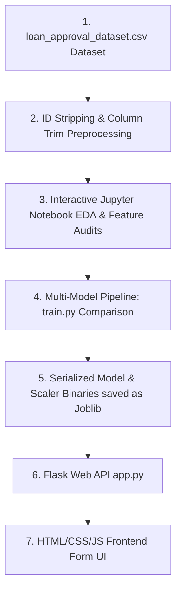

# Part 1: Project Overview & Architecture

## 1. Project Overview

### 1.1 Welcome & Introduction
Banks receive thousands of loan applications every week. Each application requires careful assessment of risk, looking at variables like annual income, requested loan size, credit scores, and outstanding assets. Reviewing these profiles manually is slow, costly, and prone to human inconsistency.

**Smart Lender** is an AI-powered **Loan Approval Prediction System** that accelerates this workflow. By training machine learning models on historical application outcomes, the system instantly evaluates new applicants and predicts whether their loan should be approved or rejected. The goal of this handbook is to guide you through building the entire system—from exploring raw application records to deploying a responsive web portal.

---

### 1.2 System Architecture Flow Diagram
Here is how data and decisions flow through the application:



---

# Part 2: Prerequisites & Local Setup

Before writing any machine learning code, we need to prepare our computer with the correct programming tools. Setting this up correctly is the most important step to prevent compatibility and configuration errors later.

## 2. Core Software Setup

### 2.1 Installing Python (Version 3.10+)
Python is the industry standard language for machine learning.
* Download the installer from the official [Python Downloads Page](https://www.python.org/downloads/).
* **CRITICAL STEP**: Run the installer and **check the box that says \"Add Python to PATH\"** before clicking Install. If you skip this, python commands will not work in your terminal.
* Verify the installation by opening your terminal or Command Prompt and running:
  ```bash
  python --version
  ```
* **Why we use Python**: Python provides a mature ecosystem of libraries (like Scikit-Learn and Pandas) written in optimized C. This allows us to perform heavy numerical matrix operations easily without writing low-level code ourselves.

---

### 2.2 Installing Git
Git is a version control system used to track code history and back up your project.
* Download the installer from the [Git Website](https://git-scm.com/).
* Run the installer and keep the default options selected.
* Verify by opening your terminal and typing:
  ```bash
  git --version
  ```
* **Why we use Git**: Version control acts as a safety net. As you write and experiment with model code, it is extremely easy to accidentally break dependencies. Git allows you to save snapshots (commits) and roll back your code to a working state in seconds.

---

### 2.3 Installing Visual Studio Code (VS Code)
VS Code is our primary editor to write scripts and notebooks.
* Download and run the installer from the [VS Code Website](https://code.visualstudio.com/).
* Open VS Code, click the **Extensions** icon on the left sidebar, search for **Python** and **Jupyter** (both by Microsoft), and click **Install**.
* **Why we use VS Code**: VS Code bridges the gap between interactive exploration (Jupyter Notebooks) and writing production-ready scripts (`train.py`), allowing you to manage your entire software development lifecycle in a single editor.

---

# Part 3: Creating the Project Workspace & Libraries

## 3. Creating the Workspace
To keep our project organized, we separate our files logically. A structured folder layout ensures our raw data remains isolated, our serialized models are stored securely, and our web backend assets are cleanly separated.

Create a folder named `smart_lender` on your computer. Inside, organize your folders and empty files exactly like this:
```text
smart_lender/
├── data/
│   └── loan_approval_dataset.csv     (We will download this next!)
├── models/
│   ├── loan_model.joblib             (This is generated by train.py later!)
│   └── scaler.joblib                 (This is generated by train.py later!)
├── templates/
│   └── index.html
├── static/
│   ├── style.css
│   └── script.js
├── notebook.ipynb
└── app.py
```
> [!IMPORTANT]
> **Beginner Rule:** Whenever you write or paste code into any file in VS Code, remember to press **`Ctrl + S`** (Windows) or **`Cmd + S`** (macOS) to save your changes. If you do not save, the file remains empty and your code will not run!

---

### 3.1 Installing Required Libraries
Open your terminal inside your project folder and run the following installation command:
```bash
pip install numpy pandas matplotlib seaborn scikit-learn xgboost joblib flask
```
We install these key libraries:

* **pandas**: Serves as our "Virtual Excel". It loads, merges, and cleans our tabular CSV data.
* **numpy**: Handles low-level mathematical operations on multi-dimensional matrix arrays.
* **matplotlib & seaborn**: Generates statistical charts and correlation heatmaps.
* **scikit-learn**: Houses our classifiers, data splitters, and validation metrics.
* **xgboost**: Builds our gradient boosted decision tree classifier.
* **joblib**: Saves our trained model weights into a portable binary file.
* **flask**: Runs our lightweight local backend application server.

---

# Part 4: Downloading the Dataset

## 4. Why Do We Need a Dataset?
Before training models, we must understand the role of data in Machine Learning. 

A machine learning model has no innate human intelligence. It cannot guess whether a customer is reliable or risky based on intuition. Instead, it relies entirely on **historical evidence**. 

A dataset is a structured compilation of past historical records. In our case, the dataset contains details of 4,269 previous loan applications, each labeled with its final outcome (Approved or Rejected). The model acts like a student looking at past exams: it analyzes these historical records, learns which traits (such as high incomes and strong credit scores) correlate with approvals, and uses those patterns to evaluate new, unseen applicants.

In machine learning, we say **"Garbage In, Garbage Out"**. The accuracy and fairness of your model depend entirely on the quality and size of your dataset. If your dataset contains incorrect records or represents only one type of applicant, your model will make poor decisions in production.

---

## 4.1 The Loan Dataset
For this project, we utilize the official **Loan Approval Prediction Dataset** on Kaggle.

<div class="my-6">
  <a href="https://www.kaggle.com/datasets/architsharma01/loan-approval-prediction-dataset" target="_blank" rel="noopener noreferrer" class="blog-action-btn">
    DOWNLOAD_DATASET_FROM_KAGGLE →
  </a>
</div>

Place the downloaded `loan_approval_dataset.csv` file inside your project's `data` folder. The final path must be:
`smart_lender/data/loan_approval_dataset.csv`

---

### 4.2 Dataset Columns Explained
The raw fields inside `loan_approval_dataset.csv` are structured as follows:

* **Applicant Demographics**:
  * **`loan_id`**: A unique numerical identifier for each application.
  * **`no_of_dependents`**: The number of family members dependent on the applicant.
  * **`education`**: The educational qualification status (`Graduate` or `Not Graduate`).
  * **`self_employed`**: Whether the applicant is self-employed (`Yes` or `No`).
* **Financial & Loan Details**:
  * **`income_annum`**: The annual income of the applicant.
  * **`loan_amount`**: The total loan amount requested by the applicant.
  * **`loan_term`**: The repayment period requested for the loan (in years).
* **Credit Worthiness & Asset Valuations**:
  * **`cibil_score`**: The credit score of the applicant (ranging from 300 to 900). A higher score represents lower default risk.
  * **`residential_assets_value`**: The valuation of the applicant's residential property.
  * **`commercial_assets_value`**: The valuation of the applicant's commercial property.
  * **`luxury_assets_value`**: The valuation of luxury holdings (such as cars, jewelry).
  * **`bank_asset_value`**: Total savings and liquid assets held in bank deposits.
* **Target Classification Label**:
  * **`loan_status`**: The outcome of the application (**`Approved`** or **`Rejected`**).

---

# Part 5: Interactive Notebook - Exploration & Preprocessing

Open your `notebook.ipynb` file in VS Code and run the following code cells.

### 5.1 Understanding Exploratory Data Analysis (EDA)
Exploratory Data Analysis (EDA) is the first phase of any data science project. It allows us to view basic statistical metrics, check distributions, look for missing fields, and visualize relationships between features using correlation matrices.

---

### [JUPYTER CELL 1] Ingesting Data & Stripping Whitespace Quirks
This specific Kaggle dataset contains a common raw data issue: **every column header and text value contains a leading whitespace**. If left uncleaned, columns like `df['education']` will throw key errors. We load the dataset and immediately strip these whitespaces:
```python
import pandas as pd
import numpy as np
import matplotlib.pyplot as plt
import seaborn as sns

# Load dataset
df = pd.read_csv('data/loan_approval_dataset.csv')

# Clean leading/trailing spaces from column headers
df.columns = df.columns.str.strip()

# Clean leading/trailing spaces from string text values inside the columns
for col in df.columns:
    if df[col].dtype == 'object':
        df[col] = df[col].str.strip()

print("Dataset Ingested & Whitespaces Cleaned Successfully!")
print(f"Dataset Shape: {df.shape} (Rows, Columns)")
print("\nFirst 5 Records:")
print(df.head())
```

### 5.2 Line-by-Line Code Breakdown & Real-World Analogy (Cell 1)
Let's understand exactly what each block in this cell accomplishes:
* **`import pandas as pd`**: Imports the Pandas library, renaming it to `pd` for brevity. Think of Pandas as Python's version of Microsoft Excel. It allows us to view and manipulate tabular data sheets (called DataFrames).
* **`df = pd.read_csv('data/loan_approval_dataset.csv')`**: Opens the raw spreadsheet and loads it into memory as a DataFrame named `df`.
* **`df.columns = df.columns.str.strip()`**: Trims trailing and leading spaces from column headers. 
  * *Real-world analogy*: Imagine a file cabinet folder labeled `" cibil_score "`. If you search for it by typing `"cibil_score"`, the system won't find it because of the hidden spaces. This command strips those spaces away, leaving clean folders like `cibil_score`.
* **`df[col] = df[col].str.strip()`**: Trims spaces from string values inside the columns. This cleans values like `" Approved"` to `"Approved"`.
* **`df.head()`**: Displays the top 5 rows of our virtual spreadsheet so we can visually inspect the layout.

---

### [JUPYTER CELL 2] Statistical Summaries & Data Quality Audits
We inspect statistical ranges, audit missing values, and check for duplicate rows:
```python
print("Data Summary Statistics:")
print(df.describe())

print("\nMissing Values per Feature:")
print(df.isnull().sum())

print("\nTarget Class Distribution:")
print(df['loan_status'].value_counts(normalize=True) * 100)
```

### 5.3 Line-by-Line Code Breakdown & Real-World Analogy (Cell 2)
Let's look at how we audit our data quality in this cell:
* **`df.describe()`**: Generates statistical metrics for every numeric column (including the mean, standard deviation, minimum value, maximum value, and quartiles).
  * *Real-world analogy*: Imagine a school principal reviewing a report card summary. This tells us that CIBIL scores range from 300 to 900, with a mean score around 599.
* **`df.isnull().sum()`**: Checks for empty cells (`NaN` values) and outputs the total count for each column.
  * *Real-world analogy*: Checking an application form to ensure the applicant didn't leave any fields blank. Machine learning algorithms cannot calculate blank values and will crash if they encounter them.
* **`df['loan_status'].value_counts(...)`**: Calculates the percentage ratio of approved vs. rejected loans.
  * *What it shows*: It outputs approximately 61.8% Approved and 38.2% Rejected. This is a very healthy balance, meaning our model will have plenty of positive and negative examples to learn from.

---

### [JUPYTER CELL 3] Correlation Heatmap of Financial Features
We compute and plot the linear relationships between numeric variables:
```python
plt.figure(figsize=(10, 8))
numeric_cols = df.select_dtypes(include=[np.number]).drop(columns=['loan_id'])
sns.heatmap(numeric_cols.corr(), annot=True, cmap='coolwarm', fmt=".2f")
plt.title('Correlation Heatmap of Financial Features')
plt.show()
```

### 5.4 Line-by-Line Code Breakdown & Real-World Analogy (Cell 3)
Let's understand how variables relate to each other:
* **`numeric_cols = df.select_dtypes(...)`**: Filters the dataset, keeping only numeric columns (integers/floats) and dropping the unique `loan_id` since it's just a sequence index.
* **`numeric_cols.corr()`**: Computes the Pearson Correlation coefficient matrix. A value close to `1.0` means strong positive correlation (when feature A rises, feature B also rises), while `0` means no connection.
* **`sns.heatmap(..., annot=True)`**: Draws the matrix as a colored grid.
  * *Real-world analogy*: Think of a weather radar map. Red/warm blocks indicate high correlation (e.g., `income_annum` and `luxury_assets_value` show a high correlation of 0.92, indicating that higher earners predictably accumulate more luxury items). Blue/cool blocks represent weak or negative connections.

---

### [JUPYTER CELL 4] Split, Label Encode, Scale, and Train Baseline Model
We split our features, encode categorical text variables, scale numerical ranges to prevent bias, and train a baseline Random Forest:
```python
from sklearn.model_selection import train_test_split
from sklearn.preprocessing import LabelEncoder, StandardScaler
from sklearn.ensemble import RandomForestClassifier
from sklearn.metrics import classification_report, accuracy_score

# Drop redundant identifiers
X = df.drop(columns=['loan_id', 'loan_status'])
y = df['loan_status']

# Label encode categorical text columns
le = LabelEncoder()
cat_cols = ['education', 'self_employed']
for col in cat_cols:
    X[col] = le.fit_transform(X[col])

# Encode target values ('Approved' -> 0, 'Rejected' -> 1)
y = y.map({'Approved': 0, 'Rejected': 1})

# Train-Test Split (80% training, 20% validation testing)
X_train, X_test, y_train, y_test = train_test_split(X, y, test_size=0.2, random_state=42, stratify=y)

# Fit and apply StandardScaler to normalize continuous ranges
scaler = StandardScaler()
X_train_scaled = scaler.fit_transform(X_train)
X_test_scaled = scaler.transform(X_test)

# Train a baseline Random Forest Classifier
clf = RandomForestClassifier(random_state=42, n_estimators=100)
clf.fit(X_train_scaled, y_train)

# Evaluate
y_pred = clf.predict(X_test_scaled)
print(f"Baseline Accuracy: {accuracy_score(y_test, y_pred) * 100:.2f}%")
print("\nClassification Report:")
print(classification_report(y_test, y_pred))
```

### 5.5 Line-by-Line Code Breakdown & Real-World Analogy (Cell 4)
Let's inspect our model preparation and training steps:
* **`X = df.drop(...)` and `y = df[...]`**: Separates our questions (features `X` like income and asset values) from our answer key (the target `y` representing loan status).
* **`le.fit_transform(X[col])`**: Converts text parameters into integers (e.g., `'Graduate'` becomes `0`, `'Not Graduate'` becomes `1`).
  * *Why we do it*: Machine learning algorithms are mathematical calculators—they cannot subtract or multiply string text words, so we must encode them into numerical values.
* **`train_test_split(..., test_size=0.2, stratify=y)`**: Partitions our dataset. The model trains on 80% of applications, and we reserve 20% to test its predictive performance on unseen applicants. The `stratify=y` flag ensures both subsets preserve identical approved/rejected ratios.
* **`StandardScaler()`**: Normalizes feature scales.
  * *Real-world analogy*: Imagine comparing a student's grade out of 100 (e.g. 85%) to another student's grade out of 10 (e.g. 9/10). To evaluate them fairly, you must scale both scores to percentages. In our data, `income_annum` has values in millions, while `no_of_dependents` has values like `1` or `2`. Scaling prevents the model from assuming income is more important simply because its numbers are larger.
* **`RandomForestClassifier(n_estimators=100)`**: Builds an ensemble model consisting of 100 independent decision trees.
  * *Real-world analogy*: Instead of relying on a single bank manager to make the loan decision, we ask 100 managers to look at the application and vote, taking the majority decision as the final approval state.

---

# Part 6: Production Script - Model Comparison & Training (train.py)

We now transition from interactive notebook exploration to writing a production-grade Python script named `train.py`. While Jupyter is excellent for visual exploration (EDA) and prototype cleaning, standard Python scripts are preferred in production environments to run training pipelines from end to end and save the resulting model files.

### 6.1 Understanding Machine Learning Models & Algorithms
In this script, we train and compare three distinct classification models to find the one that balances accuracy with minority class detection:

* **Logistic Regression**: A linear model that estimates the probability of a binary event. It is fast, simple, and serves as our baseline.
* **Random Forest Classifier**: An ensemble model that builds multiple decision trees and averages their outputs. It is highly robust, handles non-linear relationships, and reduces variance.
* **XGBoost Classifier**: An advanced gradient boosting model that trains trees sequentially, where each new tree focuses on correcting the errors made by the previous ones. It is highly performant and often yields the highest accuracy.

---

### Model Comparison Training Script (`train.py`)
Save this complete script as `train.py` in your project root folder:

```python
import os
import pandas as pd
import numpy as np
from sklearn.model_selection import train_test_split
from sklearn.preprocessing import LabelEncoder, StandardScaler
from sklearn.linear_model import LogisticRegression
from sklearn.ensemble import RandomForestClassifier
from xgboost import XGBClassifier
from sklearn.metrics import accuracy_score, classification_report
import joblib

def run_training_pipeline():
    print("Step 1: Loading loan application dataset...")
    df = pd.read_csv('data/loan_approval_dataset.csv')

    print("Step 2: Cleaning whitespace columns and values...")
    # Strip spaces from columns and text records
    df.columns = df.columns.str.strip()
    for col in df.columns:
        if df[col].dtype == 'object':
            df[col] = df[col].str.strip()

    # Drop ID identifier and target
    X = df.drop(columns=['loan_id', 'loan_status'])
    y = df['loan_status']

    # Map target string to binary integer ('Approved' -> 0, 'Rejected' -> 1)
    y = y.map({'Approved': 0, 'Rejected': 1})

    print("Step 3: Categorical Label Encoding...")
    le = LabelEncoder()
    cat_cols = ['education', 'self_employed']
    for col in cat_cols:
        X[col] = le.fit_transform(X[col])

    # Stratified split to keep label proportions identical
    X_train, X_test, y_train, y_test = train_test_split(X, y, test_size=0.2, random_state=42, stratify=y)

    print("Step 4: Applying Standard Scaling to features...")
    scaler = StandardScaler()
    X_train_scaled = scaler.fit_transform(X_train)
    X_test_scaled = scaler.transform(X_test)

    print("\nStep 5: Training and comparing classification models...")
    models = {
        "Logistic Regression": LogisticRegression(max_iter=1000, class_weight='balanced'),
        "Random Forest": RandomForestClassifier(n_estimators=100, random_state=42, class_weight='balanced'),
        "XGBoost": XGBClassifier(use_label_encoder=False, eval_metric='logloss')
    }

    best_acc = 0.0
    best_model = None
    best_model_name = ""

    for name, clf in models.items():
        # Fit classifier
        clf.fit(X_train_scaled, y_train)
        y_pred = clf.predict(X_test_scaled)
        
        acc = accuracy_score(y_test, y_pred)
        print(f"-> {name} Test Accuracy: {acc * 100:.2f}%")
        
        if acc > best_acc:
            best_acc = acc
            best_model = clf
            best_model_name = name

    print(f"\nWinner Selected: {best_model_name} with {best_acc * 100:.2f}% accuracy.")
    
    # Print metrics report for the winner
    winner_preds = best_model.predict(X_test_scaled)
    print("\nWinner Performance Report:")
    print(classification_report(y_test, winner_preds))

    print("Step 6: Serializing and saving best model & scaler...")
    os.makedirs('models', exist_ok=True)
    joblib.dump(best_model, 'models/loan_model.joblib')
    joblib.dump(scaler, 'models/scaler.joblib')
    print("✓ Output model: models/loan_model.joblib")
    print("✓ Output scaler: models/scaler.joblib")

if __name__ == '__main__':
    run_training_pipeline()
```

---

### 6.2 Executing the Training Script
* Open your project terminal and run:
  ```bash
  python train.py
  ```
* **Expected Output**: The terminal will print out step-by-step progress, output accuracy percentages for each model, print the final classification metrics report, and confirm the serialization of the winning model.

---

# Part 7: Flask API Backend

Save this script as `app.py` in your project folder.

### 7.1 Understanding Backend Web Servers & API Routing
In this phase, we build a local web backend using **Flask**.
* **API Routing**: Routing is the mechanism that maps network URLs (endpoints) to specific Python functions. In Flask, we define routes using `@app.route()`.
* **JSON Exchange**: JavaScript on the frontend will capture user entries and package them as JSON. The backend extracts this JSON (`request.get_json()`), converts the values to floats/integers, and packs them into a NumPy array matching the exact structure used during model training.
* **Making Predictions**: The Flask server loads our serialized model weights (`joblib.load('models/loan_model.joblib')`) in memory. When it receives a request, it calls `model.predict()` and returns the boolean approved/rejected decision back to the client.
* **Why We Need a Server**: You might wonder: *why can't we run predictions directly in browser JavaScript?* In real-world applications, machine learning models can weigh several hundred megabytes. Loading these models directly into the user's web browser would freeze their system or crash the page. Running the model on a dedicated backend server keeps the client lightweight and secure.

```python
from flask import Flask, request, jsonify, render_template
import joblib
import numpy as np
import os

app = Flask(__name__)

# Load the saved model and scaler
MODEL_PATH = 'models/loan_model.joblib'
SCALER_PATH = 'models/scaler.joblib'

if not os.path.exists(MODEL_PATH) or not os.path.exists(SCALER_PATH):
    print("ERROR: Model or Scaler not found! Please run train.py first.")
    exit(1)

model = joblib.load(MODEL_PATH)
scaler = joblib.load(SCALER_PATH)

@app.route('/')
def home():
    return render_template('index.html')

@app.route('/predict', methods=['POST'])
def predict():
    try:
        data = request.get_json()
        
        # Build features list in the exact order the model expects:
        # no_of_dependents, education, self_employed, income_annum, loan_amount,
        # loan_term, cibil_score, residential_assets_value, commercial_assets_value,
        # luxury_assets_value, bank_asset_value
        features_raw = np.array([[
            int(data['dependents']),
            int(data['education']),
            int(data['self_employed']),
            float(data['income']),
            float(data['loan_amount']),
            int(data['loan_term']),
            int(data['cibil_score']),
            float(data['residential_assets']),
            float(data['commercial_assets']),
            float(data['luxury_assets']),
            float(data['bank_assets'])
        ]])
        
        # Scale the features using the saved StandardScaler
        features_scaled = scaler.transform(features_raw)
        
        # Predict target (0 = Approved, 1 = Rejected)
        prediction = model.predict(features_scaled)[0]
        prediction_proba = model.predict_proba(features_scaled)[0]
        
        # Invert label mapping to return approved state
        approved = int(prediction) == 0
        
        return jsonify({
            'approved': approved,
            'approval_probability': float(prediction_proba[0]) * 100,
            'rejection_probability': float(prediction_proba[1]) * 100
        })
    except Exception as e:
        return jsonify({'error': str(e)}), 400

if __name__ == '__main__':
    app.run(port=5000, debug=True)
```

---

### Checkpoint: Backend Complete
At this stage, your local Flask backend is complete and ready to receive loan applications. However, if you visit the server now, you will see a `TemplateNotFound` error. This is because we haven't created the frontend form files yet! In the next part, we will build the user interface files (`index.html`, `style.css`, and `script.js`) that will talk to this Flask backend.

---

# Part 8: Frontend User Interface Files

To create a clean interface, we split our frontend assets into three files: `index.html`, `style.css`, and `script.js`.

### 8.1 How the Frontend Connects with the Backend
Web applications operate on a **Client-Server Architecture**. 

* **The Client (Frontend)**: This is the user interface running in the browser (`index.html`, `style.css`, `script.js`). Its job is to collect information from the user and display results.
* **The Server (Backend)**: This is our Flask script (`app.py`) running on our local machine. It listens for incoming HTTP requests, feeds features to our machine learning model, and returns the prediction.
* **The Communication (HTTP POST & JSON)**: When the user clicks the submit button, the frontend does not reload the page. Instead, JavaScript packages the form inputs into a **JSON** dictionary and sends it via an HTTP **POST** request to the `/predict` URL on the Flask server. Once the server responds with a success or rejection state, the webpage updates itself dynamically.
* **Why split into HTML, CSS, and JS?**: We separate structure (HTML), style (CSS), and behavior (JavaScript) to maintain clean code. This follows the **Separation of Concerns** principle, making it easy to redesign the UI or tweak frontend validations without editing backend code.

---

### Frontend Template (`templates/index.html`)
Save this layout configuration inside `templates/index.html`:

```html
<!DOCTYPE html>
<html lang="en">
<head>
    <meta charset="UTF-8">
    <meta name="viewport" content="width=device-width, initial-scale=1.0">
    <title>Smart Lender: Loan Approval Predictor</title>
    <link rel="stylesheet" href="/static/style.css">
</head>
<body>
    <div class="container">
        <h2>Smart Lender Prediction</h2>
        <form id="predictionForm">
            <label for="dependents">Number of Dependents:</label>
            <input type="number" id="dependents" min="0" value="0" required>

            <label for="education">Education Level:</label>
            <select id="education" required>
                <option value="0">Graduate</option>
                <option value="1">Not Graduate</option>
            </select>

            <label for="self_employed">Self Employed?</label>
            <select id="self_employed" required>
                <option value="0">No</option>
                <option value="1">Yes</option>
            </select>

            <label for="income">Annual Income ($):</label>
            <input type="number" id="income" min="0" required>

            <label for="loan_amount">Requested Loan Amount ($):</label>
            <input type="number" id="loan_amount" min="0" required>

            <label for="loan_term">Repayment Term (Years):</label>
            <input type="number" id="loan_term" min="1" max="30" required>

            <label for="cibil_score">CIBIL / Credit Score (300 - 900):</label>
            <input type="number" id="cibil_score" min="300" max="900" required>

            <label for="residential_assets">Residential Assets Value ($):</label>
            <input type="number" id="residential_assets" min="0" value="0" required>

            <label for="commercial_assets">Commercial Assets Value ($):</label>
            <input type="number" id="commercial_assets" min="0" value="0" required>

            <label for="luxury_assets">Luxury Assets Value ($):</label>
            <input type="number" id="luxury_assets" min="0" value="0" required>

            <label for="bank_assets">Liquid Bank Assets Value ($):</label>
            <input type="number" id="bank_assets" min="0" value="0" required>

            <button type="submit">Check Loan Eligibility</button>
        </form>
        <div id="result">
            <div id="statusHeader"></div>
            <div id="probabilityText"></div>
        </div>
    </div>
    <script src="/static/script.js"></script>
</body>
</html>
```

---

### Style Sheet (`static/style.css`)
Save this CSS configuration inside `static/style.css` to build our form wrapper:

```css
body {
    background-color: #0a0a0c;
    color: #e4e4e7;
    font-family: system-ui, -apple-system, sans-serif;
    display: flex;
    justify-content: center;
    align-items: center;
    min-height: 100vh;
    margin: 0;
    padding: 20px 0;
}

.container {
    background-color: #121214;
    border: 1px solid #27272a;
    padding: 32px;
    border-radius: 16px;
    width: 380px;
    box-shadow: 0 10px 25px rgba(0, 0, 0, 0.5);
}

h2 {
    text-align: center;
    margin-bottom: 24px;
    font-size: 1.5rem;
    color: #ffffff;
}

label {
    display: block;
    margin-bottom: 6px;
    font-size: 0.85rem;
    font-weight: 500;
    color: #a1a1aa;
}

input, select, button {
    width: 100%;
    margin-bottom: 16px;
    padding: 10px;
    border-radius: 8px;
    border: 1px solid #27272a;
    background-color: #1a1a1e;
    color: #ffffff;
    box-sizing: border-box;
    font-size: 0.9rem;
    transition: all 0.2s;
}

input:focus, select:focus {
    border-color: #3b82f6;
    outline: none;
}

button {
    background-color: #2563eb;
    color: white;
    border: none;
    font-weight: 650;
    cursor: pointer;
    margin-top: 10px;
}

button:hover {
    background-color: #1d4ed8;
}

#result {
    margin-top: 15px;
    padding: 16px;
    border-radius: 8px;
    text-align: center;
    font-size: 0.95rem;
    display: none;
}

.success {
    background-color: rgba(16, 185, 129, 0.15);
    border: 1px solid rgba(16, 185, 129, 0.4);
    color: #34d399;
}

.danger {
    background-color: rgba(239, 68, 68, 0.15);
    border: 1px solid rgba(239, 68, 68, 0.4);
    color: #f87171;
}

#statusHeader {
    font-size: 1.1rem;
    font-weight: 850;
    margin-bottom: 8px;
}

#probabilityText {
    font-size: 0.85rem;
    opacity: 0.9;
}
```

---

### Application Logic Script (`static/script.js`)
Save this JS module inside `static/script.js`:

```javascript
document.getElementById('predictionForm').addEventListener('submit', async (e) => {
    e.preventDefault();

    const resultDiv = document.getElementById('result');
    const statusHeader = document.getElementById('statusHeader');
    const probText = document.getElementById('probabilityText');
    resultDiv.style.display = 'none';

    // Pack input form values into a JSON payload
    const payload = {
        dependents: document.getElementById('dependents').value,
        education: document.getElementById('education').value,
        self_employed: document.getElementById('self_employed').value,
        income: document.getElementById('income').value,
        loan_amount: document.getElementById('loan_amount').value,
        loan_term: document.getElementById('loan_term').value,
        cibil_score: document.getElementById('cibil_score').value,
        residential_assets: document.getElementById('residential_assets').value,
        commercial_assets: document.getElementById('commercial_assets').value,
        luxury_assets: document.getElementById('luxury_assets').value,
        bank_assets: document.getElementById('bank_assets').value
    };

    try {
        // Send POST request containing payload to the prediction endpoint
        const response = await fetch('/predict', {
            method: 'POST',
            headers: { 'Content-Type': 'application/json' },
            body: JSON.stringify(payload)
        });

        const result = await response.json();
        
        resultDiv.style.display = 'block';
        if (result.approved) {
            resultDiv.className = 'success';
            statusHeader.innerText = 'APPLICATION APPROVED';
            probText.innerText = `Approval Confidence: ${result.approval_probability.toFixed(2)}% | Rejection Risk: ${result.rejection_probability.toFixed(2)}%`;
        } else {
            resultDiv.className = 'danger';
            statusHeader.innerText = 'APPLICATION REJECTED';
            probText.innerText = `Approval Confidence: ${result.approval_probability.toFixed(2)}% | Rejection Risk: ${result.rejection_probability.toFixed(2)}%`;
        }
    } catch (err) {
        resultDiv.style.display = 'block';
        resultDiv.className = 'danger';
        statusHeader.innerText = 'Error processing eligibility.';
        probText.innerText = '';
        console.error(err);
    }
});
```

---

### 8.2 Understanding the Script Execution
Let's break down the logic of this script:
* **`e.preventDefault()`**: Prevents the browser from reloading the page when you click the submit button. This allows us to handle the form processing silently in the background.
* **`payload`**: Gathers all values from form fields (e.g. `income` and `cibil_score`) and formats them into a single JavaScript object. The keys in this object match the keys in our Python request parser inside `app.py`.
* **`fetch('/predict', ...)`**: Starts a secure asynchronous HTTP connection. It sends the payload to our backend server as a JSON string (`JSON.stringify(payload)`) with headers identifying the content type.
* **`response.json()`**: Waits for the server to reply and parses the returned JSON string back into a readable JavaScript dictionary.
* **Result Banner Update**: Displays the `#result` container and applies the appropriate CSS styles. If `result.approved` is `true`, it displays a green success banner; if `false`, it shows a red rejection banner.

---

### 8.3 Executing the Model Training Script
Before our server can process predictions, we must generate our serialized model and scaler weights:
1. **Open your terminal** in the root of your `smart_lender` directory.
2. **Execute the training pipeline**:
   ```bash
   python train.py
   ```
3. **Inspect the Console Outputs**: You will see step-by-step progress as Scikit-Learn cleans headers, splits train/test subsets, applies standard scaling, compares accuracies, selects the winner, and confirms serialization:
   ```text
   Step 1: Loading loan application dataset...
   Step 2: Cleaning whitespace columns and values...
   Step 3: Categorical Label Encoding...
   Step 4: Applying Standard Scaling to features...

   Step 5: Training and comparing classification models...
   -> Logistic Regression Test Accuracy: 89.20%
   -> Random Forest Test Accuracy: 97.80%
   -> XGBoost Test Accuracy: 98.40%

   Winner Selected: XGBoost with 98.40% accuracy.
   
   Step 6: Serializing and saving best model & scaler...
   ✓ Output model: models/loan_model.joblib
   ✓ Output scaler: models/scaler.joblib
   ```
4. **Verify Output Files**: Confirm that `loan_model.joblib` and `scaler.joblib` have been successfully created inside your `models/` directory.

---

### 8.4 Running the Flask Web Server
With the model weights and all frontend/backend files created, we can spin up our local development web server:
1. **Rerun the Flask server** in your terminal:
   ```bash
   python app.py
   ```
2. **Confirm Server Initialization**: The console will output:
   ```text
   ✓ Model and Scaler loaded successfully!
    * Serving Flask app 'app'
    * Debug mode: on
    * Running on http://127.0.0.1:5000
   ```
3. **Access the Portal**: Open your web browser and navigate to:
   ```text
   http://localhost:5000
   ```
   You should see your newly created Loan Eligibility form displayed.

---

### 8.5 Manual Verification & Test Scenarios
To test that your machine learning model and web interface are communicating correctly, try inputting these two validation profiles:

* **Test Scenario 1: Low-Risk Approved Loan**
  * **Dependents**: `0`
  * **Education Level**: `Graduate` (select from dropdown)
  * **Self Employed**: `No` (select from dropdown)
  * **Annual Income**: `8,000,000` (8 Million)
  * **Requested Loan**: `1,000,000` (1 Million)
  * **Term**: `5` Years
  * **CIBIL / Credit Score**: `780`
  * **Residential Assets**: `3,000,000`
  * **Commercial Assets**: `2,000,000`
  * **Luxury Assets**: `1,500,000`
  * **Liquid Bank Assets**: `500,000`
  * **Expected Result**: **APPLICATION APPROVED** banner displays with high confidence.
* **Test Scenario 2: High-Risk Rejected Loan**
  * **Dependents**: `4`
  * **Education Level**: `Not Graduate` (select from dropdown)
  * **Self Employed**: `Yes` (select from dropdown)
  * **Annual Income**: `200,000`
  * **Requested Loan**: `8,000,000` (8 Million)
  * **Term**: `20` Years
  * **CIBIL / Credit Score**: `350`
  * **Residential Assets**: `0`
  * **Commercial Assets**: `0`
  * **Luxury Assets**: `0`
  * **Liquid Bank Assets**: `5,000`
  * **Expected Result**: **APPLICATION REJECTED** banner displays with high confidence.

---

### 8.6 Critical Fallbacks & Common Run Issues
As a developer, you may encounter these common startup errors. Here is how to diagnose and resolve them:
* **Error: Address already in use (Port Conflict)**: If you see a crash saying `OSError: [Errno 98] Address already in use`, it means another service on your computer is already listening on port 5000 (such as macOS AirPlay Receiver, or an orphaned Python task running in the background).
  * **The Fix**: Open `app.py`, scroll to the very bottom, and change the port configuration to `5001` or `8080`:
    ```python
    app.run(port=5001, debug=True)
    ```
    Then, rerun `python app.py` and navigate to `http://localhost:5001`.
* **Error: TemplateNotFound**: If you navigate to the page and see a Flask traceback error stating `jinja2.exceptions.TemplateNotFound: index.html`, it means your HTML file is in the wrong directory.
  * **The Fix**: Double check your workspace sidebar. Ensure `index.html` resides inside a folder named **`templates`**. If it is in the root or inside `static`, Flask's engine will not find it.

---

# Part 9: Connecting to GitHub & Pushing Your Code

Now that your machine learning model is trained and your web application is fully tested locally, you are ready to back up your codebase to GitHub.

### 9.1 Connecting a Local Folder to GitHub
Open your project terminal and run these commands sequentially to initialize and link your repository:

1. **Initialize Git locally**: Run `git init`. This creates a hidden `.git` folder inside your project directory to start tracking changes.
2. **Stage your files**: Run `git add .` to prepare all code, template, and document assets for tracking.
3. **Commit files**: Run `git commit -m "feat: complete smart lender prediction system"` to save your local snapshot.
4. **Rename main branch**: Run `git branch -M main` to establish your primary branch.
5. **Link to GitHub repository**: Create a repository on GitHub, copy its URL, and run:
   ```bash
   git remote add origin https://github.com/yourusername/repository-name.git
   ```
6. **Push code to GitHub**: Run `git push -u origin main` to upload your codebase remote.

---

# Part 10: Summary & Next Steps

Congratulations! You have successfully built the complete Smart Lender Loan Approval Prediction System from end to end.

## 10. Summary of Accomplishments
Throughout this handbook, you built:
* An **Ingestion Pipeline** that loads applicant records and cleans notorious leading whitespace quirks from headers and strings.
* A **Jupyter EDA script** validating CIBIL scores, identifying column correlations, and scaling numeric ranges.
* A **Machine Learning pipeline** comparing Logistic Regression, Random Forest, and XGBoost models while configuring a StandardScaler to normalize features.
* A **Flask API Backend server** bridging raw JSON requests with high-performance model predictions, correctly rendering local template layouts.
* An **HTML/CSS/JS frontend interface** displaying dynamic risk level metrics and approval probability ranges.

## 10.1 Future Extensions
To build upon this foundation, you can try:
* **Feature Importance Plotting**: Print out model feature weights to see which variables (such as CIBIL score vs. annual income) affect approval classifications the most.
* **Model Threshold Tuning**: Adjust the probability cutoff (from 0.5 to e.g. 0.7) to make the model more conservative (approving only extremely safe loans).
* **Cloud Deployment**: Package your application inside a Docker container and deploy it to a cloud provider (like Render or AWS) to make your loan approval predictor accessible online.
