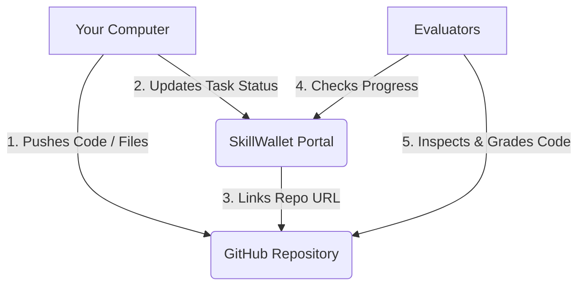

# Demystifying SmartBridge and SkillWallet

If you are working on a university or industry project through **SmartBridge**, you will be using a portal called **SkillWallet** to track your progress. For many students, this is the first time using a professional project tracking platform. It is very common to feel lost or confused about what to do next.

This guide is written in simple English to explain how the platform works, how to connect it to GitHub, how to work together as a team, and how to avoid common platform bugs.

---

## 1. The Golden Rule: SkillWallet is NOT for Code

The most common mistake students make is looking for a button in SkillWallet to upload their code, ZIP folders, or files. 

**You do not submit any code files directly to SkillWallet.** 

* **Where does your code live?** Your code, Jupyter Notebooks, datasets, and web files live entirely on **GitHub**.
* **What is SkillWallet for?** SkillWallet is just a tracking spreadsheet. You use it to tell your evaluators: *"I am working on this task right now"* or *"This task is completed."* You update statuses in SkillWallet, but your actual work is saved on GitHub.

* **Your Computer** pushes code and notebooks to **GitHub**.
* **Your Computer** updates task progress inside **SkillWallet**.
* **SkillWallet** points to your codebase via the repository link you saved.
* **Evaluators** check completed tasks in **SkillWallet** and check your code on **GitHub** to grade it.

---

## 2. Step 1: Connecting the GitHub Link (The Gatekeeper)

Before your team can click on or start any tasks, you must add your project's GitHub repository link to SkillWallet. 

**This is the gatekeeper step. If you do not enter this link, all other tasks will remain locked.**

### How to do it:
- One team member (usually the Team Lead) goes to GitHub and creates a new repository.
- Copy the URL of this repository (e.g., `https://github.com/yourusername/project-name`).
- Log into SkillWallet, go to your project overview, paste this link into the designated **GitHub Link** field, and save.
- Once saved, the rest of the project tasks will unlock for the entire team.

---

## 3. How GitHub Collaboration Works

Many students create a repository, upload a file once, and think they are done with GitHub. But since you are working in a team, you must collaborate on the **same repository**.

- **One Shared Codebase**: Do not create 5 different repositories for 5 team members. The Team Lead creates **one** repository and adds the other members as "Collaborators" in the repository settings.
- **Syncing Changes (Member A)**: When member A finishes a Jupyter Notebook, they commit and push it to the the shared repository.
- **Syncing Changes (Member B)**: Member B pulls the latest changes to their local computer, adds the preprocessing steps, and pushes it back.
- **Sync Alignment**: This back-and-forth sync keeps everyone's codebase aligned.
- **The Final Submission**: When the project is reviewed, evaluators will visit the single GitHub link saved in your SkillWallet to check all commit histories and contributions from every team member.

---

## 4. Team Roles: Team Lead vs. Team Members

Every project group has one **Team Lead** and multiple **Team Members**. Both roles have different permissions.

### The Team Lead's Job:
At the start of the project, the Team Lead must assign tasks.
* The Team Lead opens the **Team Page**, scrolls down, and assigns each task to team members (or you can assign everything to a single person depending on choice).
* There is a predefined list of tasks representing steps of the project (e.g., Environment Setup, EDA, Preprocessing, Model Training).

### The Team Member's Job:
Once tasks are assigned, members can log in and start working on their respective tasks.

---

## 5. "I got assigned, now what?" (Finding Your Tasks)

SkillWallet does not send email notifications when a task is assigned to you. If you are waiting for an email, you will never start!

### How to find your assigned work:
1. Log into your SkillWallet portal.
2. Do not look only at the *Overview* page. Instead, navigate to the Workspace page.
3. On the **right-hand side**, you will see a dropdown list of tasks.
4. Click and open each dropdown. You will see which tasks have your name attached to them, and you can select the task to change its status.

---

## 6. Changing Task Status & The Kanban Board Bug

To show your progress, you need to change the status of your tasks. The platform has four statuses:
* **To Do** (Not started)
* **In Progress** (Working on it)
* **Under Review** (Waiting for evaluation)
* **Completed** (Done)

### ⚠️ The Bug You Will Encounter
The platform has a known bug. If a regular Team Member tries to change a task status directly from "To Do" to "Under Review" or "Completed," the system will often throw a permission error and block the change.

### 💡 The Easy Workaround
To avoid this error, follow this workflow:
1. **Team Members** can change their tasks from *To Do* to *In Progress* to show they are working.
2. When the work is done, instead of the member trying to mark it completed, the **Team Lead** should log in.
3. The Team Lead goes to the **Workspace** page and updates the task status to **Under Review** directly inside the dropdown list on the right side.
4. **Important**: Your team *cannot* mark tasks as *Completed* directly. Once the Team Lead moves a task to **Under Review**, your project mentor or evaluator will review it. When they approve it, the status automatically changes to **Completed**.
5. *Do not use the Kanban Board page drag-and-drop feature* to change statuses. The Kanban page frequently throws restrictive errors for team actions. Changing status directly inside the Workspace list is 100% stable.

---

## Summary Checklist for Students
- [ ] Create one GitHub repository for the team.
- [ ] Add all team members as collaborators on GitHub.
- [ ] Paste the repository link in SkillWallet to unlock tasks.
- [ ] Team Lead assigns tasks to members.
- [ ] Members check their assigned tasks on the **Workspace** page dropdowns.
- [ ] Track code changes on GitHub (no uploads to SkillWallet).
- [ ] Let the Team Lead change task statuses to *Reviewed* in the Workspace list to avoid system bugs.

---

## 7. The Complete SkillWallet & GitHub Flow Diagram

Here is a visual summary of the entire project tracking and collaboration workflow. It displays how your computer, GitHub, SkillWallet, and the evaluators connect to complete your project tasks:

---

## Next Steps: Structuring and Project Handbooks

Now that you understand the platform tracking rules, here are the resources to build and submit your project successfully:

  <a href="/blog/smartbridge-github-submission-guide" class="block p-6 border border-neutral-800/80 rounded-2xl bg-neutral-950/40 hover:border-neutral-700/60 transition-all duration-300 relative overflow-hidden group no-underline">
    
Repository Submission Guide

    
Learn how to structure your repository with the required documentation folder and compile the 8 phase-by-phase PDF deliverables.

    

      READ_POST
      <svg class="w-3.5 h-3.5 group-hover:translate-x-1 transition-transform" fill="none" viewBox="0 0 24 24" stroke="currentColor" stroke-width="2">
        <path stroke-linecap="round" stroke-linejoin="round" d="M14 5l7 7m0 0l-7 7m7-7H3" />
      </svg>
    

  </a>
  <a href="/blog/credit-card-approval-prediction" class="block p-6 border border-neutral-800/80 rounded-2xl bg-neutral-950/40 hover:border-neutral-700/60 transition-all duration-300 relative overflow-hidden group no-underline">
    
Credit Card Approval Guide

    
Build an end-to-end classification system, run exploratory data analysis in Jupyter, compare model metrics, and build a Flask API.

    

      READ_HANDBOOK
      <svg class="w-3.5 h-3.5 group-hover:translate-x-1 transition-transform" fill="none" viewBox="0 0 24 24" stroke="currentColor" stroke-width="2">
        <path stroke-linecap="round" stroke-linejoin="round" d="M14 5l7 7m0 0l-7 7m7-7H3" />
      </svg>
    

  </a>
  <a href="/blog/opti-crop-agricultural-recommendation-system" class="block p-6 border border-neutral-800/80 rounded-2xl bg-neutral-950/40 hover:border-neutral-700/60 transition-all duration-300 relative overflow-hidden group no-underline">
    
OptiCrop Recommendation Engine

    
Build a data-driven recommendation system to identify optimal crops, complete with a dark dashboard Single Page Application (SPA).

    

      READ_HANDBOOK
      <svg class="w-3.5 h-3.5 group-hover:translate-x-1 transition-transform" fill="none" viewBox="0 0 24 24" stroke="currentColor" stroke-width="2">
        <path stroke-linecap="round" stroke-linejoin="round" d="M14 5l7 7m0 0l-7 7m7-7H3" />
      </svg>
    

  </a>

