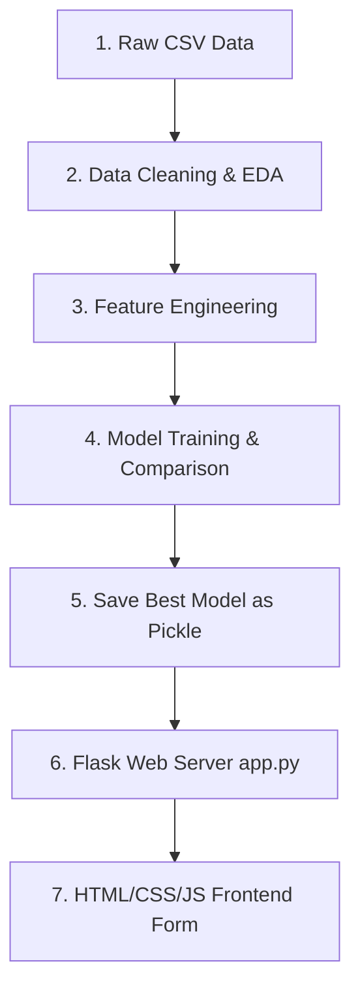

# Part 1: Project Overview & Architecture

## 1. Project Overview

### 1.1 Welcome & Introduction
Banks and financial institutions receive thousands of credit card applications every day. Manually reviewing each application is both time-consuming and highly prone to human error. This project automates the credit card approval decision using machine learning. By training a predictive model on historical applicant data, the system evaluates financial and demographic inputs to determine whether an applicant is likely to be approved or rejected.

### 1.2 System Architecture Flow Diagram
Here is how data flows through the application:



---

# Part 2: Setting Up Git & GitHub

## 1.5 Installing Git
If you don't have Git installed:
- Download the installer from the [Git Website](https://git-scm.com/).
- Run the installer with default options selected.
- Open your terminal and verify by typing:
  ```bash
  git --version
  ```

## 1.6 Connecting a Local Folder to GitHub
A common scenario is that you have created a repository on GitHub first, and now want to connect your local project folder to it without downloading/cloning a blank folder. Follow these steps in your project terminal:

1. **Initialize Git locally**:
   ```bash
   git init
   ```
   This creates a hidden `.git` folder inside your project to track changes.

2. **Add all files to stage**:
   ```bash
   git add .
   ```

3. **Commit files**:
   ```bash
   git commit -m "Initial commit: environment setup"
   ```

4. **Rename main branch**:
   ```bash
   git branch -M main
   ```

5. **Link to GitHub repository**:
   Copy your repository URL from GitHub (e.g., `https://github.com/yourusername/repository-name.git`) and run:
   ```bash
   git remote add origin https://github.com/yourusername/repository-name.git
   ```

6. **Push code to GitHub**:
   ```bash
   git push -u origin main
   ```
   Now your local code is uploaded to GitHub and linked successfully!

---

# Part 3: Setting Up Your Development Environment

## 2. Installing Python

### 2.1 Why Python?
Python is the industry standard language for Machine Learning and Data Science. It is readable, beginner-friendly, and has a vast ecosystem of pre-built packages for scientific computing (like NumPy, Pandas, Scikit-Learn).

### 2.2 Downloading Python
Go to the official [Python website](https://www.python.org/downloads/) and download Python 3.8 or above for your Operating System.

### 2.3 Installing Python
- Run the installer executable.
- **IMPORTANT**: Check the box that says **"Add Python to PATH"** before clicking Install Now.

---

## 3. Installing Visual Studio Code

### 3.1 Download VS Code
Go to the [VS Code Website](https://code.visualstudio.com/) and download the stable build.

---

## 4. Installing Required VS Code Extensions

### 4.1 Python & Jupyter Extensions
Click on the Extensions icon on the left sidebar in VS Code, search for **Python** and **Jupyter** (by Microsoft), and click **Install**.

---

# Part 4: Creating Your First ML Project

## 5. Creating the Project Folder

### 5.1 Recommended Folder Structure
Set up your folder exactly like this:
```text
credit_card_approval_project/
├── data/
│   └── creditcard_data.csv
├── models/
│   └── card_model.joblib
├── templates/
│   └── index.html
├── static/
│   ├── style.css
│   └── script.js
├── notebook.ipynb
└── app.py
# Part 5: Downloading and Understanding the Dataset

## 8. Finding a Dataset

### 8.1 Where to Download Datasets
For this project, we utilize the official [Kaggle Credit Card Dataset](https://www.kaggle.com/datasets/mlg-ulb/creditcardfraud). Kaggle is an online database platform hosting millions of open datasets for model builders.

### 8.2 Choosing the Correct Dataset
We select a tabular credit card application dataset containing applicant demographics (income, gender, employment status) and a target binary label column (`Approved`) indicating approval status.

### 8.3 Downloading the Dataset
1. Open the [Kaggle Credit Card Dataset Link](https://www.kaggle.com/datasets/mlg-ulb/creditcardfraud) in your browser.
2. Sign in and download the dataset archive.
3. Extract the downloaded folder to extract the `creditcard_data.csv` application file.

### 8.4 Placing the Dataset Inside the Project
Create a folder named `data` inside your root project folder. Move the extracted file inside, naming it exactly:
`credit_card_approval_project/data/creditcard_data.csv`

---

## 6. Creating Your First Jupyter Notebook

### 6.1 Creating a New Notebook (.ipynb)
Right-click the explorer sidebar in VS Code, select **New File**, name it `notebook.ipynb`, and press Enter.

---

## 7. Installing Required Libraries

### 7.1 Objective
Install the scientific libraries needed to load, preprocess, visualize, and train machine learning models.

### 7.2 Code Block (Run in Command Line / VS Code Terminal)
```bash
pip install numpy pandas matplotlib seaborn scikit-learn xgboost joblib flask
```

---

# Part 6: Interactive Notebook - Importing Libraries & Loading Data

### 7.3 [JUPYTER CELL 1] Importing Core Libraries
Open your `notebook.ipynb` file, create a new code cell, paste the following code, and execute it:
```python
import numpy as np
import pandas as pd
import matplotlib.pyplot as plt
import seaborn as sns

print("Core libraries imported successfully!")
```

### 7.4 [JUPYTER CELL 2] Loading the Dataset
Create a new code cell, paste this code to load the dataset, and click run:
```python
# Load the dataset
df = pd.read_csv('data/creditcard_data.csv')
print("Dataset loaded. Number of rows:", len(df))
```

---

# Part 7: Interactive Notebook - Exploratory Data Analysis (EDA)

Follow along step-by-step. Each of the following steps must be run in a separate cell inside your Jupyter Notebook to inspect the outputs clearly.

### 8.1 [JUPYTER CELL 3] Viewing First Rows
Create a new cell and run:
```python
df.head()
```
*Purpose*: Displays the first 5 records of applicants containing columns like Gender, Annual Income, Income Type, Years Employed, and Approval status.

### 8.2 [JUPYTER CELL 4] Viewing Last Rows
Create a new cell and run:
```python
df.tail()
```
*Purpose*: Displays the last 5 records of your dataset.

### 8.3 [JUPYTER CELL 5] Dataset Shape
Create a new cell and run:
```python
df.shape
```
*Purpose*: Displays `(rows, columns)` count.

### 8.4 [JUPYTER CELL 6] Schema Info & Columns Data Types
Create a new cell and run:
```python
df.info()
```
*Purpose*: Lists all column names, their datatypes (float64, int64, object), and non-null counts.

### 8.5 [JUPYTER CELL 7] Statistical Summary
Create a new cell and run:
```python
df.describe()
```
*Purpose*: Generates descriptive statistics of numerical columns (mean, standard deviation, minimum, maximum, etc.).

### 8.6 [JUPYTER CELL 8] Value Counts of Approval Target
Create a new cell and run:
```python
df['Approved'].value_counts()
```
*Purpose*: Tells you how many applicants were approved (1) vs rejected (0).

### 8.7 [JUPYTER CELL 9] Checking for Missing Null Values
Create a new cell and run:
```python
df.isnull().sum()
```
*Purpose*: Counts missing values per column.

### 8.8 [JUPYTER CELL 10] Checking for Duplicate Records
Create a new cell and run:
```python
df.duplicated().sum()
```
*Purpose*: Identifies if there are redundant row copies.

### 8.9 [JUPYTER CELL 11] Univariate Analysis: Income Distribution Histogram
Create a new cell and run:
```python
plt.figure(figsize=(8, 4))
sns.histplot(df['Annual_Income'], bins=30, kde=True, color='blue')
plt.title('Distribution of Annual Income')
plt.xlabel('Income')
plt.ylabel('Count')
plt.show()
```

### 8.10 [JUPYTER CELL 12] Bivariate Analysis: Gender vs Approval Counts
Create a new cell and run:
```python
sns.countplot(x='Gender', hue='Approved', data=df, palette='Set2')
plt.title('Credit Card Approval by Gender')
plt.show()
```

### 8.11 [JUPYTER CELL 13] Bivariate Analysis: Education vs Approval Counts
Create a new cell and run:
```python
plt.figure(figsize=(10, 5))
sns.countplot(x='Education_Level', hue='Approved', data=df, palette='muted')
plt.xticks(rotation=45)
plt.title('Credit Card Approval by Education Level')
plt.show()
```

### 8.12 [JUPYTER CELL 14] Boxplot for Income Outliers
Create a new cell and run:
```python
sns.boxplot(x='Approved', y='Annual_Income', data=df)
plt.title('Income Outliers Check')
plt.show()
```

### 8.13 [JUPYTER CELL 15] Correlation Matrix & Heatmap
Create a new cell and run:
```python
# Select only numeric columns for correlation calculation
numeric_df = df.select_dtypes(include=[np.number])
plt.figure(figsize=(10, 8))
sns.heatmap(numeric_df.corr(), annot=True, cmap='coolwarm', fmt=".2f")
plt.title('Correlation Matrix Heatmap')
plt.show()
```

---

# Part 8: Interactive Notebook - Preprocessing & Feature Engineering

### 9.1 [JUPYTER CELL 16] Handling Missing Values
Create a new cell and run:
```python
# Fill missing numeric values with columns median
df['Annual_Income'] = df['Annual_Income'].fillna(df['Annual_Income'].median())
print("Missing values resolved!")
```

### 9.2 [JUPYTER CELL 17] Encoding Categorical Columns
Create a new cell and run:
```python
from sklearn.preprocessing import LabelEncoder

le = LabelEncoder()
categorical_cols = ['Gender', 'Income_Type', 'Education_Level']

for col in categorical_cols:
    df[col] = le.fit_transform(df[col])

print("Encoding complete. Categorical features converted to numbers.")
df.head()
```

---

# Part 9: Interactive Notebook - Training & Multi-Model Comparison

### 10.1 [JUPYTER CELL 18] Splitting Features & Target Data
Create a new cell and run:
```python
X = df.drop(columns=['Approved'])
y = df['Approved']
```

### 10.2 [JUPYTER CELL 19] Splitting into Train and Test Groups
Create a new cell and run:
```python
from sklearn.model_selection import train_test_split

X_train, X_test, y_train, y_test = train_test_split(X, y, test_size=0.2, random_state=42)
print(f"Train size: {X_train.shape[0]}, Test size: {X_test.shape[0]}")
```

### 10.3 [JUPYTER CELL 20] Training Multiple Classification Models
Create a new cell and run:
```python
from sklearn.linear_model import LogisticRegression
from sklearn.tree import DecisionTreeClassifier
from sklearn.ensemble import RandomForestClassifier
from xgboost import XGBClassifier
from sklearn.metrics import accuracy_score

# Instantiate classification models
models = {
    "Logistic Regression": LogisticRegression(max_iter=1000),
    "Decision Tree": DecisionTreeClassifier(),
    "Random Forest": RandomForestClassifier(n_estimators=100, random_state=42),
    "XGBoost": XGBClassifier(use_label_encoder=False, eval_metric='logloss')
}

# Run training loops
for name, model in models.items():
    model.fit(X_train, y_train)
    y_pred = model.predict(X_test)
    acc = accuracy_score(y_test, y_pred)
    print(f"{name} Test Accuracy: {acc * 100:.2f}%")
```

### 10.4 [JUPYTER CELL 21] Detailed Accuracy Metrics & Confusion Matrix
Create a new cell and run:
```python
from sklearn.metrics import classification_report, confusion_matrix

best_model = models["Random Forest"]
y_pred = best_model.predict(X_test)

print("Confusion Matrix:")
print(confusion_matrix(y_test, y_pred))
print("\nClassification Report:")
print(classification_report(y_test, y_pred))
```

### 10.5 [JUPYTER CELL 22] Saving Best Trained Model to disk
Create a new cell and run:
```python
import joblib

# Export model as a portable file
joblib.dump(best_model, 'models/card_model.joblib')
print("Model file successfully written into models/ folder!")
```

---

# Part 10: Python Script - Flask Application Server

The following code is not run in Jupyter. You must copy it and save it as a Python script named `app.py` in your project folder.

### 11.1 Creating app.py Script
Create a new file named `app.py` and write the following code:
```python
from flask import Flask, request, jsonify, render_template
import joblib
import numpy as np

app = Flask(__name__)

# Load the saved model file
model = joblib.load('models/card_model.joblib')

@app.route('/')
def home():
    return render_template('index.html')

@app.route('/predict', methods=['POST'])
def predict():
    data = request.get_json()
    
    # Arrange features in the exact columns order X was trained with
    features = np.array([[
        data['gender'],
        data['income'],
        data['income_type'],
        data['education']
    ]])
    
    prediction = model.predict(features)[0]
    return jsonify({'approved': int(prediction) == 1})

if __name__ == '__main__':
    app.run(port=5000, debug=True)
```

---

# Part 11: Web Application Frontend Files

### 12.1 Creating templates/index.html Layout
```html
<!DOCTYPE html>
<html lang="en">
<head>
    <meta charset="UTF-8">
    <meta name="viewport" content="width=device-width, initial-scale=1.0">
    <title>Credit Card Eligibility Predictor</title>
    <link rel="stylesheet" href="/static/style.css">
</head>
<body>
    <div class="container">
        <h2>Credit Card Eligibility Predictor</h2>
        <form id="predictionForm">
            <label for="gender">Gender (0 = Female, 1 = Male):</label>
            <input type="number" id="gender" required>

            <label for="income">Annual Income ($):</label>
            <input type="number" id="income" required>

            <label for="incomeType">Income Type (Numeric Code):</label>
            <input type="number" id="incomeType" required>

            <label for="education">Education Level (Numeric Code):</label>
            <input type="number" id="education" required>

            <button type="submit">Predict Eligibility</button>
        </form>
        <div id="result"></div>
    </div>
    <script src="/static/script.js"></script>
</body>
</html>
```

### 12.2 Creating static/style.css Styles
```css
body {
    background-color: #0c0c0e;
    color: #f3f4f6;
    font-family: sans-serif;
    display: flex;
    justify-content: center;
    align-items: center;
    height: 100vh;
}
.container {
    background-color: #16161a;
    border: 1px solid #2e2e38;
    padding: 30px;
    border-radius: 12px;
    width: 320px;
}
input, button {
    width: 100%;
    margin-bottom: 12px;
    padding: 10px;
    border-radius: 6px;
    border: 1px solid #3a3a46;
    background-color: #24242e;
    color: white;
}
button {
    background-color: #6366f1;
    cursor: pointer;
}
```

### 12.3 Creating static/script.js Callbacks
```javascript
document.getElementById('predictionForm').addEventListener('submit', async (e) => {
    e.preventDefault();
    const data = {
        gender: parseFloat(document.getElementById('gender').value),
        income: parseFloat(document.getElementById('income').value),
        income_type: parseFloat(document.getElementById('incomeType').value),
        education: parseFloat(document.getElementById('education').value)
    };

    const response = await fetch('/predict', {
        method: 'POST',
        headers: { 'Content-Type': 'application/json' },
        body: JSON.stringify(data)
    });

    const result = await response.json();
    document.getElementById('result').innerText = result.approved ? 'APPROVED' : 'REJECTED';
});
```

# Part 12: Understanding the Complete Workflow

## 25. End to End Project Flow

### 25.1 Dataset → Cleaning → Model → Saved Model → Flask → Frontend
Here is a summary of how the components link up:
1. **Raw CSV Data**: The raw database snapshot of applicant attributes.
2. **Jupyter Preprocessing**: Code filters duplicate rows, fills missing cells, and encodes text labels to numbers.
3. **Model Selection**: Compares algorithms and exports the best parameters as a serialized `.joblib` model object.
4. **Flask Backend API**: Loads the `.joblib` model at startup and listens for POST request payloads.
5. **Web Interface Form**: A clean page capturing applicant attributes, packaging them as JSON, requesting predictions, and displaying approvals dynamically.

### 25.2 Understanding How Everything Works Together
By building this flow, you have designed a full production-ready template. The frontend is stateless, the server handles API routing, and the machine learning model evaluates numerical queries based on its training parameters.

---

# Part 13: Common Errors and Fixes

## 26. Troubleshooting Guide

### 26.1 Python Not Found
- **Symptom**: Command `python` is not recognized.
- **Fix**: Re-run the installer and select **Add Python to PATH**.

### 26.2 pip Not Recognized
- **Symptom**: Command `pip install ...` fails.
- **Fix**: Restart your VS Code terminal to load path variables.

### 26.3 ModuleNotFoundError
- **Symptom**: `ModuleNotFoundError: No module named 'xgboost'`.
- **Fix**: Run `pip install xgboost` in your terminal.

### 26.4 FileNotFoundError
- **Symptom**: `FileNotFoundError: [Errno 2] No such file or directory: 'data/creditcard_data.csv'`.
- **Fix**: Verify your terminal working directory is in the root `credit_card_approval_project` folder.

### 26.5 Dataset Path Issues
- **Fix**: Use absolute paths or check folder casing.

### 26.6 KeyError
- **Symptom**: `KeyError: 'Approved'`.
- **Fix**: Verify target column naming matches your CSV header exactly.

### 26.7 ValueError
- **Symptom**: `ValueError: could not convert string to float`.
- **Fix**: Ensure all category string columns are Label Encoded.

### 26.8 Shape Mismatch
- **Symptom**: Model expects 10 features but gets 4.
- **Fix**: Ensure your array shapes during training matches request payloads.

### 26.9 Flask Errors
- **Symptom**: Port 5000 already in use.
- **Fix**: Change port inside `app.run(port=5001)`.

### 26.10 Browser Connection Errors
- **Symptom**: CORS block or fetch failure.
- **Fix**: Ensure your server is active on the matching host/port.

---

# Part 14: Applying This Workflow to Other Projects

## 27. Using This Same Workflow for Any ML Project
You can apply this exact end-to-end blueprint to any tabular classification project:
- **Credit Card Approval Prediction** (This guide)
- **Water Quality Prediction** (Classifying safe vs contaminated samples)
- **Crop Recommendation** (Predicting suitable crops based on soil inputs)
- **Student Performance Prediction** (Classifying passing vs failing metrics)
- **House Price Prediction** (Regression workflows)
- **Disease Prediction** (Predicting health diagnoses)

---

# Part 15: Final Project

## 28. Complete Project Folder Structure
```text
credit_card_approval_project/
├── data/
│   └── creditcard_data.csv
├── models/
│   └── card_model.joblib
├── templates/
│   └── index.html
├── static/
│   ├── style.css
│   └── script.js
├── notebook.ipynb
└── app.py
```

## 29. Complete End to End Flow Diagram
Ensure your files communicate in the following path:
`creditcard_data.csv` -> `notebook.ipynb` -> `card_model.joblib` -> `app.py` -> `index.html`.

## 30. Final Project Checklist
- [x] Python setup complete and verified.
- [x] Git linked and committed to GitHub.
- [x] Preprocessing completes with 0 nulls.
- [x] Accuracy scored on 4 algorithms.
- [x] Joblib model successfully loaded by Flask app.

## 31. What's Next?

### 31.1 Improving Accuracy
Explore Hyperparameter Optimization (GridSearchCV) or try feature scaling.

### 31.2 Trying Different Models
Evaluate extra classifiers like Support Vector Machines (SVM) or Neural Networks.

### 31.3 Deploying Your Project
Deploy your application on cloud hosts like IBM Watson Studio or Heroku to share it online.

