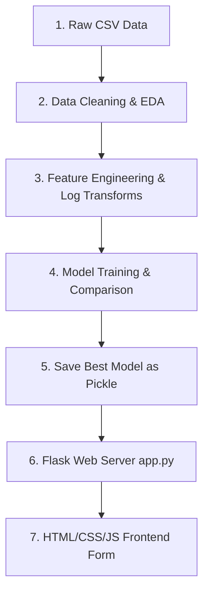

# Part 1: Project Overview & Architecture

## 1. Project Overview

### 1.1 Welcome & Introduction
The Human Development Index (HDI) is a statistical composite index of life expectancy, education, and per capita income indicators, which are used to rank countries into four tiers of human development. In this guide, we will build a complete web application that predicts a country's HDI score based on user inputs. We will transition from simple data creation to full exploratory data analysis (EDA), multi-model regression training, and deploying a Flask web server.

### 1.2 System Architecture Flow Diagram
Here is how data flows through our HDI Predictor application:



---

# Part 2: Setting Up Git & GitHub

## 1.5 Installing Git
If you don't have Git installed:
- Download the installer from the [Git Website](https://git-scm.com/).
- Run the installer with default options selected.
- Open your terminal and verify by typing:
  ```bash
  git --version
  ```

## 1.6 Connecting a Local Folder to GitHub
A common scenario is that you want to back up your code and share it with others. Follow these steps in your terminal:

1. **Initialize Git locally**:
   ```bash
   git init
   ```
   This creates a hidden `.git` folder inside your project to track changes.

2. **Add all files to stage**:
   ```bash
   git add .
   ```

3. **Commit files**:
   ```bash
   git commit -m "Initial commit: environment setup"
   ```

4. **Rename main branch**:
   ```bash
   git branch -M main
   ```

5. **Link to GitHub repository**:
   Create a blank repository on GitHub, copy its URL (e.g., `https://github.com/yourusername/hdi-predictor.git`), and run:
   ```bash
   git remote add origin https://github.com/yourusername/hdi-predictor.git
   ```

6. **Push code to GitHub**:
   ```bash
   git push -u origin main
   ```
   Now your local code is backed up to GitHub!

---

# Part 3: Setting Up Your Development Environment

## 2. Installing Python

### 2.1 Why Python?
Python is the industry standard language for Machine Learning and Data Science. It is readable, beginner-friendly, and has a vast ecosystem of pre-built packages for scientific computing (like NumPy, Pandas, Scikit-Learn).

### 2.2 Downloading Python
Go to the official [Python website](https://www.python.org/downloads/) and download Python 3.8 or above for your Operating System.

### 2.3 Installing Python
- Run the installer executable.
- **IMPORTANT**: Check the box that says **"Add Python to PATH"** before clicking Install Now.

---

## 3. Installing Visual Studio Code

### 3.1 Download VS Code
Go to the [VS Code Website](https://code.visualstudio.com/) and download the stable build.

---

## 4. Installing Required VS Code Extensions

### 4.1 Python & Jupyter Extensions
Click on the Extensions icon on the left sidebar in VS Code, search for **Python** and **Jupyter** (by Microsoft), and click **Install**.

---

# Part 4: Creating Your First ML Project

## 5. Creating the Project Folder

### 5.1 Recommended Folder Structure
Set up your folder exactly like this:
```text
HDI_Project/
├── data/
│   └── hdi_data.csv
├── models/
│   └── HDI.pkl
├── templates/
│   ├── index.html
│   └── result.html
├── static/
│   ├── style.css
│   └── script.js
├── notebook.ipynb
└── app.py
```

---

# Part 5: Downloading and Understanding the Dataset

## 8. Finding a Dataset

### 8.1 Where to Download Datasets
For this project, we are modeling the official UNDP Human Development Report data. You can download historical datasets from [Kaggle HDI Datasets](https://www.kaggle.com/). 

### 8.2 Understanding the Target
We are performing **Regression** because our target variable (`hdi`) is a continuous number ranging from 0.000 to 1.000, unlike classification where the target is a discrete category (like Approved/Rejected).

### 8.3 The Four Main Indicators
1. **Life Expectancy at Birth**: Measured in years.
2. **Expected Years of Schooling**: Years of schooling a child can expect to receive.
3. **Mean Years of Schooling**: Average number of years of education received by people ages 25 and older.
4. **Gross National Income (GNI) per Capita**: Measured in USD.

---

# Part 6: Interactive Notebook - Importing Libraries & Loading Data

### 7.3 [JUPYTER CELL 1] Importing Core Libraries
Open your `notebook.ipynb` file, create a new code cell, paste the following code, and execute it:
```python
import numpy as np
import pandas as pd
import matplotlib.pyplot as plt
import seaborn as sns

print("Core libraries imported successfully!")
```

### 7.4 [JUPYTER CELL 2] Loading the Dataset
Create a new code cell, paste this code to load the dataset, and click run:
```python
# For this tutorial, we will create a mock dataset dataframe 
# if you haven't downloaded the CSV yet.
data = {
    'life_expectancy': [70.5, 80.2, 55.3, 75.1, 82.5, 65.0, 78.4, 60.1],
    'expec_yr_school': [12.0, 16.5, 8.0, 14.2, 17.0, 10.5, 15.3, 9.2],
    'mean_yr_school': [9.0, 13.0, 4.5, 11.5, 14.2, 7.5, 12.1, 5.8],
    'gross_inc_percap': [13000, 48000, 1300, 24000, 60000, 5000, 35000, 2100],
    'hdi': [0.700, 0.900, 0.450, 0.800, 0.940, 0.550, 0.850, 0.480]
}
df = pd.DataFrame(data)
print("Dataset loaded. Number of rows:", len(df))
```

---

# Part 7: Interactive Notebook - Exploratory Data Analysis (EDA)

Follow along step-by-step. Each of the following steps must be run in a separate cell inside your Jupyter Notebook to inspect the outputs clearly.

### 8.1 [JUPYTER CELL 3] Viewing First Rows
Create a new cell and run:
```python
df.head()
```

### 8.3 [JUPYTER CELL 4] Dataset Shape
Create a new cell and run:
```python
df.shape
```

### 8.4 [JUPYTER CELL 5] Schema Info & Columns Data Types
Create a new cell and run:
```python
df.info()
```

### 8.5 [JUPYTER CELL 6] Statistical Summary
Create a new cell and run:
```python
df.describe()
```

### 8.6 [JUPYTER CELL 7] Bivariate Analysis: Income vs HDI
Create a new cell and run:
```python
plt.figure(figsize=(8, 4))
sns.scatterplot(x='gross_inc_percap', y='hdi', data=df, color='green')
plt.title('Income vs Human Development Index')
plt.xlabel('GNI per Capita')
plt.ylabel('HDI')
plt.show()
```
*Purpose*: Notice how income curves non-linearly against HDI. This means we will likely need to log-transform the income!

### 8.7 [JUPYTER CELL 8] Correlation Matrix & Heatmap
Create a new cell and run:
```python
plt.figure(figsize=(10, 8))
sns.heatmap(df.corr(), annot=True, cmap='viridis', fmt=".2f")
plt.title('Correlation Matrix Heatmap')
plt.show()
```

---

# Part 8: Interactive Notebook - Preprocessing & Feature Engineering

### 9.1 [JUPYTER CELL 9] Log Transforming Income
Because income scales exponentially while HDI scales linearly, the official UNDP formula uses the natural logarithm of income.
Create a new cell and run:
```python
df['log_gross_inc_percap'] = np.log(df['gross_inc_percap'])
print("Income log-transformed successfully!")
```

---

# Part 9: Interactive Notebook - Training the Machine Learning Model

### 10.1 [JUPYTER CELL 10] Splitting Features & Target Data
Create a new cell and run:
```python
X = df[['life_expectancy', 'expec_yr_school', 'mean_yr_school', 'log_gross_inc_percap']]
y = df['hdi']
```

### 10.2 [JUPYTER CELL 11] Splitting into Train and Test Groups
Create a new cell and run:
```python
from sklearn.model_selection import train_test_split

X_train, X_test, y_train, y_test = train_test_split(X, y, test_size=0.2, random_state=42)
print(f"Train size: {X_train.shape[0]}, Test size: {X_test.shape[0]}")
```

### 10.3 [JUPYTER CELL 12] Training the Linear Regression Model
Create a new cell and run:
```python
from sklearn.linear_model import LinearRegression
from sklearn.metrics import mean_squared_error, r2_score

# Instantiate the regression model
model = LinearRegression()

# Train the model
model.fit(X_train, y_train)

# Evaluate the model
y_pred = model.predict(X_test)
r2 = r2_score(y_test, y_pred)
mse = mean_squared_error(y_test, y_pred)
print(f"Linear Regression | R2 Score: {r2:.4f} | MSE: {mse:.4f}")
```

### 10.4 [JUPYTER CELL 13] Saving the Trained Model to disk
Create a new cell and run:
```python
import pickle
import os

os.makedirs("models", exist_ok=True)

# Export model as a portable pickle file
with open("models/HDI.pkl", "wb") as file:
    pickle.dump(model, file)
print("Model file successfully written into models/HDI.pkl!")
```

---

# Part 10: Python Script - Flask Application Server

The following code is not run in Jupyter. You must copy it and save it as a Python script named `app.py` in your project folder.

### 11.1 Creating app.py Script
Create a new file named `app.py` and write the following code:
```python
from flask import Flask, render_template, request
import pickle
import numpy as np

app = Flask(__name__)

# Load the saved ML model
with open('models/HDI.pkl', 'rb') as file:
    model = pickle.load(file)

@app.route('/')
def home():
    return render_template('index.html')

@app.route('/predict', methods=['POST'])
def predict():
    # 1. Get the numbers the user typed into the website
    life = float(request.form['life_expectancy'])
    expec_school = float(request.form['expec_yr_school'])
    mean_school = float(request.form['mean_yr_school'])
    gni = float(request.form['gross_inc_percap'])
    
    # 2. Ask the ML model to predict based on those numbers
    log_gni = np.log(gni) if gni > 0 else 0
    features = np.array([[life, expec_school, mean_school, log_gni]])
    prediction = model.predict(features)[0]
    
    # 3. Send the result to the result page
    return render_template('result.html', score=round(prediction, 3))

if __name__ == '__main__':
    app.run(debug=True)
```

---

# Part 11: Web Application Frontend Files

### 12.1 Creating templates/index.html Layout
Create `index.html` inside the `templates` folder:
```html
<!DOCTYPE html>
<html lang="en">
<head>
    <meta charset="UTF-8">
    <meta name="viewport" content="width=device-width, initial-scale=1.0">
    <title>HDI Predictor</title>
    <link rel="stylesheet" href="/static/style.css">
</head>
<body>
    <div class="container">
        <h2>Human Development Index Predictor</h2>
        <form action="/predict" method="POST">
            <label>Life Expectancy (Years):</label>
            <input type="number" step="any" name="life_expectancy" required>
            
            <label>Expected Years of Schooling:</label>
            <input type="number" step="any" name="expec_yr_school" required>
            
            <label>Mean Years of Schooling:</label>
            <input type="number" step="any" name="mean_yr_school" required>
            
            <label>Gross National Income per Capita ($):</label>
            <input type="number" step="any" name="gross_inc_percap" required>
            
            <button type="submit">Predict Score!</button>
        </form>
    </div>
</body>
</html>
```

### 12.2 Creating templates/result.html
Create `result.html` inside the `templates` folder:
```html
<!DOCTYPE html>
<html lang="en">
<head>
    <title>Prediction Result</title>
    <link rel="stylesheet" href="/static/style.css">
</head>
<body>
    <div class="container" style="text-align: center;">
        <h2>Prediction Complete!</h2>
        <h1 style="color: #6366f1;">{{ score }}</h1>
        <p>(Scores are between 0 and 1. Closer to 1 means higher development!)</p>
        <br>
        <a href="/" class="button">Go Back</a>
    </div>
</body>
</html>
```

### 12.3 Creating static/style.css Styles
```css
body {
    background-color: #0c0c0e;
    color: #f3f4f6;
    font-family: sans-serif;
    display: flex;
    justify-content: center;
    align-items: center;
    height: 100vh;
}
.container {
    background-color: #16161a;
    border: 1px solid #2e2e38;
    padding: 30px;
    border-radius: 12px;
    width: 320px;
}
input, button, .button {
    width: 100%;
    margin-bottom: 12px;
    padding: 10px;
    border-radius: 6px;
    border: 1px solid #3a3a46;
    background-color: #24242e;
    color: white;
    display: block;
    box-sizing: border-box;
    text-align: center;
    text-decoration: none;
}
button, .button {
    background-color: #6366f1;
    cursor: pointer;
    font-weight: bold;
}
```

---

# Part 12: Understanding the Complete Workflow

## 25. End to End Project Flow
1. **Raw CSV Data / Dictionary**: The raw database snapshot of applicant attributes.
2. **Jupyter Preprocessing**: Code filters duplicate rows, applies log transforms, and evaluates correlation.
3. **Model Training**: Trains a Linear Regression model, evaluating R2 Score and MSE, saving the learned parameters as a serialized `.pkl` model object.
4. **Flask Backend API**: Loads the `.pkl` model at startup and listens for POST request payloads via HTML forms.
5. **Web Interface Form**: A clean page capturing applicant attributes, sending them securely to the server, and displaying the HDI score dynamically.

---

# Part 13: Common Errors and Fixes

## 26. Troubleshooting Guide

### 26.1 Python Not Found
- **Symptom**: Command `python` is not recognized.
- **Fix**: Re-run the installer and select **Add Python to PATH**.

### 26.2 ModuleNotFoundError
- **Symptom**: `ModuleNotFoundError: No module named 'flask'`.
- **Fix**: Run `pip install flask scikit-learn numpy pandas` in your terminal.

### 26.3 Template Not Found
- **Symptom**: `jinja2.exceptions.TemplateNotFound: index.html`.
- **Fix**: Verify your `index.html` file is strictly inside a folder named exactly `templates` located next to `app.py`.

### 26.4 Shape Mismatch
- **Symptom**: Model expects 4 features but gets a different number.
- **Fix**: Ensure your array shapes during prediction exactly match the training columns (`life_expectancy`, `expec_yr_school`, `mean_yr_school`, `log_gross_inc_percap`).

### 26.5 Flask Port Conflicts
- **Symptom**: Port 5000 already in use.
- **Fix**: Change port inside `app.run(port=5001)`.

---

# Part 14: Applying This Workflow to Other Projects

## 27. Using This Same Workflow for Any ML Project
You can apply this exact end-to-end blueprint to any tabular regression project:
- **Human Development Index Predictor** (This guide)
- **House Price Prediction** (Regression workflows)
- **Stock Market Forecasting** (Predicting future closing prices)
- **Car Resale Value Estimator** (Predicting vehicle depreciation)
- **Credit Card Approval Prediction** (Classification workflows)

---

# Part 15: Final Project

## 28. Complete Project Folder Structure
```text
HDI_Project/
├── data/
│   └── hdi_data.csv
├── models/
│   └── HDI.pkl
├── templates/
│   ├── index.html
│   └── result.html
├── static/
│   └── style.css
├── notebook.ipynb
└── app.py
```

## 29. Complete End to End Flow Diagram
Ensure your files communicate in the following path:
`notebook.ipynb` -> `models/HDI.pkl` -> `app.py` -> `templates/index.html` -> `templates/result.html`.

## 30. Final Project Checklist
- [x] Python setup complete and verified.
- [x] Git linked and committed to GitHub.
- [x] Feature Engineering (log transformation) completed.
- [x] Linear Regression model successfully trained.
- [x] Pickle model successfully loaded by Flask app.
- [x] CSS Styles applied to frontend forms.

## 31. What's Next?
Deploy your application on cloud hosts like Vercel, Render, or Heroku to share it online!

---

## 32. Connect with the Author
Have questions or want to see more projects? Let's connect!
- **Portfolio**: [itsnaseersyed.dev](https://itsnaseersyed.dev)
- **GitHub**: [itsnaseersyed](https://github.com/itsnaseersyed)
- **LinkedIn**: [Syed Naseer](https://www.linkedin.com/in/syed-naseer-66bb0231b)
- **Instagram**: [@naseerintech](https://www.instagram.com/naseerintech)
