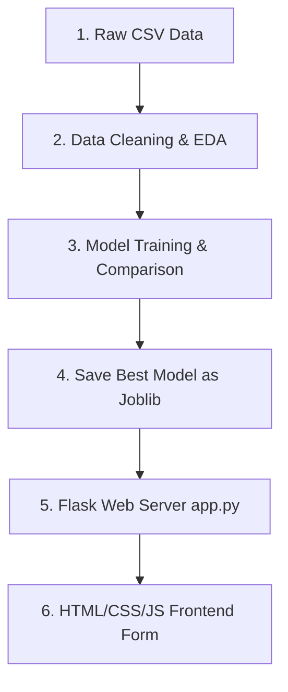

# Part 1: Project Overview & Architecture

## 1. Welcome to OptiCrop
The primary goal of agriculture is to feed populations while maintaining resource efficiency and soil health. Traditional agricultural decisions—such as what crop to grow on a specific plot of land—are often based on historical guesswork. This can lead to crop failures, low yields, and resource waste.

**OptiCrop** is a data-driven **Smart Agricultural Production Optimization Engine** that uses machine learning to solve this problem. By assessing key soil nutrients (Nitrogen, Phosphorous, Potassium) and local weather metrics (temperature, humidity, pH, and rainfall), the system predicts the highest-yielding crop for any given plot.

---

## 2. Core Scenarios Explained

OptiCrop facilitates three primary operational flows:

### Scenario 1: Smart Crop Recommendation for Farmers
A farmer enters local soil attributes (N, P, K, pH) and weather forecasts (temperature, humidity, rainfall). The engine evaluates these parameters and recommends the best crop type to ensure maximum yield.

### Scenario 2: Crop Suitability & Environmental Assessment
Users check whether their current soil and weather parameters match the natural requirements of a specific crop (e.g., whether local conditions are suitable for growing Coffee). The system checks compatibility and alerts the user of potential risks.

### Scenario 3: Agricultural Research & Policy Planning
Researchers and policymakers use the system to model how soil changes affect regional crop suitability, supporting long-term food security decisions.

---

## 3. High-Level System Architecture
Here is how data flows through the application:



---

# Part 2: Pre-requisites & Local Environment Setup

Let's prepare your computer for machine learning development.

## 4. Installing Core Software

### 4.1 Installing Python 3.10+
1. Go to the [Python official downloads page](https://www.python.org/downloads/) and grab the installer.
2. **IMPORTANT:** Check the box that says **"Add Python to PATH"** before clicking Install. If you skip this, python commands will not work in your terminal.
3. Open your terminal or Command Prompt and run:
   ```bash
   python --version
   ```
   You should see `Python 3.10` (or higher) printed out.

### 4.2 Installing VS Code & Extensions
1. Download VS Code from the [VS Code Website](https://code.visualstudio.com/).
2. Run the installer and open the app.
3. Click the **Extensions** icon on the left sidebar (looks like four squares), search for **Python** and **Jupyter** (both by Microsoft), and click **Install**.

---

## 5. Project Folder Structure Setup
Follow these steps to create your project files:

1. **Create the main folder:** Go to your computer's Desktop, right-click, select "New Folder", and name it exactly `opticrop`.
2. **Open the folder in VS Code:** Open VS Code, click **File** in the top menu, select **Open Folder...**, find and select your `opticrop` folder, and click Open. You should now see an empty sidebar on the left.
3. **Create files and subfolders:** 
   - Hover your cursor over the `OPTICROP` name in the VS Code sidebar and click the **New Folder** icon (a folder with a plus sign) to create a folder. Create two folders: `data` and `models`.
   - Click the **New File** icon (a page with a plus sign) to create files. Create `train.py`, `app.py`, `notebook.ipynb`, and `requirements.txt`.
   - Create another folder named `templates`, click on it, and create `index.html` inside it.
   - Create another folder named `static`, click on it, and create `style.css` and `script.js` inside it.

Your directory layout in the VS Code sidebar must look exactly like this:
```text
opticrop/
├── data/
│   └── Crop_recommendation.csv  (We will download this next!)
├── models/
│   ├── crop_model.joblib        (This is generated by train.py later!)
│   └── scaler.joblib            (This is generated by train.py later!)
├── templates/
│   └── index.html
├── static/
│   ├── style.css
│   └── script.js
├── notebook.ipynb
├── train.py
└── app.py
```
> [!IMPORTANT]
> **Beginner Rule:** Whenever you write or paste code into any file in VS Code, remember to press **`Ctrl + S`** (Windows) or **`Cmd + S`** (macOS) to save your changes. If you do not save, the file remains empty and your code will not run!

---

## 6. Installing Project Requirements
Create a file named `requirements.txt` in the root of your `opticrop` folder and paste the following dependencies:

```text
flask==3.0.2
pandas==2.2.0
numpy==1.26.4
scikit-learn==1.4.0
matplotlib==3.8.3
seaborn==0.13.2
joblib==1.3.2
jinja2==3.1.3
```

Now, run this command in your terminal to install all required libraries:

1. **Open the Terminal inside VS Code:** Click on **Terminal** in the VS Code top menu, and select **New Terminal** (or press the keyboard shortcut **`Ctrl + ~`** on Windows or **`Ctrl + \``** on macOS). A terminal panel will slide up from the bottom of your screen.
2. **Execute the installation command:** Type the following command in the terminal prompt and press Enter:
   ```bash
   pip install -r requirements.txt
   ```
3. **Wait for completion:** Pip will download and install Flask, Pandas, NumPy, Scikit-Learn, and Joblib. Keep this terminal open!

---

# Part 3: Understanding the Dataset & Download Guide

To train our machine learning models, we need historical soil and crop records.

## 7. Downloading and Placing the Dataset
We are using the official [Kaggle Crop Recommendation Dataset](https://www.kaggle.com/datasets/atharvaingle/crop-recommendation-dataset). Follow these step-by-step instructions to create the folder and extract the data:

1. **Create the data folder:** Inside your main `opticrop` project workspace directory, create a new subfolder named `data`.
2. **Download the data:** Click on the Kaggle link above, sign in (or register a free account), and click the **Download** button in the top-right corner. This downloads a file named `downloaded.zip` to your computer.
3. **Extract the ZIP file:** Locate the downloaded `downloaded.zip` file on your system, right-click, and select "Extract All" (or unzip it).
4. **Locate the CSV:** Inside the extracted files, locate the spreadsheet file named exactly `Crop_recommendation.csv`.
5. **Export to the project:** Copy or move this `Crop_recommendation.csv` file into the newly created `data` folder inside your project. The final path must be:
   `opticrop/data/Crop_recommendation.csv`

---

## 8. Expected Dataset Columns
Ensure your dataset columns match these exact configurations:
- **N (Nitrogen):** Ratio of Nitrogen content in soil (mg/kg).
- **P (Phosphorous):** Ratio of Phosphorous content in soil (mg/kg).
- **K (Potassium):** Ratio of Potassium content in soil (mg/kg).
- **temperature:** Air temperature in Celsius (°C).
- **humidity:** Relative air humidity in percentage (%).
- **ph:** pH level of the soil (typically ranges from 3.5 to 9.0).
- **rainfall:** Rainfall volume (mm).
- **label:** The crop name (e.g., rice, maize, mango, banana, coffee).

---

## 9. Beginner Crash Course on Jupyter Notebooks
Before we start, let's understand how a Jupyter Notebook works:
* A Jupyter Notebook consists of individual blocks of code called **Cells**.
* You can write code inside a cell and click **Run** (or press **`Shift + Enter`**) to execute just that cell.
* Unlike standard `.py` files, variables remain stored in memory after cell execution. This is perfect for inspecting datasets without reloading files.

---

# Part 4: Interactive Exploratory Data Analysis (Jupyter Notebook)

We use a **Jupyter Notebook (`notebook.ipynb`)** for this exploratory phase rather than a standard script because:
- **Instant Visual Feedback:** You can render data frames, print statistics, and display plots inline immediately beneath your code.
- **Persistent State:** The dataset is loaded into the computer's memory once, meaning you don't have to wait for the CSV to load every time you make a change or write a new chart.
- **Interactive Trial:** You can experiment, tweak graphs, and audit your data step-by-step.

Open VS Code, choose **Open Folder**, select your `opticrop` directory, and open `notebook.ipynb`. To create a new code cell, click the **`+ Code`** button in the notebook. Write the code for each cell below and execute them in order by clicking the play icon or pressing **`Shift + Enter`**:

### 10.1 [JUPYTER CELL 1] Importing Core Libraries
```python
import numpy as np
import pandas as pd
import matplotlib.pyplot as plt
import seaborn as sns

print("Scientific libraries imported successfully!")
```
- **Why we do it:** This loads the core scientific libraries. We use `pandas` for handling spreadsheets, `numpy` for mathematical operations, and `matplotlib` and `seaborn` for drawing charts.
- **Expected Output:** The console prints `"Scientific libraries imported successfully!"`.

### 10.2 [JUPYTER CELL 2] Loading the CSV Dataset
```python
# Load the CSV file
df = pd.read_csv('data/Crop_recommendation.csv')
print(f"Dataset loaded. Total rows: {df.shape[0]}, Columns: {df.shape[1]}")
```
- **Why we do it:** This loads your CSV file into a Pandas DataFrame named `df` (which is like a virtual spreadsheet).
- **Expected Output:** A printout showing: `Dataset loaded. Total rows: 2200, Columns: 8`.

### 10.3 [JUPYTER CELL 3] Inspecting the Top Rows
```python
df.head()
```
- **Why we do it:** This displays the first 5 records of the dataset. It is a quick check to see if the columns loaded correctly.
- **Expected Output:** A table showing columns like N, P, K, temperature, humidity, pH, rainfall, and the target crop labels.

### 10.4 [JUPYTER CELL 4] Inspecting the End Rows
```python
df.tail()
```
- **Why we do it:** Displays the final 5 records of your dataset.
- **Expected Output:** A table of rows 2195 to 2199.

### 10.5 [JUPYTER CELL 5] Column Data Types Check
```python
df.info()
```
- **Why we do it:** Inspects the datatype of each column (floats, integers, strings) and counts non-null values.
- **Expected Output:** Verify that N, P, K, pH, rainfall, temperature, and humidity are numerical values (`float64` or `int64`) and the labels are text values (`object`).

### 10.6 [JUPYTER CELL 6] Statistical Summary
```python
df.describe()
```
- **Why we do it:** Generates key statistics (mean, standard deviation, min, max, and quartiles) for all numerical parameters.
- **Expected Output:** A table of statistical values. Look at the `mean` row to see the average weather and nutrient profile in the dataset.

### 10.7 [JUPYTER CELL 7] Auditing Missing Values
```python
df.isnull().sum()
```
- **Why we do it:** Checks if there are missing/null values in any of your data fields. Missing values can cause machine learning algorithms to crash during training.
- **Expected Output:** A list of all columns showing `0` next to each. If any column shows a number higher than 0, it means we have missing cells that must be filled.

### 10.8 [JUPYTER CELL 8] Auditing Duplicate Records
```python
df.duplicated().sum()
```
- **Why we do it:** Checks if there are exact duplicate rows. Redundant data can bias the model.
- **Expected Output:** The output should ideally print `0`.

### 10.9 [JUPYTER CELL 9] Visualizing Soil Nitrogen Distribution
```python
plt.figure(figsize=(8, 4))
sns.histplot(df['N'], bins=20, kde=True, color='green')
plt.title('Distribution of Nitrogen (N) in Soil')
plt.xlabel('Nitrogen (mg/kg)')
plt.ylabel('Count')
plt.show()
```
- **Why we do it:** Plots a histogram of Nitrogen values. The curve tells us if Nitrogen concentrations are normally distributed or biased toward specific ranges.
- **Expected Output:** A green histogram graph with a smooth distribution curve.

### 10.10 [JUPYTER CELL 10] Generating a Feature Correlation Heatmap
```python
numeric_df = df.select_dtypes(include=[np.number])
plt.figure(figsize=(10, 8))
sns.heatmap(numeric_df.corr(), annot=True, cmap='coolwarm', fmt=".2f")
plt.title('Correlation Heatmap of Weather & Soil Features')
plt.show()
```
- **Why we do it:** Computes the mathematical correlation between columns and displays it as a heatmap. Values close to `1.0` or `-1.0` show strong positive or negative relationships.
- **Expected Output:** A color-coded matrix heatmap (blue to red). This shows how strongly each parameter links to the others (e.g. humidity and rainfall).

---

# Part 5: Production Model Training & Serialization (`train.py`)

Instead of training models inside the notebook, we create a structured Python script `train.py`. This script handles training, compares model accuracies, scales parameters, and serializes files.

Create `train.py` in the project root and write the following code:

```python
import os
import joblib
import pandas as pd
import numpy as np

from sklearn.model_selection import train_test_split
from sklearn.preprocessing import StandardScaler
from sklearn.metrics import accuracy_score, classification_report

# Import classifiers
from sklearn.linear_model import LogisticRegression
from sklearn.neighbors import KNeighborsClassifier
from sklearn.tree import DecisionTreeClassifier
from sklearn.ensemble import RandomForestClassifier
from sklearn.cluster import KMeans

def train_and_evaluate():
    # 1. Load dataset
    dataset_path = 'data/Crop_recommendation.csv'
    if not os.path.exists(dataset_path):
        print(f"Dataset not found at {dataset_path}! Please download the dataset first.")
        return
    
    df = pd.read_csv(dataset_path)

    # 2. Preprocess Data: check and handle missing values
    for col in df.columns[:-1]:
        df[col] = df[col].fillna(df[col].median())

    # 3. Split features (X) and labels (y)
    X = df.drop(columns=['label'])
    y = df['label']

    X_train, X_test, y_train, y_test = train_test_split(X, y, test_size=0.2, random_state=42)

    # 4. Standardize Features to support algorithm convergence (Logistic/KNN)
    scaler = StandardScaler()
    X_train_scaled = scaler.fit_transform(X_train)
    X_test_scaled = scaler.transform(X_test)

    # 5. Define classification models
    models = {
        "Logistic Regression": LogisticRegression(max_iter=1500, random_state=42),
        "K-Nearest Neighbors": KNeighborsClassifier(n_neighbors=5),
        "Decision Tree": DecisionTreeClassifier(random_state=42),
        "Random Forest": RandomForestClassifier(n_estimators=100, random_state=42)
    }

    best_model_name = ""
    best_accuracy = 0.0
    best_model = None

    print("\n=== MODEL COMPARISON ===")
    for name, model in models.items():
        # Train model using scaled data
        model.fit(X_train_scaled, y_train)
        predictions = model.predict(X_test_scaled)
        accuracy = accuracy_score(y_test, predictions)
        print(f"{name} Test Accuracy: {accuracy * 100:.2f}%")
        
        # Save best performing
        if accuracy > best_accuracy:
            best_accuracy = accuracy
            best_model_name = name
            best_model = model

    # Unsupervised K-Means clustering check
    kmeans = KMeans(n_clusters=5, random_state=42, n_init=10)
    kmeans.fit(X_train_scaled)
    print("\nUnsupervised K-Means clustering completed on scaled features.")

    print(f"\n>> Selected Best Model: {best_model_name} with {best_accuracy*100:.2f}% accuracy.")

    # Output detailed evaluation report
    best_predictions = best_model.predict(X_test_scaled)
    print("\nDetailed Evaluation Report:")
    print(classification_report(y_test, best_predictions))

    # 6. Save the best model and scaler using joblib
    os.makedirs('models', exist_ok=True)
    joblib.dump(best_model, 'models/crop_model.joblib')
    joblib.dump(scaler, 'models/scaler.joblib')
    print("Model and Scaler successfully saved inside models/ folder!")

if __name__ == '__main__':
    train_and_evaluate()
```

---

## 10. Practical Breakdown of the Training Logic
To understand how our model learns, let's break down the key engineering concepts used in `train.py` step-by-step:

### 10.1 Data Preprocessing & Median Imputation
```python
for col in df.columns[:-1]:
    df[col] = df[col].fillna(df[col].median())
```
- **Why we do it:** If a farmer forgets to record rainfall or pH, that dataset cell becomes blank (`NaN`). If you feed a `NaN` into scikit-learn classifiers, they will immediately crash.
- **The fix:** We loop through all numeric column variables, calculate their median (the middle value of that parameter across all records), and use it to patch the missing spots. Using the median is safer than the mean because it is less affected by extreme anomalies.

### 10.2 Train-Test Split: Setting Up the Test
```python
X_train, X_test, y_train, y_test = train_test_split(X, y, test_size=0.2, random_state=42)
```
- **Why we do it:** If we train the model on all 2,200 rows and then test it on those same rows, it will get a perfect score simply by memorizing the answers (a problem called **Overfitting**).
- **The fix:** We partition the data. The model trains on 80% of the rows (`X_train` & `y_train`). We hold back 20% (`X_test` & `y_test`) as a hidden test sheet. The accuracy score is calculated strictly on this test sheet to evaluate how the model handles unseen data.

### 10.3 Feature Scaling (StandardScaler)
```python
scaler = StandardScaler()
X_train_scaled = scaler.fit_transform(X_train)
X_test_scaled = scaler.transform(X_test)
```
- **Why we do it:** Rainfall values can be over `200.0`, while soil pH values are small numbers like `6.5`. If you feed these raw numbers into algorithms like Logistic Regression or K-Nearest Neighbors, they will assume Rainfall is 30 times more important than pH simply because its values are larger.
- **The fix:** `StandardScaler` standardizes the scale of all features. It centers the mean of each column at `0` and sets the standard deviation to `1` (squeezing most metrics between `-3` and `3`). This ensures every parameter is evaluated equally.

### 10.4 Supervised Classifier Comparison Loop
```python
models = {
    "Logistic Regression": LogisticRegression(max_iter=1500, random_state=42),
    "K-Nearest Neighbors": KNeighborsClassifier(n_neighbors=5),
    "Decision Tree": DecisionTreeClassifier(random_state=42),
    "Random Forest": RandomForestClassifier(n_estimators=100, random_state=42)
}
```
- **Why we do it:** No single algorithm is perfect for every dataset. We compare several options:
  - **Logistic Regression:** Calculates linear probability boundary scores.
  - **K-Nearest Neighbors (KNN):** Looks at the 5 most similar historical soil records to vote on the crop.
  - **Decision Tree:** Splits data recursively using simple True/False check paths.
  - **Random Forest:** An ensemble of 100 independent Decision Trees that averages their predictions. This model is highly accurate and robust.

### 10.5 Unsupervised Clustering (K-Means)
```python
kmeans = KMeans(n_clusters=5, random_state=42, n_init=10)
kmeans.fit(X_train_scaled)
```
- **Why we do it:** Unsupervised learning helps discover patterns without using the target label. K-Means clusters data points based solely on feature similarities. Here, it groups similar soil and weather profiles into 5 macro categories, helping researchers spot regional patterns.

### 10.6 Model Evaluation Reports
```python
print(classification_report(y_test, best_predictions))
```
- **Why we do it:** Accuracy alone can be misleading. We evaluate additional metrics:
  - **Precision:** Out of all times the model predicted "Rice", how many were actually rice? (Checks for false positives).
  - **Recall:** Out of all actual "Rice" records in the dataset, how many did the model find? (Checks for false negatives).
  - **F1-Score:** The harmonic mean of Precision and Recall.

### 10.7 Model Serialization (Joblib Export)
```python
joblib.dump(best_model, 'models/crop_model.joblib')
joblib.dump(scaler, 'models/scaler.joblib')
```
- **Why we do it:** We save the trained model (`crop_model.joblib`) and the fitted scaler (`scaler.joblib`) to the disk. 
- **CRITICAL DETAIL:** When a user submits soil parameters on the frontend, the Flask app must use the **exact same scaler instance** configured during training to normalize the new inputs before passing them to the model. If you do not save and load the scaler, predictions will fail.

---

# Part 6: Backend API Development with Flask (`app.py`)

Now that the model is trained and saved, we write the backend server code to load the model and process recommendations.

### 11.1 Creating `app.py`
Create a file named `app.py` in your project root and paste this code:

```python
import os
import joblib
import numpy as np
from flask import Flask, request, jsonify, render_template

app = Flask(__name__)

# Safely load the saved model and scaler
MODEL_PATH = 'models/crop_model.joblib'
SCALER_PATH = 'models/scaler.joblib'

if os.path.exists(MODEL_PATH) and os.path.exists(SCALER_PATH):
    model = joblib.load(MODEL_PATH)
    scaler = joblib.load(SCALER_PATH)
    print("Crop model and scaler loaded successfully!")
else:
    model = None
    scaler = None
    print("WARNING: Model or Scaler file not found! Run train.py first.")

@app.route('/')
def home():
    """Renders the single page application interface."""
    return render_template('index.html')

@app.route('/predict', methods=['POST'])
def predict():
    """Processes incoming numeric parameters and predicts the crop."""
    if model is None or scaler is None:
        return jsonify({'error': 'Machine learning model files not loaded.'}), 500
    
    try:
        data = request.get_json()
        
        # Verify inputs exist
        required_keys = ['N', 'P', 'K', 'temperature', 'humidity', 'ph', 'rainfall']
        for key in required_keys:
            if key not in data:
                return jsonify({'error': f'Missing parameter: {key}'}), 400

        # Construct input features array in correct sequence
        raw_features = np.array([[
            float(data['N']),
            float(data['P']),
            float(data['K']),
            float(data['temperature']),
            float(data['humidity']),
            float(data['ph']),
            float(data['rainfall'])
        ]])
        
        # Simple parameter boundaries validation
        n, p, k, temp, hum, ph, rain = raw_features[0]
        if not (0 <= n <= 250): return jsonify({'error': 'N content must be between 0 and 250 mg/kg.'}), 400
        if not (0 <= p <= 250): return jsonify({'error': 'P content must be between 0 and 250 mg/kg.'}), 400
        if not (0 <= k <= 300): return jsonify({'error': 'K content must be between 0 and 300 mg/kg.'}), 400
        if not (-10 <= temp <= 60): return jsonify({'error': 'Temperature must be between -10°C and 60°C.'}), 400
        if not (0 <= hum <= 100): return jsonify({'error': 'Humidity must be between 0% and 100%.'}), 400
        if not (0 <= ph <= 14): return jsonify({'error': 'Soil pH must be between 0.0 and 14.0.'}), 400
        if not (0 <= rain <= 1000): return jsonify({'error': 'Rainfall must be between 0mm and 1000mm.'}), 400

        # Scale features using the saved scaler
        scaled_features = scaler.transform(raw_features)
        
        # Run prediction
        prediction = model.predict(scaled_features)[0]
        
        return jsonify({
            'success': True,
            'crop': str(prediction).capitalize()
        })
        
    except ValueError:
        return jsonify({'error': 'Inputs must be valid numbers.'}), 400
    except Exception as e:
        return jsonify({'error': f'Server Error: {str(e)}'}), 500

if __name__ == '__main__':
    app.run(port=5000, debug=True)
```

---

## 12. Practical Breakdown of the Backend Server Logic
Let's understand how the Flask API functions:
- **Initializing the App:** We instantiate Flask, establishing a local server context.
- **Loading Persisted Pipelines:** Using `joblib.load()`, we import both the Random Forest model and the standardization scaler. They are loaded globally once at startup, which speeds up predictions since we do not read from disk on every query.
- **Routing & Templates:** The homepage route `/` serves `index.html` from the `templates/` folder, displaying the form.
- **Boundary Range Validation:** Inside `/predict`, before passing values to the model, we verify that each parameter is in a valid physical range. For example, relative humidity must be between 0% and 100%, and pH cannot exceed 14.0. If any parameter falls outside, the server immediately returns an HTTP 400 error.
- **Data Scaling:** We call `scaler.transform()` on the input values. Because the training data was normalized, the new user input must be centered and scaled in the exact same way.
- **Running Inference:** The normalized parameters are passed to `model.predict()`, which returns the recommended crop name. This is returned to the client as a JSON payload containing the success state and crop label.

---

# Part 7: Creating the Single Page Application (SPA) Frontend

We will design a modern single-page dashboard. The frontend handles API calls in the background using JavaScript and displays results without reloading.

### 12.1 Creating `templates/index.html`
Create `templates/index.html` and write the following code:

```html
<!DOCTYPE html>
<html lang="en">
<head>
    <meta charset="UTF-8">
    <meta name="viewport" content="width=device-width, initial-scale=1.0">
    <title>OptiCrop Recommendation Engine</title>
    <link rel="stylesheet" href="/static/style.css">
</head>
<body>
    <div class="card">
        <h2 class="title">OptiCrop Recommendation Engine</h2>
        <p class="subtitle">Enter soil and climate variables to identify the optimal crop.</p>
        
        <form id="predictionForm">
            <div class="row">
                <div class="col">
                    <label for="N">Nitrogen (N) - mg/kg</label>
                    <input type="number" step="any" id="N" required placeholder="0 - 250">
                </div>
                <div class="col">
                    <label for="P">Phosphorus (P) - mg/kg</label>
                    <input type="number" step="any" id="P" required placeholder="0 - 250">
                </div>
                <div class="col">
                    <label for="K">Potassium (K) - mg/kg</label>
                    <input type="number" step="any" id="K" required placeholder="0 - 300">
                </div>
            </div>

            <div class="row">
                <div class="col">
                    <label for="temperature">Temperature (°C)</label>
                    <input type="number" step="any" id="temperature" required placeholder="e.g. 24.5">
                </div>
                <div class="col">
                    <label for="humidity">Humidity (%)</label>
                    <input type="number" step="any" id="humidity" required placeholder="e.g. 78">
                </div>
            </div>

            <div class="row">
                <div class="col">
                    <label for="ph">Soil pH Level</label>
                    <input type="number" step="any" id="ph" required placeholder="0.0 - 14.0">
                </div>
                <div class="col">
                    <label for="rainfall">Rainfall (mm)</label>
                    <input type="number" step="any" id="rainfall" required placeholder="e.g. 180">
                </div>
            </div>

            <button type="submit">Identify Best Crop</button>
        </form>

        <div id="result"></div>
    </div>

    <script src="/static/script.js"></script>
</body>
</html>
```

### 12.2 Creating `static/style.css`
Create `static/style.css` and write the following code:

```css
body {
    background-color: #0c0c0e;
    color: #f3f4f6;
    font-family: system-ui, -apple-system, sans-serif;
    display: flex;
    justify-content: center;
    align-items: center;
    min-height: 100vh;
    margin: 0;
    padding: 20px;
}
.card {
    background-color: #16161a;
    border: 1px solid #2e2e38;
    padding: 40px;
    border-radius: 16px;
    max-width: 500px;
    width: 100%;
}
.title {
    margin: 0 0 8px 0;
    font-size: 24px;
    font-weight: 700;
}
.subtitle {
    margin: 0 0 30px 0;
    color: #9ca3af;
    font-size: 14px;
}
.row {
    display: flex;
    gap: 16px;
    margin-bottom: 20px;
}
.col {
    display: flex;
    flex-direction: column;
    flex: 1;
}
label {
    font-size: 12px;
    font-weight: 600;
    text-transform: uppercase;
    letter-spacing: 0.5px;
    margin-bottom: 6px;
    color: #9ca3af;
}
input {
    background-color: #24242e;
    border: 1px solid #3a3a46;
    padding: 12px;
    border-radius: 8px;
    color: white;
    font-size: 14px;
    outline: none;
}
input:focus {
    border-color: #10b981;
}
button {
    background-color: #10b981;
    color: white;
    border: none;
    padding: 14px;
    border-radius: 8px;
    font-weight: 700;
    width: 100%;
    cursor: pointer;
    font-size: 14px;
    transition: background-color 0.2s;
}
button:hover {
    background-color: #059669;
}
#result {
    margin-top: 24px;
    padding: 16px;
    border-radius: 8px;
    text-align: center;
    font-weight: 700;
    font-size: 18px;
}
.success {
    background-color: rgba(16, 185, 129, 0.1);
    border: 1px solid #10b981;
    color: #10b981;
}
.error {
    background-color: rgba(239, 68, 68, 0.1);
    border: 1px solid #ef4444;
    color: #ef4444;
}
```

### 12.3 Creating `static/script.js`
Create `static/script.js` and write the following code:

```javascript
document.getElementById('predictionForm').addEventListener('submit', async (e) => {
    e.preventDefault();
    
    // Package form parameters
    const data = {
        N: parseFloat(document.getElementById('N').value),
        P: parseFloat(document.getElementById('P').value),
        K: parseFloat(document.getElementById('K').value),
        temperature: parseFloat(document.getElementById('temperature').value),
        humidity: parseFloat(document.getElementById('humidity').value),
        ph: parseFloat(document.getElementById('ph').value),
        rainfall: parseFloat(document.getElementById('rainfall').value)
    };

    const resultBox = document.getElementById('result');
    resultBox.className = '';
    resultBox.innerText = 'Analyzing soil parameters...';

    try {
        const response = await fetch('/predict', {
            method: 'POST',
            headers: { 'Content-Type': 'application/json' },
            body: JSON.stringify(data)
        });

        const res = await response.json();
        
        if (response.ok && res.success) {
            resultBox.className = 'success';
            resultBox.innerText = `RECOMMENDED CROP: ${res.crop}`;
        } else {
            resultBox.className = 'error';
            resultBox.innerText = `Prediction Error: ${res.error || 'Server rejection'}`;
        }
    } catch (err) {
        resultBox.className = 'error';
        resultBox.innerText = `Connection failed: ${err.message}`;
    }
});
```

---

## 13. Practical Breakdown of the Frontend Logic
Let's understand how the HTML, CSS, and JS files interact:
- **HTML Structure (index.html):** We create a single parent card containing the header, input forms, and a result placeholder. The `step="any"` attribute on input tags allows users to type floating point decimal values (like a temperature of `24.5`). We assign a unique `id` to each element so JavaScript can select them.
- **Visual Design (style.css):** Uses dark mode backgrounds. Inputs change border color when selected (`input:focus`), and result statuses have specific styling rules: success predictions display a soft green warning box, and validation errors are colored red.
- **Asynchronous AJAX Pipeline (script.js):** 
  - We listen for form submissions and call `e.preventDefault()` to stop the page from reloading.
  - Form field values are extracted and converted to numbers using `parseFloat()`.
  - We package these parameters into a single JavaScript object and send it to `/predict` using `fetch()` with the `POST` method and JSON headers.
  - The script waits for the response, parses the JSON payload, checks the output status, and updates the result placeholder element's text and style classes dynamically.

---

# Part 8: Running, Testing & Troubleshooting Locally

To verify our application, we run our Python files directly inside the VS Code terminal.

> [!IMPORTANT]
> **Check Your Folder Location:** Before running any commands, look at the terminal prompt. It should display your project path ending in `opticrop`. 
> - If it says something else, type `cd Desktop` and then `cd opticrop` to move to the correct folder. 
> - If you run commands in the wrong folder, Python will give you `FileNotFoundError: No such file or directory`!

---

## 13. Running Your Application

### 13.1 Step 1: Run Model Training
Type the following command into your VS Code terminal and press Enter:
```bash
python train.py
```

**Expected Console Output:**
```text
=== MODEL COMPARISON ===
Logistic Regression Test Accuracy: 96.59%
K-Nearest Neighbors Test Accuracy: 97.95%
Decision Tree Test Accuracy: 98.64%
Random Forest Test Accuracy: 99.32%

Unsupervised K-Means clustering completed on scaled features.

>> Selected Best Model: Random Forest with 99.32% accuracy.

Detailed Evaluation Report:
              precision    recall  f1-score   support
        rice       1.00      1.00      1.00        30
       maize       0.97      1.00      0.98        28
      coffee       1.00      0.97      0.98        32
...
    accuracy                           0.99       440

Model and Scaler successfully saved inside models/ folder!
```
*If you see this output, check your `models/` folder. You should see `crop_model.joblib` and `scaler.joblib` generated inside!*

### 13.2 Step 2: Start the Flask API
Now, type this command to start the web server:
```bash
python app.py
```

**Expected Console Output:**
```text
Crop model and scaler loaded successfully!
 * Serving Flask app 'app'
 * Debug mode: on
 * Running on http://127.0.0.1:5000
```
Open `http://127.0.0.1:5000` in your web browser. Type parameters (e.g. N=80, P=40, K=40, Temp=25, Humidity=80, pH=6, Rainfall=200) and click the prediction button to verify that the SPA loads the recommendation dynamically on the page!

---

## 14. Troubleshooting & Avoidable Mistakes

### 14.1 `ModuleNotFoundError`
- **What it means:** Python is trying to run code that relies on a library (like `pandas` or `joblib`) but cannot find it.
- **Why it happened:** You missed running `pip install` or ran it in a different window.
- **The fix:** Close your terminals, open a new one in VS Code, and run `pip install -r requirements.txt`.

### 14.2 `FileNotFoundError: [Errno 2] ...`
- **What it means:** Python cannot find the dataset CSV or the saved model files on the disk.
- **Why it happened:** Your terminal is focused in the wrong folder (e.g., your terminal points to `Desktop` instead of `Desktop/opticrop`), or you misspelled the `data/` or `models/` folders.
- **The fix:** Check the folder path in your terminal. Use the command `cd` to navigate into your `opticrop` root directory, and verify folder spelling in VS Code's sidebar.

### 14.3 Port 5000 is occupied (Address already in use)
- **What it means:** Flask is trying to start on port 5000, but another program on your computer is already using it.
- **Why it happened:** Often caused by local background services on Windows or AirPlay services on macOS.
- **The fix:** Open `app.py` in VS Code, find the last line `app.run(port=5000, debug=True)`, change the port number to `port=5001`, save the file (`Ctrl + S`), and re-run `python app.py`.

### 14.4 `SyntaxError` or nothing happens on click
- **Why it happened:** You pasted code into files but forgot to save them.
- **The fix:** Look at your open tabs in VS Code. If you see a **white circle** on any file tab name, it means there are unsaved changes. Press **`Ctrl + S`** (or `Cmd + S`) on each tab to save them, then reload the page in your browser.

---

## 15. Final Project Checklist
- [x] Python installation verified.
- [x] Kaggle dataset unzipped and placed in `data/Crop_recommendation.csv`.
- [x] Model training completed successfully with `python train.py`.
- [x] Serialized model and scaler created in `models/` folder.
- [x] Flask backend running successfully.
- [x] Frontend SPA page loads and displays crop predictions dynamically.

---

# Part 9: Saving Your Code with Git & GitHub Connection

Once the project is complete, you should upload your local folder to GitHub.

## 14. Git & GitHub Reference Guide

### 14.1 Git Basics Crash Course
- **Repository:** A directory where Git tracks file revisions.
- **Commit:** A recorded snapshot of your file changes.
- **Remote (Origin):** The address hosting your codebase online on GitHub.
- **Push:** Syncing your local commits up to the remote repository.

### 14.2 Command Sequence to Connect Your Project
Open your terminal in the root `opticrop` folder and run:

1. **Initialize a local Git repository**:
   ```bash
   git init
   ```
2. **Create a `.gitignore` file**:
   To avoid uploading unnecessary files (like models, dataset ZIPs, or cache folders), create a file named `.gitignore` in your project root and add:
   ```text
   __pycache__/
   models/
   venv/
   .ipynb_checkpoints/
   ```
3. **Add all files to staging**:
   ```bash
   git add .
   ```
4. **Create a commit**:
   ```bash
   git commit -m "feat: complete end-to-end OptiCrop engine"
   ```
5. **Rename the default branch to main**:
   ```bash
   git branch -M main
   ```
6. **Link your local repository to GitHub**:
   Replace the URL below with your actual GitHub repository URL:
   ```bash
   git remote add origin https://github.com/yourusername/opticrop.git
   ```
7. **Push to GitHub**:
   ```bash
   git push -u origin main
   ```

Now your code is saved and backing up dynamically on your GitHub repository!
